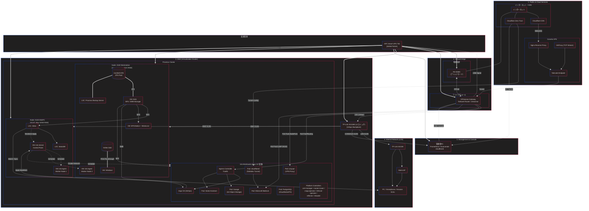

以下はこのプロジェクトの目的であるネットワーク図です。
変更を行う際には、この図を参考にして、全体の構成を把握してください。

```mermaid
---
config:
  theme: neo-dark
  look: neo
---
flowchart TB
 subgraph SUBNET_INTERNET["インターネット / CDN"]
        NET_INTERNET["インターネット"]
        NET_CFCDN["Cloudflare CDN"]
        NET_CFZT["Cloudflare Zero Trust"]
  end
 subgraph NET_VPS["Conoha VPS"]
        VPS_NGINX["Nginx Reverse Proxy"]
        VPS_HAPROXY["HAProxy (TCP Stream)"]
        VPS_TAILSCALE("Tailscale Endpoint")
  end
 subgraph LAYER_PUBLIC["1. Public & Cloud Services"]
    direction LR
        SUBNET_INTERNET
        NET_VPS
  end
 subgraph SUBNET_EXTERNAL["物理境界"]
        HW_ROUTER_ONU["RS-500KI<br>（ブリッジモード）"]
  end
 subgraph SUBNET_FIREWALL["ファイアウォール"]
        HW_ROUTER_OPNSENSE["OPNsense Gateway<br>Tailscale Router / Zenarmor"]
  end
 subgraph LAYER_EDGE["2. Network Edge"]
        SUBNET_EXTERNAL
        SUBNET_FIREWALL
  end
 subgraph HW_SERVER_MINIPC["Node: N100 MiniPC<br>[4C/4T, Max 32GB RAM]"]
        K3S_CP["VM: k3s Server<br>Control Plane"]
        K3S_AGENT_MINI["VM: k3s Agent<br>Worker Node 1"]
        LXC_MARIADB["LXC: MariaDB"]
        LXC_GITEA["LXC: Gitea"]
  end
 subgraph HW_SERVER_Z440["Node: Z440 Workstation<br>[Xeon 8C/16T+, ECC RAM]"]
        K3S_AGENT_Z440["VM: k3s Agent<br>Worker Node 2"]
        LXC_PBS["LXC: Proxmox Backup Server"]
        VM_NAS["VM: NAS<br>NFS / SMB Manager"]
        VM_REC["VM: EPGStation + Mirakurun"]
        VM_WINDOWS["VM: Windows"]
        STORAGE_HDD[("IronWolf 4TB<br>ZFS Pool")]
        STORAGE_NVME[("NVMe SSD")]
  end
 subgraph K3S_FLOATING["k3s Workloads (Argo CD 管理)"]
        POD_INGRESS["Ingress Controller<br>Traefik"]
        POD_ARGO["Argo CD (GitOps)"]
        POD_CLOUDFLARED["Pod: cloudflared<br>(fickledev Tunnel)"]
        POD_XRAYVPN["Pod: xrayvpn<br>(VPN Proxy)"]
        POD_HOMEASSISTANT["Pod: Home Assistant"]
        POD_MINECRAFT["Pod: Minecraft Bedrock"]
        POD_GARAGE["Pod: Garage<br>(S3 Object Storage)"]
        POD_POSTGRES["Pod: PostgreSQL<br>(CloudNativePG)"]
        POD_PLATFORM["Platform Controllers<br>cert-manager / cluster-issuer /<br>cnpg-operator / infisical-operator /<br>reflector / reloader"]
  end
 subgraph HW_VCLUSTER["Proxmox Cluster"]
        HW_SERVER_MINIPC
        HW_SERVER_Z440
        K3S_FLOATING
  end
 subgraph SUBNET_DMZ["3. DMZ (Virtualization Cluster)"]
        HW_SWITCH_TPLink["TP-Link SG116E (L2スイッチ)<br>[1Gbps Backplane]"]
        HW_VCLUSTER
  end
 subgraph SUBNET_INTERNAL["4. Internal Network (LAN)"]
        HW_SWITCH_TPLINK_LAN["TP-Link SG108"]
        HW_CLIENT_AP["Aterm AP"]
        HW_CLIENT_DEVICES["PC / Smartphone / Amazon Echo"]
  end
 subgraph SUBNET_CONSOLE["5. Management & Console"]
        HW_ADMIN_PC["管理用PC<br>Prometheus / Guacamole<br>cloudflared"]
  end
 subgraph POWER_SYSTEM["電源管理"]
        UPS_MAIN["APC Smart-UPS 750<br>[500W/750VA]"]
  end
    NET_INTERNET --- NET_CFCDN & NET_CFZT & HW_ROUTER_ONU
    NET_CFCDN -- Web(443) --> VPS_NGINX
    VPS_NGINX --> VPS_TAILSCALE
    VPS_HAPROXY --> VPS_TAILSCALE
    VPS_TAILSCALE -- Tunnel --> HW_ROUTER_OPNSENSE
    HW_ROUTER_ONU <-- PPPoE --> HW_ROUTER_OPNSENSE
    HW_ROUTER_OPNSENSE -- LAG (2Gbps) --> HW_SWITCH_TPLink
    HW_SWITCH_TPLink -- "DMZ-VLAN" --> HW_SERVER_Z440 & HW_SERVER_MINIPC
    HW_SWITCH_TPLink -- "LAN-VLAN" --> HW_SWITCH_TPLINK_LAN
    HW_SWITCH_TPLink -- "CONSOLE-VLAN" --> HW_ADMIN_PC
    HW_ROUTER_OPNSENSE -- Port Fwd/Routing --> POD_INGRESS
    POD_INGRESS --> POD_ARGO & POD_GARAGE & POD_HOMEASSISTANT
    HW_ROUTER_OPNSENSE -- "Port Fwd (NodePort)" --> POD_XRAYVPN
    HW_ROUTER_OPNSENSE -- "Port Fwd (UDP 19132)" --> POD_MINECRAFT
    NET_CFZT -- "Tunnel (crafty)" --> POD_CLOUDFLARED
    POD_CLOUDFLARED --> POD_MINECRAFT
    STORAGE_HDD == ZFS === VM_NAS
    STORAGE_HDD === LXC_PBS
    VM_NAS -- NFS --> LXC_GITEA & VM_REC & K3S_FLOATING
    VM_NAS -- SMB --> HW_CLIENT_DEVICES
    LXC_GITEA --> LXC_MARIADB
    STORAGE_NVME == PCIe Passthrough === VM_WINDOWS
    HW_SERVER_MINIPC <== Cluster Network ==> HW_SERVER_Z440
    LXC_GITEA -. Terraform Apply .-> K3S_CP
    LXC_GITEA -- Watch / Sync --> POD_ARGO
    POD_ARGO -- Apply Manifests --> K3S_CP
    K3S_CP -. Schedule .-> K3S_AGENT_MINI & K3S_AGENT_Z440 & K3S_FLOATING
    NET_CFZT -- CF Tunnel --> HW_ADMIN_PC
    HW_ADMIN_PC -- USB Console --- HW_ROUTER_OPNSENSE
    HW_SWITCH_TPLINK_LAN --> HW_CLIENT_AP & HW_CLIENT_DEVICES
    HW_CLIENT_AP --> HW_CLIENT_DEVICES
    UPS_MAIN -- USB Signal --- HW_ROUTER_OPNSENSE
    UPS_MAIN ==> HW_ROUTER_ONU & HW_ROUTER_OPNSENSE & HW_SWITCH_TPLink & HW_SERVER_Z440 & HW_SERVER_MINIPC & HW_ADMIN_PC
```
