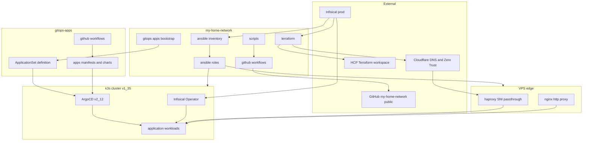
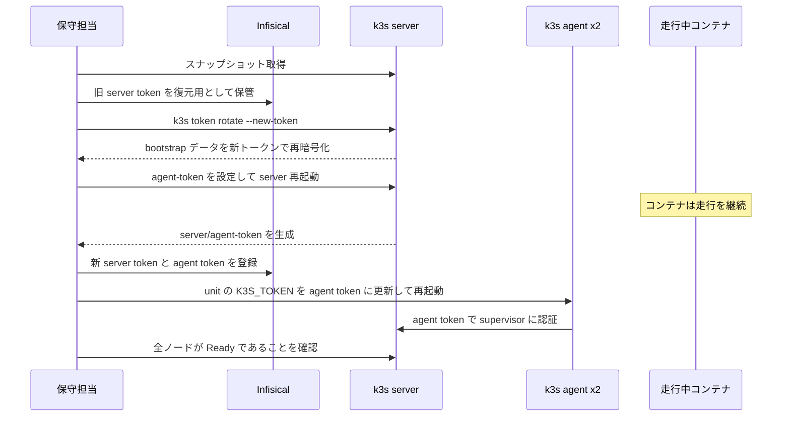
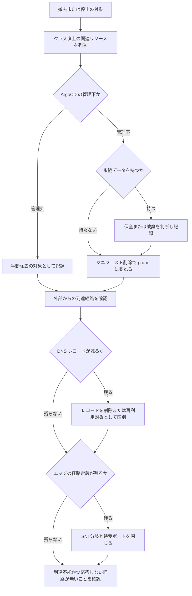
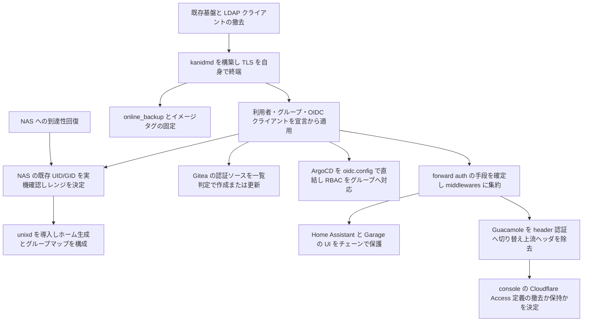
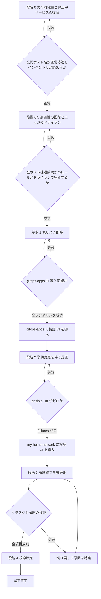

# Technical Design: iac-hygiene-remediation

## Overview

**Purpose**: 稼働中のホームラボ IaC を構成する 3 リポジトリに対し、監査で検出された品質欠陥を是正する。対象は新機能ではなく既存コードであり、成果物は「危険な状態の解消」「動作していないコードの除去または修復」「将来の変更コストの低減」「実態と一致するドキュメント」の 4 つである。

**Users**: ホームラボ管理者が単独で運用・変更する環境であり、是正の受益者も同一である。加えて `gitops-apps` で並走する `autonomous-parallel-dev-platform` が、本 spec の定める GitOps 規約を前提として設計される。

調査の過程で、公開サイトが停止していることが判明した。オリジンの証明書が 3 か月前に失効し、ゾーンの SSL 設定が厳格な検証を要求するため Cloudflare がオリジンへの接続を拒否している。証明書配布の経路が構造的に断線していたことが原因であり、これは本 spec が対象とする「動作していないコード」の帰結そのものである。復旧を段階 0 として最優先に置く。

あわせて、構成管理そのものが実行不能であることが判明した。作業ツリーに残る 5 個の Vault 暗号化ファイルに対し `ansible.cfg` が復号鍵の供給を持たないため、インベントリのパース時点で全ての play が停止する。この除去は段階 0 の最初のステップであり、他の全ての是正の前提となる。

**Impact**: `my-home-network` は Terraform / Ansible / CI が変化する。`gitops-apps` は ApplicationSet の除外設定、リソース保護アノテーション、Helm 依存の固定、mailu の撤去、認証基盤と Kubernetes Dashboard の撤去、xrayvpn の停止によりクラスタ上の稼働構成が変化する。公開リポジトリの git 履歴が書き換えられ、k3s のクラスタトークンが更新される。認証は Kanidm を単一の基盤として再構築され、Gitea / ArgoCD / NAS / Home Assistant / Garage の UI / Guacamole がその背後に置かれる。

### Goals

- 平文シークレットと漏洩済み認証情報を排除し、agent へのトークン配布を最小権限に是正する。
- 到達不能なコード、未適用のマニフェスト、参照されない変数を、修復または削除により解消する。
- mailu を撤去し、xrayvpn を復帰可能な形で停止する。いずれも到達可能かつ応答しない経路を残さない。
- 認証基盤と Kubernetes Dashboard を撤去し、認証を Kanidm 単体に集約する。ユーザー、グループ、OIDC クライアントを宣言的に定義し、NAS の POSIX アカウントを同一の基盤から供給する。
- 実行されていない検証 (`ansible-lint`、`kustomize build`、`helm template`、履歴を含むシークレットスキャン) を自動化し、是正状態を維持する仕組みを持つ。
- 各是正を独立して切り戻せる単位に分割し、高影響な変更を他と混ぜずに適用する。

### Non-Goals

- docker-mailserver (DMS) の設計・構築・移行。mailu 撤去後のメール基盤は未構築のまま残す。
- xrayvpn の削除。停止に留め、マニフェストは保持する。
- blog の新規構築。`/blog` は経路定義のみが存在し実体を持たないため、定義の削除に留める。
- 各ホストの IP アドレスの単一情報源化。重複の明示と不整合の検知に留める。
- Kubernetes クラスタの構成変更。トークンローテーションに不可避な範囲を除く。
- サービスのダウンタイムの最小化。是正の適用に伴う停止は許容範囲とし、無停止であることを段階の完了条件にも適用単位の分割基準にもしない。ただし永続データまたは復元不能な資産を失う操作は、ダウンタイムの許容とは独立に承認ゲートの対象とする。
- 上流由来ファイル (`ansible/roles/rlex.k3s/` の Galaxy 取得物、`.kiro/settings/`、`.claude/commands/`) の内容改変。取得元の二重定義解消は対象に含む。
- 撤去する認証基盤が保持する利用者・グループ・アプリケーション定義の移行。新しい基盤の定義は宣言から作り直す。
- Kubernetes Dashboard の代替となる画面の構築。クラスタの管理操作の手段は kubeconfig と端末クライアントとする。ブラウザから提供される開発ワークスペースはこの規約の対象外であり、その構築も本 spec の範囲に含めない。
- 認証基盤に統合しないサービスへの認証の追加。統合対象は Gitea、ArgoCD、NAS のログイン、Home Assistant、Garage の UI、Guacamole に限る。

## Boundary Commitments

### This Spec Owns

- `my-home-network` の `terraform/`、`ansible/`、`scripts/`、`.github/workflows/`、`README.md`、`.kiro/steering/` の内容。
- `gitops-apps` の `apps/`、`argocd/`、`.gitignore`、`.github/`、`README.md`、`.kiro/steering/` の内容。
- k3s クラスタトークンの値とその配布経路の定義。
- `my-home-network` の git 履歴に含まれる認証情報の除去。
- ホストアドレスの重複一覧と、その不整合を検知する契約。
- 自作 Kubernetes ワークロードの resources / probe / securityContext / イメージタグの規約。
- クラスタ上に存在し `gitops-apps` に対応する定義を持たないリソースの除去または取り込みの判断。
- エッジホストの証明書供給、待受ポート集合、ネットワークフィルタ、稼働サービス集合。
- 管理対象ホストへの接続鍵の配布状態。
- シークレット管理基盤のキー空間と、両リポジトリからの参照の対応。
- ノード上のローカルストレージ領域の確保状態。
- `portfolio` のビルド方式・配信基盤の定義・デプロイワークフロー、およびその配信先を指す DNS レコードとエッジホスト側の経路定義。
- 認証基盤の稼働定義、その利用者・グループ・OIDC クライアントの宣言、および各サービスが認証基盤を参照する設定。
- NAS の POSIX アカウント解決の構成と、UID/GID の割当レンジ。

### Out of Boundary

- DMS の構築とメール DNS の再設計。本 spec は mailu 向けレコードの削除と、DMS で再利用する値の区別までを行う。
- `autonomous-parallel-dev-platform` が導入するワークロードそのもの。本 spec はそれが従う規約を定めるに留まる。認証基盤に用意する開発基盤向けの OIDC クライアントは宣言の定義までを扱い、それを用いる開発環境の構築は含めない。
- 開発ワークスペース向けの仮想マシンの作成と配置。本 spec は死蔵領域の解放と解放容量の記録までを扱い、解放した容量の使途は決めない。
- Proxmox ホスト側の証明書の発行・配布。TLS 検証の有効化が証明書の入れ替えを要する場合、その実施は本 spec の範囲外とし、判断材料の提示までを行う。
- Infisical に格納された値そのものの管理。参照経路の定義のみを扱う。ただしキーの棚卸しと参照の整合は対象に含む。
- ローテーション不可能な外部サービスの認証情報の値そのもの。平文保持箇所の削減までを扱う。
- 上流の導入物に付随するカスタムリソース定義の削除。保持の是非の判断までを扱う。
- k3s クラスタ上の永続データの復旧。クラスタ上に復旧を要するデータは存在せず、クラスタ全体の再構築を許容範囲とする。クラスタ内のリソース削除は保全手順を伴わない。この前提はクラスタの外側 (Proxmox ゲスト、ホスト上のファイルシステム、リポジトリの履歴) には及ばない。
- `rlex.k3s` role 本体の機能追加。取得元の一本化と、呼び出し側からの変数注入までを扱う。
- `portfolio` の画面・コンテンツ・依存フレームワークのバージョン更新。移設に必要な範囲の変更のみを扱う。

### Allowed Dependencies

- Infisical (`workspaceId` は `.infisical.json` で固定、環境は `prod` 単一) をシークレットの単一の正として利用する。
- HCP Terraform (`organization = fickledev`, workspace `my-home-network`) を Terraform state の保管先として利用する。
- ArgoCD v2.12.1 の ApplicationSet git directory generator と sync-options アノテーションに依存する。
- k3s v1.35.0+k3s3 の `k3s token rotate` サブコマンドに依存する。
- metrics-server の稼働に依存する (`kubectl top` による resources の実測のため)。
- Kanidm (`kanidmd` サーバと `kanidm-unixd` クライアント) を唯一の認証基盤として利用する。宣言的な適用は非公式の実装 (`kanidm-provision` または Terraform provider) に依存し、供給元とバージョンを固定する。
- Kanidm の公式 PPA を NAS の apt パッケージソースとして利用する。
- Traefik の forward auth middleware に依存する。実現手段は単一に定め、`apps/common/middlewares.yaml` に集約する。
- 依存制約: `gitops-apps` のマニフェストは `my-home-network` の Ansible 変数を参照しない。逆方向も同様。両リポジトリ間で共有するのは Gitea の URL、認証基盤の公開ホスト名、およびクラスタの実体のみであり、その重複は要件 7.9 の一覧に記録する。

### Revalidation Triggers

- k3s トークンの種類 (server / agent) の変更 — agent の join 手順に影響するため、クラスタへのノード追加手順を再確認する。
- ApplicationSet の `directories` 定義の変更 — 生成される Application の集合が変わるため、`apps/` にディレクトリを追加する全ての作業が影響を受ける。
- `Prune=false` を付与するリソースの集合の変更 — 削除時の挙動が変わるため、撤去作業の手順を再確認する。
- ホストアドレスの重複一覧の変更 — 整合チェックの判定対象が変わるため、チェック実装の更新を要する。
- 認証基盤のグループ名の変更 — ArgoCD の RBAC と NAS のログイン許可グループが大文字小文字まで一致する前提で構成されるため、双方の設定を再確認する。
- 認証基盤のマイナーバージョンの更新 — バックアップからの復元が同一バージョンでのみ成立するため、保持しているバックアップとイメージタグの対応を再確認する。
- 自作ワークロードの resources 規約の変更 — `autonomous-parallel-dev-platform` を含む全ワークロードが再検証の対象となる。

## Architecture

### Existing Architecture Analysis

**現行の構造と制約**

- 2 層 IaC。Terraform が Proxmox 上に VM/LXC を作成し、Ansible が OS とミドルウェアを構成する。ArgoCD が `gitops-apps` を k3s へ同期する。
- Ansible の role 粒度は「ホスト役割単位」であり、横断的機能を担う role の前例がない。`ansible/ansible.cfg:4` の `roles_path = ./roles:./playbooks/roles` により `ansible/roles/` 直下に role を追加できる。
- シークレットは Infisical に集約済みで、`lookup('env', ...)` が 27 箇所。Kubernetes 側は Infisical Operator が `InfisicalStaticSecret` で同期する。認証はクラスタ全体で共有される単一の `InfisicalAuth` を指す。
- ArgoCD は ApplicationSet の git directory generator で `apps/*` を全走査する。除外定義がないため、`apps/base` と `apps/common` も Application として生成される。generator が渡すのは `path` と `path.basename` のみで、マニフェスト本文へ値を注入する経路が存在しない。
- syncPolicy は全 Application 一律で `prune: true` + `selfHeal: true`。リソース単位の保護アノテーションの使用実績はゼロ。

**維持する境界**

- Terraform (リソース作成) と Ansible (構成適用) の責務分離。
- `gitops-apps` を ArgoCD が読む唯一のマニフェスト源とする構造。`my-home-network/gitops/apps/` は ApplicationSet の初期投入定義のみを持つ。
- Infisical を唯一のシークレット供給経路とする一方向構成。

**対処する技術的負債**

- `playbooks/` に tasks ファイルを配置する構造 (`ansible-lint` の唯一の FATAL の原因)。
- agent への server token 配布。`/var/lib/rancher/k3s/server/node-token` は `server/token` へのシンボリックリンクであり、agent にクラスタ管理者権限が渡っている。
- `Chart.lock` と `charts/` がいずれも追跡されず、依存バージョンが再現不能な状態。
- 未適用のまま残る個別 Application 定義 (`argocd/mailu-application.yaml`) とマニフェスト群 (`apps/xrayvpn/` の 8 ファイル)。

### Architecture Pattern & Boundary Map

**Selected pattern**: リスク階層型の段階適用。是正を影響度と可逆性で 4 段階に分け、段階ごとに完了条件と検証手段を定義する。段階間の依存は「前段階の完了が後段階の前提条件になる」場合のみ許す。



**Architecture Integration**:

- **Domain/feature boundaries**: 是正はリポジトリと技術層で分割する。Terraform 層、Ansible 層、GitOps 層、横断層 (検証・ドキュメント) の 4 領域とし、各領域の変更が他領域のファイルに触れないことを分割の条件とする。mailu 撤去と xrayvpn 停止のみが Terraform 層と GitOps 層をまたぐため、この 2 つは領域横断のワークストリームとして独立させる。
- **Existing patterns preserved**: Terraform と Ansible の責務分離、`lookup('env', ...)` による変数間接化層、Infisical への一方向のシークレット供給、ApplicationSet による Application の自動生成。
- **New components rationale**: `storage_disk` role はディスクプロビジョニングの重複解消と `ansible-lint` の FATAL 解消を同時に達成する唯一の手段として新設する。ホストアドレス整合チェッカは、単一情報源化を回避した結果として不整合の検知を担う新しい責務であり、既存のどこにも置き場がない。CI ワークフローは両リポジトリに存在しないため新設する。
- **Steering compliance**: `structure.md` の「1 role = 1 コンポーネント」に対し `storage_disk` は横断的機能 role という新しい粒度を導入する。この逸脱は steering に記録する (要件 11.5 と同じ更新で扱う)。

**Dependency direction**: `Infisical / Terraform locals` → `Ansible inventory` → `Ansible roles` → `playbooks` の順で、逆方向の参照を禁じる。role は inventory の具体的な変数名ではなく一般名の変数のみを参照する既存の間接化層を維持する。GitOps 側は `values / kustomization` → `templates / resources` → `cluster` の一方向とし、マニフェストが Ansible 変数を参照しない。

### Technology Stack

| Layer | Choice / Version | Role in Feature | Notes |
|-------|------------------|-----------------|-------|
| Infrastructure / Runtime | k3s v1.35.0+k3s3 | トークンローテーションの実行基盤 | `k3s token rotate` は v1.28.3+k3s1 以降で利用可能 |
| Infrastructure / Runtime | ArgoCD v2.12.1 | ApplicationSet の除外と sync-options 保護 | `exclude: true` と `Prune=false` の双方に対応 |
| Configuration Management | Ansible >= 10.7.0 / ansible-lint >= 26.3.0 | 是正対象および検証手段 | 現状 23 failures、うち 1 件 FATAL |
| Configuration Management | community.crypto | 証明書の有効期限判定 (`x509_certificate_info` の `valid_at`) | 新規依存。`ansible/collections/requirements.yml` に宣言 |
| Configuration Management | ansible.posix / community.general / kubernetes.core | 既に使用中だが未宣言 | 同ファイルに宣言し README と steering の記述と一致させる |
| IaC | Terraform >= 1.5.0 / bpg/proxmox | 安全でない既定値の是正と `ignore_changes` の見直し | provider のバージョン上限を設定する |
| Data / Storage | Helm `Chart.lock` | 依存バージョンの固定 | lock 不在時は `dependency build` が `update` にフォールバックする |
| Observability | metrics-server (稼働中) | `kubectl top` による resources 実測 | 新規導入なし。VPA は採用しない |
| CI | GitHub Actions / gitleaks-action v2 | 検証の自動実行 | v2 は引数がハードコードで走査範囲がイベント種別に依存する |
| Tooling | git-filter-repo | git 履歴からのシークレット除去 | GitHub 公式が推奨する唯一のツール |
| Tooling | Python >= 3.10 (uv 管理) | ホストアドレス整合チェッカ | 既存の `scripts/` と同じ実行環境 |
| Edge / Certificates | Cloudflare Origin CA (有効期間 15 年) | プロキシ経由のホスト名への証明書供給 | Cloudflare が既に Terraform 管理下にあり、証明書を宣言として保持できる。更新機構と更新失敗の故障モードを持たない |
| Edge / Certificates | ACME クライアント (エッジホスト常駐) + DNS-01 | プロキシを経由しないホスト名と Cloudflare ゾーン外のホスト名への証明書供給 | `tochiweb.mydns.jp` は Cloudflare ゾーンに属さず Origin CA が適用できない。配布方式を置き換える |
| Edge / Runtime | Ubuntu 24.04 (VPS), nginx, haproxy | 公開経路の終端 | ホスト側フィルタが不在。上流の制御のみに依存 |
| Identity | Kanidm (`kanidmd`) | 唯一の認証基盤。OIDC provider と POSIX ディレクトリを兼ねる | TLS を自身で終端する。StartTLS 非対応。LDAP は read-only。implicit flow を拒否する。マイナーバージョンを飛ばした更新に非対応 |
| Identity | Kanidm 宣言的適用 (`kanidm-provision` または Terraform provider) | 利用者・グループ・OIDC クライアントの冪等な適用 | いずれも上流の公式提供物ではない。供給元とバージョンを固定する |
| Identity | `kanidm-unixd` / `kanidm-unixd-tasks` (公式 PPA) | NAS の POSIX アカウント解決とホームディレクトリの自動生成 | `passwd` による変更を認証基盤へ反映しない。UID/GID レンジは実機確認のうえ決定する |
| Identity | Traefik forward auth middleware | Home Assistant / Garage の UI / Guacamole の保護 | `apps/common/middlewares.yaml` に集約する。既存の接続元アドレス制限と連鎖させる。Garage の S3 API パスには適用しない |
| Identity | `guacamole-auth-header` 拡張 | Guacamole の認証 | 上流から到達する利用者識別ヘッダの除去が成立条件 |
| Quality | yamllint 1.38 | YAML の静的検査 | 除外設定が前提。無設定では 6152 件 |
| Quality | pytest | スクリプトのテスト実行 | 未宣言のため現在テストが一度も実行されていない |

## File Structure Plan

### Directory Structure

```
my-home-network/
├── ansible/
│   ├── collections/
│   │   └── requirements.yml          # 新規: collection 依存の宣言 (README と steering が参照済み)
│   ├── roles/
│   │   ├── storage_disk/             # 新規: ディスクプロビジョニングの共通 role
│   │   │   ├── defaults/main.yml     #   disk_item の既定値とファイルシステム種別のパッケージ写像
│   │   │   ├── meta/main.yml
│   │   │   └── tasks/main.yml        #   configure_scsi_disk.yml の内容を昇格
│   │   ├── kanidm_unixd/             # 新規: NAS の POSIX アカウント解決
│   │   │   ├── defaults/main.yml     #   UID/GID レンジ、home_* 設定、許可グループ、map_group
│   │   │   ├── handlers/main.yml
│   │   │   ├── tasks/main.yml        #   PPA の登録、パッケージ導入、参加、サービス起動
│   │   │   └── templates/            #   unixd / nsswitch / pam の設定
│   │   └── sssd/                     # 削除
│   └── playbooks/
│       ├── kanidm_unixd.yml          # 新規: NAS への POSIX 統合の適用
│       ├── sssd.yml                  # 削除
│       └── (configure_scsi_disk.yml と setup_minio_storage.yml を削除)
├── scripts/
│   └── check_host_addresses.py       # 新規: ホストアドレスの重複一覧と不整合検知
├── docs/
│   └── host-addresses.md             # 新規: 重複定義箇所の一覧 (要件 7.1 の成果物)
├── .ansible-lint                     # 新規: exclude_paths と profile
└── .github/workflows/
    ├── secret-scan.yml               # 変更: 効果のない args を除去、fetch-depth を修正
    ├── secret-scan-history.yml       # 新規: schedule トリガの全履歴走査
    └── validate.yml                  # 新規: terraform validate + ansible-lint + アドレス整合チェック

gitops-apps/
├── .gitignore                        # 変更: charts/ を追加 (Chart.lock は追跡)
├── apps/
│   ├── argocd/applicationset.yaml    # 変更: base と common を exclude
│   ├── common/middlewares.yaml       # 変更: forward auth middleware とチェーンを追加
│   ├── kanidm/                       # 新規: 認証基盤の稼働定義
│   │   ├── kustomization.yaml
│   │   ├── namespace.yaml
│   │   ├── statefulset.yaml          #   SQLite を保持する永続ボリューム、自前 TLS 終端
│   │   ├── service.yaml
│   │   ├── ingress.yaml
│   │   ├── certificate.yaml
│   │   ├── infisical-secret.yaml
│   │   ├── provision-job.yaml        #   利用者・グループ・OIDC クライアントの冪等な適用
│   │   └── provision/                #   宣言定義の本体
│   ├── authentik-fickledev/          # 削除
│   ├── kubernetes-dashboard/         # 削除
│   ├── mailu/                        # 削除
│   ├── postgres/
│   │   ├── authentik-fickledev-cluster.yaml   # 削除
│   │   ├── backups.yaml              # 変更: 撤去したクラスタの ScheduledBackup を削除
│   │   └── postgres-cluster.yaml     # 変更: 撤去した基盤向けの DB / ロール宣言を削除
│   └── xrayvpn/                      # 変更: 未適用 8 ファイルを削除、replicas を 0 に
├── argocd/mailu-application.yaml     # 削除
└── .github/workflows/
    └── validate.yml                  # 新規: kustomize build + helm dependency build + helm template

portfolio/
├── wrangler.jsonc                    # 新規: 静的資産の配信先と動的経路の振り分け
├── worker/index.js                   # 新規: 問い合わせ経路の fetch ハンドラ
├── next.config.js                    # 変更: 静的エクスポートと画像最適化の無効化、実験的設定の除去
├── tailwind.config.cjs               # 変更: 生成対象に app ディレクトリを追加
├── app/
│   ├── api/                          # 削除
│   └── actions.js                    # 削除
├── actions.js                        # 削除
└── .github/workflows/
    └── deploy.yml                    # 変更: イメージ転送と SSH 経由の配置を wrangler による配信に置換
```

### Modified Files

**Terraform 層**

- `terraform/variables.tf` — 認証情報変数に機微指定を付与し既定値を除去。TLS 検証スキップの既定値を反転。環境依存値の既定値を除去。未使用変数を削除。
- `terraform/versions.tf` — provider のバージョンに上限を設定。
- `terraform/modules/vm/main.tf` / `modules/container/main.tf` — `ignore_changes` から `disk` と `user_account` を除去。残す属性には理由を記録。データストア名を変数化。
- `terraform/locals.tf` — コメントアウトされたホスト定義を削除。
- `terraform/cloudflare_dns.tf` — VPS アドレスとゾーン名を変数化。共通属性のレコードを反復定義に変換。mailu 向けレコードを削除し、xrayvpn 向け (`appflowy.fickledev.com`) の扱いを要件 13 に従って決定。
- `terraform/cloudflare_dns.tf` — `root_a` / `root_aaaa` / `www_a` / `www_aaaa` を削除し、Workers のカスタムドメイン定義に置換。
- `terraform/cloudflare_waf.tf` / `terraform/.env.example` — 削除。
- `terraform/cloudflare_zero_trust.tf` — タスク識別子を含むコメントを除去。撤去する認証基盤へのトンネル ingress ルートを削除し、Kanidm の公開ホスト名のルートを追加。`console.fickledev.com` の Access アプリケーションとポリシーは、Guacamole の認証を Kanidm へ移した後に撤去か保持かを決定する。

**Ansible 層**

- `ansible/roles/nas/tasks/storage.yml` — `storage_disk` role の呼び出しに置換。
- `ansible/playbooks/setup_agent_storage.yml` — `include_tasks` を `include_role` に変更。
- `ansible/roles/letsencrypt/` — 有効期限判定を `x509_certificate_info` に置換。証明書と秘密鍵の反復処理を統合。無効化された 165 行と空の反復を削除。
- `ansible/roles/vps_proxy/` — メール用 frontend と証明書バンドル生成を削除。一度限りの移行処理を削除。前提条件チェックを先頭へ移動。xray SNI 定義を要件 13 に従って無効化。未参照変数を削除。`fickledev.com` / `www.fickledev.com` の vhost と `/blog` の経路、および `vps_proxy_upstream_main` / `vps_proxy_upstream_blog` を削除。
- `ansible/roles/gitea/` — データディレクトリのパーミッションを是正。管理者作成失敗の既定挙動を変更。ロックファイルの無条件削除を見直し。重複タスクを統合。
- `ansible/roles/proxmox_backup/` — 作成と更新のリクエスト本文を共有。`changed_when` の固定を解消。`no_log` の適用範囲を限定。role defaults の環境変数二重読みを解消。
- `ansible/roles/nfs_client/tasks/main.yml` — マウント状態の事前チェックを削除し `state: mounted` に委ねる。
- `ansible/roles/argocd/` — 未参照変数 17 個を削除。テンプレートの直書き値を defaults 参照に変更。待機処理を単一タイムアウトに統一。
- `ansible/roles/nas/` — 重複タスクを削除。handler 名の大文字化。空の `vars/main.yml` を削除。
- `ansible/roles/sssd/` / `ansible/playbooks/sssd.yml` — 削除。POSIX 統合は `kanidm_unixd` role が担う。
- `ansible/roles/gitea/` — 認証ソースの登録を、一覧取得による有無の判定と作成・更新の分岐として実装。
- `ansible/inventory/` — `frontier` の不整合を解消。`k3s` グループ変数の型不一致を修正。k3s トークンの参照を agent token へ切り替え。未参照変数とコメントアウトを削除。作業ツリーの Vault 暗号化ファイル 5 個を削除。LDAP bind 用の認証情報変数を削除し、NAS 向けに `kanidm_unixd` の変数を定義。鍵をパスで指定する記述を除去し、Infisical 由来の供給に置き換え。接続ユーザーの割当は現状のまま維持。
- `ansible/ansible.cfg` — ホスト鍵検証の方針を一本化。非推奨設定を除去。存在しない `roles_path` エントリを削除。
- `ansible/playbooks/site.yml` / `k3s.yml` — プレースホルダを解消し、`import_playbook` に名前を付与。孤立 playbook の位置づけを決定。

**GitOps 層**

- `apps/authentik-fickledev/` — 削除。平文パスワード、`latest` タグ、名称と一致しない NetworkPolicy、マウントされない ConfigMap、主コンテナとワーカーの env 重複がこの削除で同時に解消される。
- `apps/garage/` — Ingress のバックエンドを修正。不要マウントを削除。`Chart.yaml` の `appVersion` を実体に一致させる。セットアップ Job のインラインスクリプトを見直し。バックアップの二重削除を解消。UI のパスのみを forward auth の対象とする。
- `apps/postgres/` — 未登録マニフェストの扱いを決定。撤去する基盤専用のクラスタとその ScheduledBackup、および共有クラスタの bootstrap から当該 DB / ロールの宣言を削除。PVC と Cluster に `Prune=false` / `Delete=false` を付与。
- `apps/kubernetes-dashboard/` — 削除。TLS 検証のスキップ、未登録の公開定義の二重定義、保守終了イメージ、実装と乖離した README がこの削除で同時に解消される。
- `apps/common/middlewares.yaml` — forward auth の middleware と、既存の接続元アドレス制限を含むチェーンを追加。
- `apps/argocd/` — `argocd-cm` の `oidc.config` と `argocd-rbac-cm` の `policy.csv` を追加。CLI 用の公開クライアントを登録。
- `apps/cluster-issuer/cluster-issuer.yaml` — ACME 連絡先を実在アドレスに。タスク識別子コメントを除去。
- `apps/home-assistant/values.yaml` — 起動時の外部取得を再現可能な手段に置換、または除去。forward auth の背後に置き、内蔵認証を保持したまま転送元アドレスの解釈と信頼するプロキシを設定。コンパニオンアプリの経路を適用除外とする。
- `apps/cnpg-operator/` — 取得元とバージョンを識別可能にする。
- `gitops-apps/README.md` / `.kiro/steering/` — ApplicationSet の除外設定、ワークロード一覧、定義方式の基準を実態に同期。

**ドキュメント**

- `README.md` — 打ち消し線付きの経緯 17 行を削除。NAS の記述を実装に一致させる。存在しないファイルへの参照を解消。メールと xrayvpn の現状を反映。
- `.kiro/steering/tech.md` — `collections/requirements.yml` の手順、`vault.yml.example` の位置づけ、lint の実行手順を実態に一致させる。
- `.kiro/steering/structure.md` — `gitops-apps` および `portfolio` との境界と、本 spec が 3 リポジトリを横断する事実を記述。`storage_disk` role の粒度の逸脱を記録。
- `.kiro/steering/product.md` — ワークロード一覧を実態に一致させる。

## System Flows

### k3s トークンのローテーションと配布経路の是正



ローテーション自体は API 呼び出しであり、停止は server 再起動中のコントロールプレーン API の断に留まる。ノードの削除と再 join は不要で、新トークンでの再起動のみで足りる。停止の長さは手順の選択基準にしない。旧トークンはローテーション前のスナップショットの復元に必要なため破棄しない。

### 撤去と停止の判断フロー



mailu では `pvc/redis-data-mailu-redis-master-0` が ArgoCD の管理外に該当し、手動除去が必須となる。xrayvpn では PVC が存在しないため保全判断は不要だが、`appflowy.fickledev.com` の DNS レコードと VPS の SNI 分岐が「外部からの到達経路」に該当する。

### 認証基盤の構築と統合



Garage は S3 API と UI で扱いを分ける。`Fwd` が生成する middleware の適用対象は UI のパスに限り、API のパスに適用すると AWS 署名 v4 の検証が壊れる。`Guac` は上流から到達する利用者識別ヘッダの除去を成立条件とし、除去のない構成では認証が迂回される。

## Requirements Traceability

| Requirement | Summary | Components | Interfaces | Flows |
|-------------|---------|------------|------------|-------|
| 1.1-1.3 | 平文シークレットの除去 | SecretHygiene, AuthentikDecommission, XrayvpnSuspension | InfisicalStaticSecret | 撤去と停止 |
| 1.4-1.5, 1.8 | k3s トークンのローテーション | ClusterTokenRotation | k3s token rotate | トークンローテーション |
| 1.6-1.7 | git 履歴からの除去 | HistorySanitization | git-filter-repo | — |
| 1.9-1.11 | 資格情報のローテーション、発行方式、残存リスクの記録 | SecretHygiene | Infisical キー空間 | — |
| 2.1-2.5 | スキャン範囲の是正 | SecretScanPipeline | GitHub Actions | — |
| 3.1-3.3 | Terraform の安全な既定値 | TerraformHardening | variable 定義 | — |
| 3.4-3.8 | 権限と検証の既定値 | SecretHygiene, WorkloadGuardrails, AuthentikDecommission, DashboardDecommission | role defaults, マニフェスト | — |
| 4.1-4.4 | GitOps の破損修復 | ManifestRepair | kustomization, chart templates | — |
| 4.5-4.6 | エッジ設定の破損修復 | EdgeProxyRepair | haproxy テンプレート | 撤去と停止 |
| 4.7-4.9 | Terraform の差分抑止解除 | TerraformHardening | module lifecycle | — |
| 4.10-4.14 | インベントリと依存の整合 | AnsibleIntegrity | inventory, requirements.yml | — |
| 5.1-5.7 | mailu の撤去 | MailuDecommission | ApplicationSet, DNS, haproxy | 撤去と停止 |
| 6.1-6.6 | ディスク処理の共通化 | StorageDiskRole | disk_item 契約 | — |
| 6.7-6.15 | その他の重複解消 | DuplicationConsolidation, AuthentikDecommission | role tasks, chart helpers | — |
| 7.1-7.3 | アドレス重複の検知 | HostAddressDriftCheck | チェッカ契約 | — |
| 7.4-7.13 | 環境固有値の集約 | TerraformHardening, ManifestRepair, AuthentikDecommission | variable, values | — |
| 8.1-8.18 | 冪等性とエラー処理 | AnsibleIntegrity, ManifestRepair | role tasks | — |
| 9.1-9.14 | デッドコードの除去 | DeadCodeRemoval, AuthentikDecommission, DashboardDecommission | — | — |
| 10.1-10.3, 10.12, 10.13 | ワークロードの品質ガード | WorkloadGuardrails | `kubectl top` 実測値, patch / values | — |
| 10.4-10.6, 10.11 | イメージと依存の固定 | WorkloadGuardrails, AuthentikDecommission, DashboardDecommission, IdentityPlatform | Chart.lock, タグ | — |
| 10.7-10.8 | prune 保護と namespace 規約 | GitOpsSyncPolicy | sync-options アノテーション | — |
| 10.9-10.10, 7.14, 21.9 | 定義方式の統一と生成対象の除外 | GitOpsSyncPolicy | ApplicationSet exclude | — |
| 11.1-11.11 | ドキュメントと steering | DocsSync, AuthentikDecommission, DashboardDecommission | — | — |
| 12.1-12.4, 12.10-12.17 | 段階適用と切り戻し、停止可能な段階境界、破壊的操作の承認ゲート | 全コンポーネント | — | 撤去と停止 |
| 12.5-12.9 | 検証の自動化 | VerificationPipeline | GitHub Actions | — |
| 13.1-13.6 | xrayvpn の停止 | XrayvpnSuspension | replicas, SNI, DNS | 撤去と停止 |
| 14.1-14.7 | クラスタ孤児の除去 | ClusterOrphanCleanup | ArgoCD 管理ラベル | 撤去と停止 |
| 15.1-15.15 | エッジ証明書の再建と単一機構への収束 | EdgeCertificateSupply | Cloudflare Origin CA, ACME クライアント | 証明書供給の再建 |
| 16.1-16.13 | エッジ実機と定義の整合 | EdgeHostAlignment | vps_proxy テンプレート | — |
| 17.1-17.11 | 実行環境に依存しない到達性の確立と接続鍵の IaC 化 | HostReachability | SSH 鍵, inventory, Infisical キー空間 | — |
| 18.1-18.8, 18.11 | 死蔵ストレージの解放、解放容量の記録、割当の見直し方針 | StorageReclamation | fstab, disk_item, locals.tf の zfs_pools, 解放容量の記録 | — |
| 18.9-18.10 | ゲスト内で解放された領域の返却 | StorageReclamation, TerraformHardening | vm モジュールの disk 属性, module lifecycle | — |
| 19.1-19.17 | 定期実行の是正と PBS バックアップ構成の再構築 | ScheduleAndBackupRepair | ScheduledBackup, CronJob, proxmox_backup ロール, storage.cfg, jobs.cfg, Infisical キー空間 | — |
| 20.1-20.7 | シークレット棚卸し | SecretInventory | Infisical キー空間 | — |
| 21.1-21.12 | 重複制御機構の解消 | ControlPlaneDeduplication | ApplicationSet, Reflector | — |
| 22.1-22.9 | 静的品質ゲートの拡張 | StaticQualityGates | CI ワークフロー | — |
| 23.1-23.6 | リポジトリ資産の整理 | RepositoryHousekeeping | git ブランチ, gitignore | — |
| 24.1-24.21 | portfolio の Workers 移設 | PortfolioWorkersMigration | wrangler 設定, Worker fetch ハンドラ, DNS | — |
| 25.1-25.11 | 認証基盤と LDAP クライアントの撤去 | AuthentikDecommission | ApplicationSet, CNPG bootstrap, Zero Trust ingress, DNS, sssd role | 撤去と停止 |
| 26.1-26.9, 26.17 | 認証基盤の構築と宣言的定義 | IdentityPlatform | kanidmd, provisioning 定義, online_backup | 認証基盤の構築と統合 |
| 26.10-26.16 | NAS の POSIX 統合 | PosixIdentityIntegration | kanidm-unixd 設定契約 | 認証基盤の構築と統合 |
| 26.37-26.38 | LDAPS の待受とアプリケーション単位の認証情報 | IdentityPlatform | LDAPS bind 契約 | 認証基盤の構築と統合 |
| 26.18-26.36 | サービスの認証統合 | ServiceAuthIntegration | OIDC クライアント, forward auth の判定ワークロードと middleware, header 認証, Gitea / ArgoCD の HTTPS 公開オリジン | 認証基盤の構築と統合 |
| 27.1-27.6 | Kubernetes Dashboard の撤去 | DashboardDecommission | ApplicationSet, DNS | 撤去と停止 |
| 28.1-28.7 | 仮想化基盤上のゲストと定義の整合 | ProxmoxGuestAlignment | locals.tf, PVE ゲスト一覧 | — |
| 29.1-29.5 | クラスタ内の証明書発行系のシークレット供給 | SecretInventory | ClusterIssuer, Infisical | — |

## Components and Interfaces

| Component | Domain/Layer | Intent | Req Coverage | Key Dependencies (P0/P1) | Contracts |
|-----------|--------------|--------|--------------|--------------------------|-----------|
| ClusterTokenRotation | Security | クラスタトークンを更新し agent への配布を最小権限にする | 1.4, 1.5, 1.8, 3.x | k3s server (P0), Infisical (P0), rlex.k3s (P1) | Batch |
| HistorySanitization | Security | public リポジトリの履歴から認証情報を除去する | 1.6, 1.7, 1.8 | GitHub (P0), git-filter-repo (P0) | Batch |
| SecretScanPipeline | Security | 差分と全履歴の双方を走査する | 2.1-2.6 | gitleaks-action (P0) | Batch |
| SecretHygiene | Security | 平文値を Infisical 参照へ移し権限既定値を是正する。資格情報をローカル生成で更新し、不能なものの残存リスクを記録する | 1.1-1.3, 1.9-1.11, 3.4-3.8 | Infisical Operator (P0), openssl (P0) | State |
| TerraformHardening | IaC | 安全な既定値と差分抑止の解除、値の集約 | 3.1-3.3, 4.7-4.9, 7.4-7.5, 7.12 | HCP Terraform (P0), bpg/proxmox (P1) | State |
| StorageDiskRole | Ansible | ディスクプロビジョニングの唯一の実装 | 6.1-6.6 | ansible.posix (P0) | Service |
| AnsibleIntegrity | Ansible | 冪等性とエラー処理、インベントリ整合の回復 | 4.10-4.14, 8.x | community.crypto (P1) | Service |
| EdgeProxyRepair | Ansible | VPS の経路定義から死んだ設定を除去する | 4.5, 4.6, 13.3, 13.4 | haproxy (P0) | State |
| DuplicationConsolidation | 横断 | 重複した定義を単一の定義に集約する | 6.7-6.15 | — | — |
| MailuDecommission | 横断 | mailu を痕跡なく撤去する | 5.1-5.7 | ArgoCD (P0), Cloudflare (P1) | Batch |
| AuthentikDecommission | 横断 | 既存の認証基盤と LDAP クライアント設定を痕跡なく撤去する | 25.1-25.11, 1.2, 3.7, 6.13, 7.11 | ArgoCD (P0), CNPG (P0), Cloudflare (P1), Infisical (P1) | Batch |
| DashboardDecommission | GitOps | Kubernetes Dashboard を撤去し管理操作の手段を kubeconfig に寄せる | 27.1-27.6, 3.5 | ArgoCD (P0), Cloudflare (P1) | Batch |
| IdentityPlatform | Security | 認証基盤を構築し、その定義を宣言的かつ冪等に適用する | 26.1-26.9, 26.17 | k3s (P0), cert-manager (P0), Infisical (P0), kanidm-provision (P1) | State, Batch |
| PosixIdentityIntegration | Ansible | NAS の POSIX アカウント解決とホームディレクトリ生成を認証基盤へ寄せる | 26.10-26.16 | IdentityPlatform (P0), HostReachability (P0), Kanidm PPA (P1) | Service |
| ServiceAuthIntegration | 横断 | 各サービスの認証を認証基盤へ統合する | 26.18-26.33 | IdentityPlatform (P0), Traefik (P0), Gitea (P1), ArgoCD (P1) | State, Service |
| XrayvpnSuspension | 横断 | xrayvpn を復帰可能な形で停止する | 13.1-13.6 | ArgoCD (P0), haproxy (P0) | State |
| GitOpsSyncPolicy | GitOps | 削除と生成の制御粒度を定義する | 10.7-10.10, 7.14, 21.9 | ArgoCD ApplicationSet (P0) | State |
| WorkloadGuardrails | GitOps | ArgoCD が管理するワークロードの品質規約を確立する | 10.1-10.6, 10.11-10.13, 3.5, 3.6 | metrics-server (P0) | State |
| ManifestRepair | GitOps | 破損した参照と重複定義を修復する | 4.1-4.4, 7.6-7.7, 7.13, 8.14-8.17 | — | — |
| ClusterOrphanCleanup | 横断 | Git に対応物のないクラスタ上のリソースを除去する | 14.1-14.7 | ArgoCD (P0) | Batch |
| EdgeCertificateSupply | エッジ | エッジホストの証明書供給を Origin CA と ACME の 2 機構で確立し、移設の完了後に ACME 単独へ収束させる | 15.1-15.15 | Cloudflare Origin CA (P0), ACME (P0) | Service, Batch |
| EdgeHostAlignment | エッジ | エッジホストの実機状態と定義を一致させ、ロールを完走可能にする | 16.1-16.13 | vps_proxy ロール (P0) | State |
| ProxmoxGuestAlignment | IaC | 仮想化基盤上のゲストと Terraform の定義の対応を確定する | 28.1-28.6 | HostReachability (P0), PVE API (P0) | — |
| PortfolioWorkersMigration | エッジ | 公開サイトの配信を自宅とエッジホストから切り離す | 24.1-24.21 | Cloudflare Workers (P0), Infisical (P0), Terraform (P1) | Service, Batch |
| HostReachability | Ansible | 到達性を実行環境に依存しない形で確立し、到達しない 2 コンテナへの接続を回復する | 17.1-17.11 | Infisical (P0), pct exec (P0) | State |
| StorageReclamation | 横断 | 死蔵した領域と孤児ディレクトリを解放し解放容量を記録する | 18.1-18.6 | StorageDiskRole (P1) | Batch |
| ScheduleAndBackupRepair | 横断 | 定期実行の頻度と成果物の保持を是正し、PBS のバックアップ構成を定義から再構築する | 19.1-19.14 | CNPG (P0), HostReachability (P0), Infisical (P0) | Batch |
| SecretInventory | Security | シークレット基盤の内容と参照を一致させる | 20.1-20.7 | Infisical (P0) | State |
| ControlPlaneDeduplication | GitOps | 同一対象を制御する重複機構を解消する | 21.1-21.12 | ArgoCD (P0), Reflector (P1) | State |
| StaticQualityGates | 横断 | 検査されていない記述とコードに検査を導入する | 22.1-22.9 | GitHub Actions (P0) | Batch |
| RepositoryHousekeeping | 横断 | 放置された枝と空のリポジトリを整理する | 23.1-23.6 | GitHub, Gitea (P1) | — |
| HostAddressDriftCheck | 横断 | アドレスの重複を明示し不整合を検知する | 7.1-7.3, 7.9 | Python 3.10+ (P0) | Service |
| DeadCodeRemoval | 横断 | 参照されない定義とアーティファクトを除去する | 9.1-9.14 | — | — |
| VerificationPipeline | 横断 | 是正状態を維持する検証を自動実行する | 12.5-12.9 | GitHub Actions (P0) | Batch |
| DocsSync | 横断 | ドキュメントと steering を実態に一致させる | 11.1-11.11 | — | — |

### Security

#### ClusterTokenRotation

| Field | Detail |
|-------|--------|
| Intent | k3s のクラスタトークンを更新し、agent へ配布するトークンを管理者権限から agent 権限へ切り替える |
| Requirements | 1.4, 1.5, 1.8 |

**Responsibilities & Constraints**

- 新しい server token の生成と、agent token の導入。トークン値の保管先は Infisical。
- 旧 server token をローテーション前スナップショットの復元用として保管する。破棄しない。
- クラスタのノード構成そのものは変更しない。ノードの削除と再 join を伴う手順を採らない。
- 走行中のワークロードを停止させない。コントロールプレーン API の一時断のみを許容する。

**Dependencies**

- Outbound: k3s server — `k3s token rotate` の実行 (P0)
- Outbound: Infisical — 新旧トークンの保管 (P0)
- External: `rlex.k3s` role — agent の systemd unit へのトークン書き出し (P1)

**Contracts**: Batch [x]

##### Batch / Job Contract

- **Trigger**: 手動実行。段階 3 の単独適用として行う。
- **Input / validation**: 実行前にクラスタのスナップショットが取得済みであること、全ノードが Ready であること、ArgoCD の自動 sync を停止するか否かの判断が済んでいること。
- **Output / destination**: 新 server token と agent token を Infisical へ登録。旧 server token を復元用として別キーに保管。
- **Idempotency & recovery**: ローテーションは冪等でない。再実行は新しいトークンを再度生成する。失敗時はスナップショットからの復元と旧トークンによる再構成が復旧経路となる。

**Implementation Notes**

- Integration: `rlex.k3s` が `tasks/master.yml` で `/var/lib/rancher/k3s/server/node-token` を読んで `set_fact` する構造に依存している。agent token への切り替えは、まず呼び出し側からの変数注入で実現できるかを確認し、role 本体の改変が必要な場合は要件 4.14 の取得元一本化と併せて判断する。
- Validation: ローテーション後に全ノードが Ready であること、新規 agent が agent token で join できること、旧 server token での join が失敗することを確認する。
- Risks: 単一 server 構成のため、server 再起動中に ArgoCD の sync が失敗しうる。実施前に自動 sync を停止するか、失敗を許容して事後に再 sync する。
- Risks: ローテーションが失敗しノードが復帰しない場合、スナップショットからの復元に加えてクラスタ全体の再構築が回復手段として成立する。クラスタ上の永続データは復旧対象ではなく、ワークロードは `gitops-apps` から再生成できる。実行前に対象と影響範囲を提示し承認を得る。

#### HistorySanitization

| Field | Detail |
|-------|--------|
| Intent | public リポジトリの git 履歴から漏洩した認証情報を除去する |
| Requirements | 1.6, 1.7, 1.8 |

**Responsibilities & Constraints**

- 対象は `my-home-network` の履歴のみ。`gitops-apps` は対象外 (漏洩の混入がない)。
- ファイルごと削除するのではなく、文字列単位の置換とする。履歴上のファイルの存在を消さない。
- ClusterTokenRotation の完了を前提条件とする。ローテーションが先に完了していれば、書き換えが不完全でも実害が残らない。

**Dependencies**

- Inbound: ClusterTokenRotation — ローテーション完了が前提 (P0)
- Outbound: GitHub — force push と、必要なら Support 依頼 (P0)
- External: git-filter-repo — `--replace-text` による置換 (P0)

**Contracts**: Batch [x]

##### Batch / Job Contract

- **Trigger**: 手動実行。ClusterTokenRotation の完了後、段階 3 の単独適用として行う。
- **Input / validation**: 置換対象は要件 1.6 が定める 2 系統、すなわち k3s トークンが混入した 26 コミットと、暗号化されずにコミットされたデータベース資格情報が混入した 3 コミットの双方とする。事前に Pull Request の有無を確認する。fork が 0 件であることを再確認する。
- **Output / destination**: 書き換え後の履歴を force push。書き換え前のローカルクローンを破棄し再取得する。
- **Idempotency & recovery**: 実行前のリポジトリの完全なバックアップを別の場所に保持する。書き換えは元に戻せないため、バックアップが唯一の復旧経路となる。

**Implementation Notes**

- Integration: force push 後も Pull Request 内の参照とキャッシュビューは残る。該当する Pull Request が存在する場合、GitHub Support への依頼が必要になる。存在しなければ不要。
- Validation: 書き換え後に全履歴を対象としたシークレットスキャンを実行し、検出がゼロであることを確認する。これが要件 2.2 の検証と同一になる。
- Risks: 書き換え前のクローンから push されると復活する (recontamination)。書き換え直後に全クローンを再取得し、`schedule` トリガの全履歴走査で継続的に検知する。

#### SecretScanPipeline

| Field | Detail |
|-------|--------|
| Intent | 差分走査と全履歴走査を分離し、履歴に埋まった値を検出可能にする |
| Requirements | 2.1-2.5 |

**Responsibilities & Constraints**

- gitleaks-action v2 は引数がハードコードされており、走査範囲はイベント種別で決まる。`push` / `pull_request` は差分のみ、`schedule` / `workflow_dispatch` は全履歴。
- 検出があればジョブを失敗させる。許可リストによる除外で検出を回避しない。
- 検出内容の出力にシークレット値そのものを含めない。

**Contracts**: Batch [x]

##### Batch / Job Contract

- **Trigger**: 既存ジョブは `push` / `pull_request` を維持。新規ジョブは `schedule` と `workflow_dispatch`。
- **Input / validation**: 全履歴走査ジョブは `fetch-depth: 0` を要する。差分走査ジョブも `baseRef^` の解決に履歴を要するため `fetch-depth` を見直す。
- **Output / destination**: SARIF レポート。値は redact される。
- **Idempotency & recovery**: 走査は副作用を持たない。何度実行しても安全。

**Implementation Notes**

- Integration: 現行 `secret-scan.yml:26-27` の `args:` は v2 が宣言していない入力であり反映されない。実装時にこの前提を実測で確認し、反映される場合は引数の修正で対応する。
- Validation: 履歴書き換えの前に全履歴走査を実行し、トークンが検出されることを確認する。書き換え後に再実行し、検出がゼロになることを確認する。この 2 点で走査が実際に履歴を見ていることを証明する。
- Risks: `GITLEAKS_LICENSE` は Organization 所有リポジトリでのみ必須。個人アカウントのため不要だが、リポジトリの所有者が変わった場合に必要となる。

### Ansible

#### StorageDiskRole

| Field | Detail |
|-------|--------|
| Intent | ディスクの検出からマウントまでを担う唯一の実装 |
| Requirements | 6.1-6.6 |

**Responsibilities & Constraints**

- 対象デバイスの一意な特定、パーティション作成、ファイルシステム作成、マウントと fstab 登録を担う。
- 対象デバイスを一意に特定できない場合は処理を中断し、破壊的操作を行わない。既存の事前条件チェック (`by-path` リンク数の検証、既存パーティションレイアウトの検証) を保持する。
- ファイルシステム種別に応じたパッケージの導入を含む。`nas` role の `prerequisites.yml` が持つ写像を role 内へ移す。
- role は `disk_item` という一般名の変数のみを受け取り、呼び出し側の変数名 (`nas_data_*` 等) を知らない。

**Dependencies**

- External: `ansible.posix.mount` — 冪等なマウントと fstab 登録 (P0)

**Contracts**: Service [x]

##### Service Interface

役割の契約を Ansible の変数構造として定義する。

```yaml
# storage_disk role の入力契約
storage_disk_items:            # list of disk_item
  - name: str                  # 必須。ラベルおよび識別子として使用
    scsi_address: str          # 必須。by-path の解決に使用
    partition_number: int      # 既定 1
    filesystem_type: str       # 既定 xfs
    mount_path: str            # 必須。マウント先の絶対パス
    mount_opts: str            # 既定 defaults
    owner: str                 # 省略時は root
    group: str                 # 省略時は root
    mode: str                  # 省略時は 0755
```

- **Preconditions**: `scsi_address` に対応する `by-path` リンクがちょうど 1 本存在すること。対象デバイスに既存パーティションが 1 つ以下であること。
- **Postconditions**: `mount_path` にファイルシステムがマウントされ、fstab に UUID 指定のエントリが存在する。
- **Invariants**: 事前条件を満たさない場合、デバイスに対する書き込みを一切行わない。

**Implementation Notes**

- Integration: `nas` role は `include_role` で `storage_disk` を呼び、`nas_data_*` を `disk_item` へ写像する。`setup_agent_storage.yml` は既に `disk_item` 構造で呼んでいるため写像が不要。`setup_minio_storage.yml` は参照変数の定義も呼び出し元も存在しないため削除する。
- Validation: 移行前後で生成される fstab エントリとマウント状態が等価であることを、`nas` と agent の 2 つの利用箇所について確認する。チェックモードでの実行と、実機での再実行による changed=false の確認を組み合わせる。
- Risks: role 化により `playbooks/` に tasks ファイルを置く構造が解消され、`ansible-lint` の FATAL が消える。これは副次的な効果ではなく、この設計を選ぶ主要な理由である。

#### AnsibleIntegrity

| Field | Detail |
|-------|--------|
| Intent | 冪等性、エラー処理、インベントリと依存宣言の整合を回復する |
| Requirements | 4.10-4.14, 8.1-8.13, 8.18 |

**Responsibilities & Constraints**

- 失敗の握り潰しを解消する。失敗を許容する場合は条件を限定し理由をコード上に残す。
- 冪等性の報告を回復する。`changed_when` の無条件固定を解消する。
- 証明書の有効期限判定を外部コマンドの出力の手計算から `x509_certificate_info` の `valid_at` へ置き換える。
- collection 依存を `ansible/collections/requirements.yml` に宣言し、README と steering の記述と一致させる。
- `rlex.k3s` の取得元を Galaxy 経由か in-tree のいずれか一方に定める。
- ホスト鍵の検証方針を単一の方式に定める。要件 8.12 が指す相互無効化は既に実害を出しており、`nas` と k3s の 3 ノードの計 4 ホストで、実機のホスト鍵と手元の既知ホスト情報が一致しない。方針の一本化は、この 4 ホストの既知ホスト情報の更新を伴う。

**Dependencies**

- External: `community.crypto` — 証明書情報の取得 (P1)
- External: `ansible.posix` / `community.general` / `kubernetes.core` — 既に使用中、宣言が欠落 (P0)

**Contracts**: Service [x]

**Implementation Notes**

- Integration: `x509_certificate_info` は `valid_at` に相対時刻を与えると真偽値を返す。`not_after` は ASN.1 TIME 形式の文字列であり直接比較できないため、この方法を採る。
- Validation: 各 role を 2 回連続で実行し、2 回目に changed が報告されないことを確認する。`ansible-lint` の failures がゼロになることを確認する。
- Risks: `gitea` role の管理者作成失敗を既定で報告するよう変更すると、既に管理者が存在する環境で失敗する可能性がある。既存を検出して冪等に扱う条件を先に整える。
- Risks: ホスト鍵検証を有効側へ一本化すると、既知ホスト情報が古い 4 ホストへの接続がその時点で失敗する。方針の切り替えと既知ホスト情報の更新を同一の適用単位に置く。

#### EdgeProxyRepair

| Field | Detail |
|-------|--------|
| Intent | VPS のエッジ設定から到達不能な経路と無駄な処理を除去する |
| Requirements | 4.5, 4.6, 13.3, 13.4 |

**Responsibilities & Constraints**

- 未定義変数に依存して常に空レンダリングされるメール用 frontend / backend を削除する。
- 当該設定を支えていた証明書バンドル生成と certs ディレクトリ作成を削除する。haproxy 設定に証明書の指定が存在しないため、生成物に利用者がいない。
- xrayvpn 向けの SNI 分岐を無効化する。`vps_proxy_xray_sni` は role defaults で定義され host_vars で上書きされていないため、defaults 側を変更対象とする。
- mailu 撤去と xrayvpn 停止に伴い不要となるファイアウォールの開放ポートを閉じる。

**Contracts**: State [x]

##### State Management

- **State model**: VPS 上の `nginx` と `haproxy` の設定ファイル、および ufw の許可ポート集合。
- **Persistence & consistency**: 設定は role のテンプレートから生成される。手動変更は次回適用で上書きされる。
- **Concurrency strategy**: 単一ホストへの適用であり並行性の考慮は不要。

**Implementation Notes**

- Integration: 現在の外部到達経路は `appflowy.fickledev.com` → VPS:443 → haproxy の SNI 分岐 → k3s NodePort 32080。nginx stream 側の `xray_vpn_backend` は host_vars の上書きにより既に無効。生きているのは haproxy 経路のみ。
- Validation: 適用後に `haproxy -c` で設定の妥当性を確認し、`appflowy.fickledev.com` への TLS 接続が確立しないことを確認する。既存の minecraft 経路が影響を受けないことを確認する。
- Risks: メール用ポートの閉塞は DMS 構築時に再開放が必要となる。閉じたポートの一覧を復帰手順として記録する。

### GitOps

#### GitOpsSyncPolicy

| Field | Detail |
|-------|--------|
| Intent | ArgoCD の削除と生成の制御粒度を定義する |
| Requirements | 10.7-10.10, 7.14, 21.9 |

**Responsibilities & Constraints**

- 永続データを持つリソースを一律 prune から保護する。保護はリソース側のアノテーションで宣言し、Application を ApplicationSet の外へ出さない。
- 共有基盤的なディレクトリが Application として生成されることを解消する。
- アプリケーションの定義方式に基準を設け、各アプリがいずれかに従う状態にする。

**Dependencies**

- Outbound: ArgoCD ApplicationSet — `exclude: true` による生成対象の制御 (P0)

**Contracts**: State [x]

##### State Management

- **State model**: ApplicationSet が生成する Application の集合と、各リソースの sync-options アノテーション。
- **Persistence & consistency**: リソース側のアノテーションは Application 側の syncPolicy を常に上書きする。`selfHeal: true` が有効でも `Prune=false` のリソースは削除されず、Application が OutOfSync に留まる。この「削除されずに検知可能な形で止まる」挙動が意図した設計である。
- **Concurrency strategy**: 該当しない。

**Implementation Notes**

- Integration: 保護対象は永続データを持つリソースに限定する。付与先のリソースには `Prune=false` と `Delete=false` の双方を付与する。前者は Git からの削除、後者は Application 削除に対応するため、両方が必要。
- Integration: 「永続データ」の判定はボリュームの再生成可能性で行う。`apps/kanidm/pvc.yaml` の `kanidm-data` は保護対象に含める。person とグループ所属は Git にも Terraform state にも無く (`terraform-kanidm/identities.tf` が意図的に管理対象外とする)、当該 PVC 上の DB だけが唯一の正であり、支える PV は `reclaimPolicy: Delete` で PVC の消滅と同時に実体を失うため。
- Integration: 付与先は一律 PVC ではなく、そのボリュームが ArgoCD の追跡対象かどうか、および owner 連鎖の有無によって決まる。Helm テンプレートが PVC 自体を定義し ArgoCD が PVC を直接追跡する構成では、PVC 本体に付与して直接保護する。CNPG のように operator が PVC を動的に生成し ArgoCD の追跡対象外だが、生成された PVC の `ownerReferences` が `controller: true` で Cluster を指す構成では、Cluster CR に付与することで owner 連鎖を通じ PVC を間接的に保護する (Cluster が削除されない限り K8s の GC は owner 連鎖で PVC を巻き込まない)。
- Integration: StatefulSet の `volumeClaimTemplates` 由来の PVC は、ArgoCD の追跡対象にならず、StatefulSet を owner とする `ownerReferences` も持たない設計である。したがって同期による prune (Git からの削除) にも、Application 削除に伴う所有者のカスケード削除にも巻き込まれない。当該 PVC に対する保護アノテーションの宣言はそもそも成立せず (ArgoCD の管理下にない)、必要でもない (削除経路自体が存在しない)。この場合、保護アノテーションは StatefulSet 本体に付与し、StatefulSet 定義自体を Git からの削除・Application 削除から守る。PVC の残存は `persistentVolumeClaimRetentionPolicy` の既定値 (`Retain`) に委ねられ、アノテーションの有無で PVC の運命は変わらない。
- Integration: 保護アノテーションの付与 (要件 10.7 / 10.8) は段階 1 の先頭に置く。段階 1 は本 spec で最大規模の削除段階であり、防御機構をそれが守る削除より後に置く順序は成立しない。付与はマニフェストへの追記のみで挙動変更を伴わないため、段階 1 の性格に反しない。
- Integration: ApplicationSet の `exclude` (要件 10.9, 10.10) は段階 4 に置き、StorageClass に関する 2 つの除去 (要件 7.14 の統一後に不要となる定義の削除、要件 21.9 の `standard` の除去) を同一の適用にまとめる。`apps/base` の除外は当該 StorageClass の適用経路を失わせるため、経路の消失と定義の除去を別段階にまたがらせない。7.14 と 21.9 は同一対象に対する作業であり、分けると同じ対象を 2 段階で触ることになる。
- Validation: `apps/base` と `apps/common` を除外した後、対応する Application と namespace が消えることを確認する。`Prune=false` を付けたリソースについて、マニフェストを一時的に外した状態で sync し、削除されず OutOfSync になることを確認する。
- Risks: `apps/base` の除外は StorageClass `standard` の適用経路を失わせる。mailu 撤去により唯一の利用者が消えるため、StorageClass 自体の要否は要件 7.13 の統一結果と併せて判断し、除去は除外と同一の適用で行う。

#### WorkloadGuardrails

| Field | Detail |
|-------|--------|
| Intent | ArgoCD が管理するワークロードの再現性と異常時の隔離を確立する |
| Requirements | 10.1-10.6, 10.11-10.13, 3.5, 3.6 |

**Responsibilities & Constraints**

- ArgoCD が管理する全てのワークロードに resources、稼働状態の検査、コンテナ実行時のセキュリティ設定を定義する。対象は梱包の出自を問わない。`argocd-server` と `cnpg-operator` は制御プレーンにあたり、resources を持たない状態では QoS が BestEffort となってメモリ逼迫時に最初に退去の対象となる。制御プレーンの停止は GitOps による是正そのものを機能させなくするため、対象から外す理由がない。
- 梱包形態ごとに与える手段が異なる。Helm チャートは `values` で与える。Kustomize と上流マニフェストの取り込みは patch で注入する。`apps/cnpg-operator/cnpg-operator.yaml` は 1.1MB / 18,000 行の上流マニフェストを丸ごと取り込んだものであり、patch の対象を特定する作業を伴う。
- 上流の定義が既に要件を満たす設定を備えている場合は、その確認をもって足りるものとし、重複する定義を追加しない。与える手段が定義方式の側に存在しない場合は、対象と理由を記録する。記録を伴わない未対応を残さない。
- 全てのコンテナイメージを可変でないタグまたはダイジェストで指定する。
- Helm の依存ロックファイルを追跡し、取得された依存チャートを追跡から除外する。
- resources の値は実測に基づいて決定する。推測値を先に入れない。

**Dependencies**

- Outbound: metrics-server (稼働中) — `kubectl top` による実測値の取得 (P0)

**Contracts**: State [x]

##### State Management

- **State model**: 各ワークロードの `resources`、`livenessProbe` / `readinessProbe`、`securityContext`、イメージ参照。
- **Persistence & consistency**: memory は requests と limits を同値とし、CPU は requests のみを設定して limits を設定しない。CPU limit は throttling による遅延を生む一方でリソースの節約にならないため。memory は事後的な OOM kill による強制であり、同値とすることで巻き添えを避ける。
- **Concurrency strategy**: 該当しない。

**実測値と設定方針**

`kubectl top` による現時点の実測値を基準とする。自作ワークロードの実測メモリは以下のとおり。上流由来のワークロード (`argocd-server`、`cnpg-operator`、cert-manager、Traefik、metrics-server 等) は下表に含まれない。これらは適用時に同じ手順で実測し、余裕係数を掛けて決定する。実測を経ずに値を置かない。

| ワークロード | 実測 CPU | 実測メモリ |
|---|---|---|
| garage | 1m | 522Mi |
| garage-dashboard | 0m | 4Mi |
| cloudflared | 3m | 23Mi |
| minecraft-bedrock | 2m | 117Mi |
| postgres-cluster | 8m | 556Mi |
| xrayvpn | 1m | 16Mi |

memory の requests / limits は実測値に対する余裕係数を掛けて決定する。CPU の requests は実測値が全て 10m 未満であるため、実測値ではなく最小の実用値を下限として設定する。ノードの総容量は 32Gi (4c/8Gi、8c/16Gi、4c/8Gi) で現在の使用率は 16-30% であり、上表の実測メモリ合計は約 1.2Gi にとどまる。requests の合計が容量を圧迫する余地はない。

認証基盤は段階 2 で構築されるため上表に実測値を持たない。段階 4 の適用時に同じ手順で実測し、余裕係数を掛けて決定する。撤去する認証基盤とその専用データベースの実測メモリ合計は約 1.5Gi であり、置き換え後はこれを下回る。

**Implementation Notes**

- Integration: VerticalPodAutoscaler は採用しない。推奨値の算出のために新しいワークロードとコントローラを導入することは、本 spec が解消しようとしている「使われないまま残る資産」を新たに作る行為にあたる。metrics-server による実測と余裕係数で十分な精度が得られる。
- Validation: 適用後に全ノードで Pending の Pod が発生しないこと、既存の Application が Healthy を維持することを確認する。メモリ不足による終了は監視基盤を持たないため、適用後の一定期間、`kubectl get pods` の `restartCount` が適用前の値から増加していないこと、および `kubectl get events` に対象 namespace の `OOMKilled` が現れないことを、期間の始点と終点で照合して確認する。ArgoCD の Synced / Healthy は再起動後に回復するため、この判定には使えない。
- Risks: 実測値は測定時点の負荷を反映したものであり、ピーク時の値ではない。余裕係数を保守的に取り、適用後に OOMKilled が発生した場合の引き上げ手順を残す。
- 現状の不足範囲: `resources` を持つ自作ワークロードは xrayvpn のみ。probe を持つのは home-assistant のみ。`securityContext` を持つ自作ワークロードは存在しない。上流由来のワークロードは個別に現状を確認し、既に備えているものは確認をもって足り、不足するものに patch または `values` で与える。
- Risks: 上流由来のワークロードへの `securityContext` の注入は、上流が前提とする権限を奪って起動を妨げうる。既に上流が定義しているものはそれを尊重し、注入は不足するものに限る。注入後は当該ワークロードが Healthy を維持することを個別に確認する。

#### MailuDecommission

| Field | Detail |
|-------|--------|
| Intent | mailu を撤去し、残骸と到達不能な経路を残さない |
| Requirements | 5.1-5.7 |

**Responsibilities & Constraints**

- `apps/mailu/` 一式と `argocd/mailu-application.yaml` を削除する。後者は現在クラスタに適用されていないファイル残骸であり、削除による挙動変化はない。
- ArgoCD が管理する 6 個のリソース (`ConfigMap/unbound-config`、`Service/mailu-front`、`Service/unbound`、`Deployment/unbound`、`Certificate/mailu-certificates`、`Ingress/mailu`) は prune により削除される。
- ArgoCD の管理外にある `pvc/redis-data-mailu-redis-master-0` は prune されないため、手動除去を必須ステップとする。
- mailu 向けの DNS レコードについて、DMS 移行時に再利用するものと削除するものを区別する。

**Contracts**: Batch [x]

##### Batch / Job Contract

- **Trigger**: 手動実行。段階 1 に配置する。
- **Input / validation**: 削除前にクラスタ上の mailu namespace の全リソースを列挙し、保全対象を確定する。`Certificate/mailu-certificates` は現役の証明書であり、DMS 移行時に再取得が必要になる点を記録する。
- **Output / destination**: マニフェストの削除、DNS レコードの削除、orphan PVC の手動除去、README とネットワーク構成記述の更新。
- **Idempotency & recovery**: マニフェストの削除は git revert で戻せる。PVC のデータは戻せないが、クラスタ内の永続データは復旧対象ではないため保全を要さない。削除の実行前に対象を提示し承認を得る。

**Implementation Notes**

- Integration: mailu namespace の `tls-fickledev-com` は Reflector による複製であり、正は `cert-manager/wildcard-fickledev-com` にある。mailu namespace の削除がクラスタ全体の TLS に波及することはない。
- Validation: 撤去後に mailu namespace が存在しないこと、`mail.fickledev.com` への接続が確立しないこと、他アプリの TLS が影響を受けていないことを確認する。
- Risks: `values.yaml` は参照元チャートを失った孤児であり、`apps/mailu/` を kustomize としてビルドすると `ingressClassName` も `host` も持たない部分的な Ingress と Service を生成する。撤去によりこの不整合も解消される。

#### AuthentikDecommission

| Field | Detail |
|-------|--------|
| Intent | 既存の認証基盤と、そのクライアントとして構成された LDAP 設定を痕跡なく撤去する |
| Requirements | 25.1-25.11, 1.2, 3.7, 6.13, 7.11 |

**Responsibilities & Constraints**

- 撤去の範囲は、自作チャート一式、専用の CNPG Cluster とその ScheduledBackup、共有 CNPG Cluster の bootstrap 宣言、Zero Trust トンネルの ingress ルート、DNS レコード、`sssd` ロールと対応する playbook、インベントリの bind 用認証情報、シークレット管理基盤のキーと同期定義、およびドキュメントの記述とする。
- 撤去により、要件 1.2 の平文管理者パスワード、要件 3.7 の名称と一致しない NetworkPolicy、要件 6.13 の主コンテナとワーカーの env 重複、要件 7.11 の role defaults への LDAP 接続情報の直書きが同時に解消される。これらに対する個別の是正は行わない。同様に、マウントされない ConfigMap と `latest` タグも撤去で消滅する。
- 自作チャートは永続ボリューム要求を持たない。専用の CNPG Cluster は PVC を伴うが、接続する利用者を持たず、格納されたデータは復旧対象ではない。
- 既定の名前空間に存在する ArgoCD 管理外の重複スタックは ClusterOrphanCleanup が扱う。本コンポーネントは同じ対象を二重に扱わない。

**Dependencies**

- Outbound: ArgoCD — `prune: true` による削除 (P0)
- Outbound: CNPG — Cluster 削除と bootstrap 宣言の変更 (P0)
- Outbound: Cloudflare — トンネル ingress ルートと DNS レコードの削除 (P1)
- Outbound: Infisical — キーの削除 (P1)
- Inbound: GitOpsSyncPolicy — CNPG Cluster への保護アノテーションが先行する (P0)

**Contracts**: Batch [x]

##### Batch / Job Contract

- **Trigger**: 手動実行。段階 1 に配置し、段階 1 の削除の中で先頭に近い位置に置く。管理者初期パスワードが既定値のまま外部に公開されているため、この露出の解消を後続の削除より優先する。
- **Input / validation**: 削除前にクラスタ上の関連リソースを列挙し、永続データを持つものを一覧に含める。専用 CNPG Cluster の PVC は保護アノテーションの対象であるため、削除には明示的な操作を要する。
- **Output / destination**: マニフェストの削除、Terraform 定義の削除、Ansible ロールと playbook の削除、Infisical のキー削除、ドキュメントの更新。
- **Idempotency & recovery**: マニフェストの削除は git revert で戻せる。CNPG Cluster の PVC のデータは戻せないが、当該データベースは接続する利用者を持たない。削除の実行前に対象を提示し承認を得る。

**Implementation Notes**

- Integration: `console.fickledev.com` の Cloudflare Access は `allowed_idps` に GitHub を指定しており、撤去対象の基盤とは独立している。また Guacamole が用いるトンネルは撤去対象の基盤が用いるトンネルと別である。したがって本撤去は Guacamole のログイン経路に影響しない。
- Integration: 共有 CNPG Cluster の bootstrap 宣言からデータベースとロールを除去しても、既に作成済みの実体は消えない。実体の削除は Cluster への操作として別に行う。
- Integration: 専用 CNPG Cluster の PVC は要件 10.7 の保護アノテーションを持つため、マニフェスト削除だけでは prune されず Application が OutOfSync に留まる。撤去の完了には、承認を得たうえでの明示的な削除を要する。
- Validation: 撤去後に当該名前空間が存在しないこと、公開ホスト名への接続が確立しないこと、`sssd` を参照する playbook が存在しないこと、シークレット管理基盤に当該キーが残っていないこと、`console.fickledev.com` のログインが影響を受けていないことを確認する。
- Risks: `ansible/inventory/group_vars/all/main.yml` の bind 用認証情報を削除すると、当該変数を参照するタスクが未定義変数で停止する。ロールと playbook の削除を同一の適用に含める。

#### DashboardDecommission

| Field | Detail |
|-------|--------|
| Intent | Kubernetes Dashboard を撤去し、クラスタの管理操作の手段を kubeconfig と端末クライアントに一本化する |
| Requirements | 27.1-27.6, 3.5 |

**Responsibilities & Constraints**

- 撤去の範囲は、上流マニフェストの取り込み、二重定義の公開定義、バックエンドへの転送設定、管理者権限のサービスアカウントとその割り当て、README、および対応する DNS レコードとする。
- 撤去により、要件 3.5 の TLS 検証のスキップ、要件 9.10 の Kustomize に登録されない公開定義、要件 10.11 の保守が終了したイメージ、要件 11.3 の実装と乖離した README が同時に解消される。これらに対する個別の是正は行わない。
- 永続ボリューム要求を持たない。
- 一本化の対象はクラスタの管理操作に限る。ブラウザから提供される開発ワークスペースは別の関心事であり、この規約の対象に含めない。両者を区別しないまま steering に書くと、ブラウザのみで統合開発環境と端末を提供する構成が規約違反として読まれる。

**Dependencies**

- Outbound: ArgoCD — `prune: true` による削除 (P0)
- Outbound: Cloudflare — DNS レコードの削除 (P1)

**Contracts**: Batch [x]

##### Batch / Job Contract

- **Trigger**: 手動実行。段階 1 に配置する。
- **Input / validation**: 削除前に、クラスタ操作に用いる kubeconfig が手元で機能することを確認する。撤去後にブラウザからの操作手段が存在しなくなるため。
- **Output / destination**: マニフェストの削除、DNS レコードの削除、README と steering の更新。
- **Idempotency & recovery**: 削除は git revert で戻せる。永続データを持たないため保全を要さない。

**Implementation Notes**

- Integration: 管理者権限のサービスアカウントとその ClusterRoleBinding は、Kustomize に登録されている定義と、手動 apply を案内している定義の双方に存在しうる。撤去後にクラスタ上の残存を確認する。
- Validation: 撤去後に当該名前空間とサービスアカウントが存在しないこと、公開ホスト名への接続が確立しないこと、kubeconfig と端末クライアントによる操作が成立することを確認する。
- Risks: 撤去は要件 10.11 の対象の一つを消すが、唯一の対象ではない。イメージ固定 (要件 10.4) の作業で、クラスタ内の証明書発行系と論理レプリケーション基盤の operator が、いずれも上流のサポート対象から外れたバージョンで稼働していることが判明した。双方とも永続データまたは全ワークロードの TLS に影響するため、固定の作業とは分離し、高影響な変更の単独適用として扱う。

#### XrayvpnSuspension

| Field | Detail |
|-------|--------|
| Intent | xrayvpn を復帰可能な形で停止し、外部経路を閉じる |
| Requirements | 13.1-13.6 |

**Responsibilities & Constraints**

- 稼働するコンテナを持たない状態にする。マニフェストは保持し、復帰が設定値の変更のみで完了する状態を維持する。
- 外部からの到達経路を閉じる。停止中に到達可能でありながら応答しない経路を残さない。
- 未適用の 8 ファイル (x-ui 系 7 個と旧世代の設定 ConfigMap) は停止の判断とは独立に削除する。この削除により要件 1.3 の平文クライアント識別子も解消される。

**Contracts**: State [x]

##### State Management

- **State model**: Deployment の replicas、VPS の SNI 分岐定義、DNS レコード。
- **Persistence & consistency**: replicas を 0 とし、`vps_proxy_xray_sni` を空にする。DNS レコードは削除する。この 3 つが揃って初めて要件 13.4 が満たされる。
- **Concurrency strategy**: 該当しない。

**Implementation Notes**

- Integration: 停止時に変更する設定値は「Deployment の replicas」「`vps_proxy_xray_sni`」「`appflowy.fickledev.com` の A/AAAA レコード」の 3 点。この一覧が要件 13.5 の復帰手順そのものとなる。
- Validation: 停止後に Pod が存在しないこと、`appflowy.fickledev.com` への TLS 接続が確立しないことを確認する。
- Risks: PVC が存在しないためデータ保全の考慮は不要。`x-ui-pvc.yaml` は未適用であり実体を持たない。

#### ClusterOrphanCleanup

| Field | Detail |
|-------|--------|
| Intent | クラスタ上に存在し Git 上に対応する定義を持たないリソースを除去する |
| Requirements | 14.1-14.7 |

**Responsibilities & Constraints**

- ArgoCD の管理下になく、`gitops-apps` にも定義が存在しないワークロードを列挙し、除去または Git への取り込みを判断する。
- 起動に失敗し続けているワークロード、実行が完了した使い捨ての診断用 Pod、撤去済みと記録されている機構の実体を保持しない。
- 削除前に永続データの有無を確認する。永続データを持つものは保全または破棄の判断を記録する。
- 判断の結果「必要な機能を提供している」と分かった場合は、削除ではなく `gitops-apps` への定義追加により ArgoCD の管理下に置く。

**Dependencies**

- Outbound: ArgoCD — 管理下リソースの識別 (P0)
- Inbound: MailuDecommission — mailu の orphan PVC は本コンポーネントと同じ判断基準で扱う (P1)

**Contracts**: Batch [x]

##### Batch / Job Contract

- **Trigger**: 手動実行。段階 1 に配置する。
- **Input / validation**: 実行前にクラスタ全体のワークロードを列挙し、ArgoCD のインスタンスラベルの有無と `gitops-apps` 上の定義の有無で分類する。
- **Output / destination**: 孤児の一覧と、各々に対する削除または取り込みの判断記録。
- **Idempotency & recovery**: 削除は元に戻せない。対象はいずれもクラスタ内のリソースであり保全を要さないが、削除の実行前に対象と影響範囲を提示し承認を得る。

**確認済みの孤児**

| リソース | 状態 | 判断 |
|---|---|---|
| `default` namespace の `authentik` / `authentik-worker` / `authentik-redis` (Deployment と Service) | 2026-08-30 作成。ArgoCD のインスタンスラベルを持たない。`authentik` と `authentik-worker` は `CreateContainerConfigError` で起動に失敗し続けている | 削除。正規の構成は `authentik-fickledev` namespace で稼働しており機能の重複がない |
| `default` namespace の `node-debugger-*` Pod 6 個 | 149 日前に Completed | 削除。使い捨ての診断用 Pod の残骸 |
| `kube-system` の sealed-secrets コントローラと `sealedsecrets.bitnami.com` CRD | 稼働中だが `SealedSecret` カスタムリソースは 0 件 | 削除。steering は SealedSecrets を撤去済みと記述しており、実体が記述と乖離している |
| `pvc/redis-data-mailu-redis-master-0` | Bound。ArgoCD の管理リソース一覧に存在しない | MailuDecommission の一部として保全判断のうえ削除 |

**Implementation Notes**

- Integration: `default` namespace の authentik スタックは、正規版と同名の Service を持つが namespace が異なるため名前解決の衝突は起きていない。削除にあたり、他のワークロードが `authentik.default.svc` を参照していないことを確認する。
- Validation: 除去後にクラスタ上のワークロードを再列挙し、ArgoCD の管理下にないものが残っていないことを確認する。要件 14.7 の確認はこの再列挙をもって行う。
- Risks: sealed-secrets の CRD 削除は、`SealedSecret` リソースが 0 件であることを前提とする。削除前に再確認する。CRD の削除は当該型のリソースを全て削除するため、順序を誤ると復旧できない。この影響度から、CRD の削除 (要件 14.4 の sealed-secrets、要件 21.11) は段階 1 の中で他の削除と分離した単独の適用とし、要件 12.13 が求める分離の対象に含める。

#### ManifestRepair

| Field | Detail |
|-------|--------|
| Intent | 破損した参照と重複定義を修復する |
| Requirements | 4.1-4.4, 7.6, 7.7, 7.13, 8.14-8.17 |

**Responsibilities & Constraints**

- Kustomize の resources または Helm のテンプレートとして実際にレンダリングされないファイルを、登録するか削除する。
- Ingress のバックエンドが同一チャート内に存在しポート番号が一致する Service のみを参照する状態にする。
- 起動のたびに外部からパッケージやコンポーネントを取得する構成を、再現可能な手段に置換するか除去する。

**Implementation Notes**

- Integration: Ingress のホスト名は Helm 側が values 化されている一方 Kustomize 側は直書き。ApplicationSet がマニフェスト本文へ値を注入できないため、Kustomize 側の変数化には configMapGenerator と replacements の足場が必要になる。値の統一方法は要件 10.9 の定義方式の基準と併せて決める。
- Validation: `kustomize build` と `helm template` が全ディレクトリで成功すること、生成された Ingress のバックエンドが存在する Service を指すことを確認する。
- Risks: `apps/home-assistant` の起動時取得を除去すると当該コンポーネントの機能が失われる。除去か再現可能な手段への置換かを、機能の要否と併せて判断する。

### 認証基盤

#### IdentityPlatform

| Field | Detail |
|-------|--------|
| Intent | Kanidm を唯一の認証基盤として構築し、その定義を宣言から冪等に適用する |
| Requirements | 26.1-26.9, 26.17 |

**Responsibilities & Constraints**

- `kanidmd` を k3s 上に構築する。SQLite の状態を保持する永続ボリュームを持つ。
- TLS を自身で終端する。リバースプロキシを前段に置く場合も終端を省略しない。StartTLS に依存する経路を持たない。
- 公開ホスト名を新規に定義する。現行の LDAP クライアントが向けている名前は DNS に存在せず、いずれにせよ新規作成となる。
- `[online_backup]` を有効にし、バックアップの対象と保存先を定義として持つ。
- 利用者、グループ、OIDC クライアントを宣言として保持し、繰り返し適用しても結果が変わらない手段で反映する。手動の画面操作でのみ存在する定義を作らない。
- 認証情報の再設定と 2 段階認証の登録が、メール送信基盤に依存せずに完結する状態を保つ。

**Dependencies**

- Outbound: k3s — StatefulSet と永続ボリューム (P0)
- Outbound: cert-manager — 公開ホスト名の証明書 (P0)
- Outbound: Infisical — 管理者認証情報と OIDC クライアントシークレットの供給 (P0)
- External: `kanidm-provision` または Terraform provider — 宣言の適用 (P1)

**Contracts**: State [x] / Batch [x]

##### State Management

- **State model**: `kanidmd` が保持する SQLite の状態、宣言として保持する利用者・グループ・OIDC クライアントの集合、およびコンテナイメージのバージョン。
- **Persistence & consistency**: 宣言が正であり、適用は宣言からデータベースへの一方向とする。データベース側でのみ存在する定義を認めない。
- **Concurrency strategy**: 適用は単一の Job として直列に行う。並行適用を行わない。

##### Batch / Job Contract

- **Trigger**: マニフェストの同期に伴う宣言の適用。バックアップはサーバ側のスケジュールに従う。
- **Input / validation**: 適用前にサーバが応答すること、管理者認証情報が供給されていることを確認する。
- **Output / destination**: 認証基盤上の利用者・グループ・OIDC クライアント。バックアップは定義した保存先。
- **Idempotency & recovery**: 適用は冪等とし、2 回目の実行で変更を報告しない。復元はバックアップ取得時と同一のバージョンでのみ成立するため、バックアップとイメージタグを対で保持する。

**Implementation Notes**

- Integration: 更新はマイナーバージョンを飛ばせない。イメージタグを可変でない参照で指定し、ArgoCD の自動同期が複数のマイナーバージョンをまたいで適用する経路を作らない。要件 10.4 のイメージ固定と同一の規約に従う。
- Integration: 宣言の適用手段はいずれも上流の公式提供物ではない。供給元とバージョンを固定し、その事実を定義の近傍に記録する。
- Integration: LDAP インタフェースは read-only であり、POSIX 統合は LDAP ではなく `kanidm-unixd` が担う。POSIX 統合の経路として LDAP を用いない。ただし LDAPS の待受そのものは有効にし、tailnet 上の他ホストから到達可能な経路を持つ (要件 26.37)。用途は外部のサービスによる認証の委譲に限る。bind には利用者ごとのアプリケーション単位の認証情報を用い、主たる認証情報を外部のサービスへ渡さない (要件 26.38)。後続のメール基盤の spec はこのインタフェースの上に載る。
- Validation: 宣言を 2 回適用して 2 回目に変更が報告されないこと、バックアップが生成され復元できること、認証情報の再設定が画面から完結することを確認する。
- Risks: 状態は SQLite の単一ファイルに集約される。永続ボリュームの喪失は全定義の喪失にあたるため、`[online_backup]` の生成物の存在を段階 2 の完了条件に含める。

#### PosixIdentityIntegration

| Field | Detail |
|-------|--------|
| Intent | NAS の POSIX アカウント解決とホームディレクトリ生成を認証基盤へ寄せる |
| Requirements | 26.10-26.16 |

**Responsibilities & Constraints**

- NAS に認証基盤のクライアントと POSIX 解決デーモンを導入する。供給元は公式 PPA とし、apt のパッケージソースを構成管理の定義として持つ。
- ホームディレクトリを自動生成する。生成先の接頭辞、参照する属性、別名、命名方式、雛形の使用有無、ネットワークマウントの接頭辞を設定として保持する。
- ログインを許可するグループをホスト単位で制限する。
- ローカルのグループのメンバを認証基盤側のグループで拡張し、GID の手動整合を不要にする。
- UID/GID の割当レンジは実機確認の後に決定する。確認前にレンジを固定しない。

**Dependencies**

- Inbound: IdentityPlatform — 利用者とグループの宣言が先行する (P0)
- Inbound: HostReachability — NAS への到達性が前提 (P0)
- External: Kanidm 公式 PPA — パッケージの供給元 (P1)

**Contracts**: Service [x]

##### Service Interface

役割の契約を Ansible の変数構造として定義する。

```yaml
# kanidm_unixd role の入力契約
kanidm_unixd_uri: str                 # 必須。認証基盤の公開 URI
kanidm_unixd_uid_range: [int, int]    # 必須。実機確認の結果から決定する
kanidm_unixd_gid_range: [int, int]    # 必須。uid_range と同一でよい
kanidm_unixd_home_prefix: str         # ホームディレクトリの生成先
kanidm_unixd_home_mount_prefix: str   # ネットワークマウント時の接頭辞
kanidm_unixd_home_attr: str           # ディレクトリ名に用いる属性
kanidm_unixd_home_alias: str          # 別名として作成するシンボリックリンクの属性
kanidm_unixd_home_strategy: str       # 命名方式
kanidm_unixd_use_etc_skel: bool       # 雛形の使用有無
kanidm_unixd_allowed_login_groups:    # ログインを許可するグループ
  - str
kanidm_unixd_map_groups:              # ローカルグループへのメンバ拡張
  - local: str                        #   例: sudo
    remote: str
```

- **Preconditions**: 認証基盤が応答すること。決定済みの UID/GID レンジが実機の既存ファイルの所有者と整合すること。
- **Postconditions**: 許可グループに属する利用者がログインでき、ホームディレクトリが生成され、拡張対象のローカルグループのメンバに認証基盤側のメンバが含まれる。
- **Invariants**: 実機確認が完了していない状態でレンジを適用しない。

**Implementation Notes**

- Integration: レンジの決定は、実機上の既存ファイルの所有者と UID/GID の確認を前提とする。認証基盤の既定の動的割当レンジは現行の設定と重ならず、手動割当の推奨レンジとも異なるため、確認なしにいずれかを採ると既存ファイルの所有権が解決できなくなる。
- Integration: NAS 上でのパスワード変更コマンドは認証基盤へ反映されない。利用者を認証基盤の画面またはクライアントコマンドへ誘導する経路を、ログイン時の案内または運用ドキュメントとして持つ。
- Validation: 許可グループの利用者がログインできること、許可外のグループの利用者がログインできないこと、ホームディレクトリが生成されること、拡張対象のローカルグループの権限が有効であること、role の 2 回目実行で changed が報告されないことを確認する。
- Risks: 既存の UID/GID と決定したレンジが整合しない場合、既存ファイルの所有権の移行が必要になる。移行の要否と手順を、レンジの決定と同時に判断して記録する。

#### ServiceAuthIntegration

| Field | Detail |
|-------|--------|
| Intent | 各サービスの認証を認証基盤へ統合する |
| Requirements | 26.18-26.33 |

**Responsibilities & Constraints**

- Gitea は OIDC で連携する。設定はデータベース上の認証ソースとして保持されるため、`app.ini` に置かない。
- ArgoCD は `argocd-cm` の `oidc.config` で直結する。中継する認証コンポーネントを導入しない。CLI 用には PKCE を要求する公開クライアントを別に登録する。
- Home Assistant と Garage の UI は forward auth で保護する。Garage の S3 API のパスは適用対象に含めない。
- Guacamole はヘッダ認証の拡張と forward auth の組み合わせで認証する。内蔵の OIDC 拡張を使用しない。
- forward auth の実現手段を単一に定め、middleware を `apps/common/middlewares.yaml` に集約する。既存の接続元アドレス制限の middleware を保持し、チェーンとして適用する。
- 開発基盤向けに 2 つの OIDC クライアントを宣言に含める。一方は開発環境そのものへの到達を、他方は開発環境が公開するサービスへの到達を制御する。両者は許可するグループ、要求する認証情報の種別、セッションの有効期限を独立に設定できる形とする。開発環境への到達と、そこから公開されるサービスへの到達は保護すべき対象が異なり、単一のクライアントでは方針を分けられない。宣言の適用手段は供給元とバージョンを固定した非公式のものであり、後から定義を追加する際に同じ固定を再確認する手間が生じるため、最初の宣言に含める。

**Dependencies**

- Inbound: IdentityPlatform — OIDC クライアントの宣言が先行する (P0)
- Outbound: Traefik — forward auth middleware とチェーン (P0)
- Outbound: Gitea — 認証ソースの登録 (P1)
- Outbound: ArgoCD — `argocd-cm` / `argocd-rbac-cm` (P1)

**Contracts**: State [x] / Service [x]

##### State Management

- **State model**: 各サービスの認証設定 (Gitea のデータベース上の認証ソース、ArgoCD の ConfigMap、Ingress の middleware 参照)、および middleware の定義集合。
- **Persistence & consistency**: Gitea の認証ソースのみがマニフェストの外に状態を持つ。この一箇所について、構成管理側から現在の状態を取得して差分を判定する。
- **Concurrency strategy**: 該当しない。

##### Service Interface

forward auth の契約を、満たすべき性質として定義する。

- 保護対象のパスへの未認証の要求は、認証基盤の認証画面へ誘導される。
- 上流から到達する利用者識別ヘッダは、認証の判定より前に除去される。除去されないヘッダが認証の判定に用いられることがない。
- Garage の S3 API のパスへの要求は forward auth を経由しない。
- 既存の接続元アドレス制限は、forward auth の適用後も同じ経路に対して有効である。
- Home Assistant のコンパニオンアプリが用いる経路は、forward auth の適用除外として定義される。

**Implementation Notes**

- Integration: Gitea は認証ソースの冪等性を保証しない。`gitea admin auth list` の出力から対象の識別子を抽出し、存在しなければ `add-oauth`、存在すれば `update-oauth --id N` を実行する分岐として実装する。識別子の抽出が実装の中心であり、一覧の出力形式に依存する。
- Integration: ArgoCD の RBAC はグループ名の大文字小文字を区別する。認証基盤側のグループ名と `policy.csv` の記述を一致させる。
- Integration: Home Assistant は内蔵認証を残した二重認証とする。`http.use_x_forwarded_for` と `trusted_proxies` を設定しない場合、転送元アドレスの解釈が誤り、ログインが成立しない。
- Integration: Guacamole の認証は現状 `console.fickledev.com` の Cloudflare Access が GitHub を IdP として担っている。認証基盤へ移した後、当該 Access のアプリケーション定義とポリシーを撤去するか多層防御として保持するかを決定し、Terraform の定義に反映する。Guacamole が用いるトンネルは撤去対象の基盤が用いるトンネルとは別であり、要件 25 の撤去の影響を受けない。
- Validation: 各サービスについて未認証の要求が保護され、認証後に到達できることを確認する。Garage の S3 API が署名付き要求で成功すること、上流から利用者識別ヘッダを付与した要求が認証を迂回しないこと、Gitea の認証ソースの登録を 2 回実行して 2 回目に変更が報告されないことを確認する。
- Risks: forward auth の適用範囲を誤ると Garage の S3 API が壊れる。適用対象を UI のパスに限定し、API の疎通を適用後の確認項目に含める。
- Risks: ヘッダ認証は上流を信頼する構成であり、ヘッダの除去を欠くと認証が迂回される。除去を成立条件として扱い、迂回の試行が失敗することを確認項目に含める。

### 横断

#### HostAddressDriftCheck

| Field | Detail |
|-------|--------|
| Intent | ホストアドレスの重複を明示し、不整合を検知する |
| Requirements | 7.1-7.3, 7.9 |

**Responsibilities & Constraints**

- `terraform/locals.tf` と `ansible/inventory/` の間でホストアドレスを突き合わせ、不整合を報告する。
- Terraform の管理対象外であるホストを判定から除外する。`ansible/inventory/host_vars/pbs/main.yml` が既に持つ `source: terraform` / `source: external` を分割キーとして使う。
- 値を書き換えない。検知のみを行う。
- ArgoCD が読む生の YAML のように変数化できない箇所を、重複一覧に含める。

**Dependencies**

- External: Python >= 3.10 — 既存 `scripts/` と同じ実行環境 (P0)

**Contracts**: Service [x]

##### Service Interface

```python
from typing import NamedTuple, Sequence

class AddressEntry(NamedTuple):
    host: str          # 論理ホスト名
    address: str       # IPv4 または IPv6
    source_file: str   # リポジトリ相対パス
    source_line: int   # 1 始まりの行番号
    role: str          # "external_ip" | "internal_ip" | "backup_target" | "reference"

class Mismatch(NamedTuple):
    host: str
    role: str
    entries: Sequence[AddressEntry]   # 同一 host/role で値が食い違うもの

def collect() -> Sequence[AddressEntry]: ...
def find_mismatches(entries: Sequence[AddressEntry]) -> Sequence[Mismatch]: ...
def main() -> int: ...   # 不整合があれば非ゼロ、なければ 0
```

- **Preconditions**: `terraform/locals.tf` と `ansible/inventory/` が読み取り可能であること。
- **Postconditions**: 不整合が存在する場合は該当箇所を `file:line` 付きで出力し、非ゼロで終了する。
- **Invariants**: リポジトリのファイルを変更しない。Terraform の管理対象外と判定されたホストを不整合として報告しない。

**Implementation Notes**

- Integration: `locals.tf` は HCL であり、`terraform` コマンドを介さず解析できる形が望ましい。CI に HCP Terraform の認証を持ち込まずに済むため。解析方法は実装時に決める。
- Validation: 意図的に片方の値を変更した状態でチェックが失敗すること、正常な状態で成功することを確認する。
- Risks: `locals.tf` の記述形式に依存した解析は、記述の変更で壊れる。壊れた場合に「不整合なし」ではなく「解析失敗」として非ゼロで終了する。

#### VerificationPipeline

| Field | Detail |
|-------|--------|
| Intent | 是正状態を維持する検証を自動実行する |
| Requirements | 12.5-12.9 |

**Responsibilities & Constraints**

- `my-home-network` では Terraform の構文検証、Ansible の静的解析、ホストアドレスの整合チェックを実行する。
- `gitops-apps` では全 Kustomize のビルドと全 Helm チャートのレンダリングを、依存を取得していないクローンからでも成功する形で実行する。
- 静的解析が是正の完了前は失敗する場合、成功する状態に到達してから自動実行を導入する。赤い CI を常態化させない。

**Contracts**: Batch [x]

##### Batch / Job Contract

- **Trigger**: `push` と `pull_request`。
- **Input / validation**: `gitops-apps` の Helm 検証は `helm dependency build` を先に実行する。`Chart.lock` が追跡されていれば依存バージョンが固定される。
- **Output / destination**: ジョブの成否。
- **Idempotency & recovery**: 検証は副作用を持たない。

**Implementation Notes**

- Integration: `terraform validate` は HCP Terraform の認証を要する。CI に token を渡す方法 (Infisical 経由か GitHub Secrets か) を実装時に決める。認証なしで実行できる範囲に留める選択肢も検討する。
- Validation: 導入時点で全ジョブが成功することを確認する。`gitops-apps` の検証は段階 1 完了後、`my-home-network` の `ansible-lint` は段階 2 完了後に導入する。
- Risks: 作業ツリーの Vault 暗号化ファイルは警告ではなく致命的な実行阻害を起こす。`ansible.cfg` に `vault_password_file` の指定がないため、`ansible-inventory --list` および全ての play がインベントリのパース時点で `ERROR! Attempting to decrypt but no vault secrets found` で停止する。静的解析以前に構成管理そのものが実行不能であり、当該ファイルの除去を段階 0 の最初のステップに置く。削除できない場合は `vault_password_file` の設定に切り替える。`exclude_paths` は `group_vars` に対して効かない既知の不具合がある。

### エッジとホスト

#### EdgeCertificateSupply

| Field | Detail |
|-------|--------|
| Intent | エッジホストの証明書供給を Cloudflare Origin CA と ACME の 2 機構で確立し、配布依存を解消したうえで単一機構へ収束させる |
| Requirements | 15.1-15.15 |

**Responsibilities & Constraints**

- 証明書の供給をエッジホスト上で完結させる。他ホストからの配布に依存しない。
- ホスト名ごとに供給機構を 1 つに定める。確立後に同一ホスト名に対する並走系を撤去する。
- ACME による供給については、更新をエッジホスト上で自律的に完了させ、更新の失敗を検知できる状態にする。
- 双方の機構の設定を `vps_proxy` ロールのテンプレート配下に置く。ロールの適用によって設定が失われる経路を作らない。

**供給機構の割り当て**

Cloudflare がプロキシするホスト名には Cloudflare Origin CA を用いる。オリジンの証明書を検証するのは Cloudflare のみであり、Origin CA の有効期間は 15 年であるため、更新機構と「更新に失敗する」という故障モードを持たずに済む。Cloudflare は既に Terraform の管理下にあり、証明書を宣言として保持できる。

プロキシを経由しないホスト名は、クライアントがオリジンの証明書を直接検証するため、公開的に信頼される証明書を要する。`tochiweb.mydns.jp` は Cloudflare の管理ゾーンに属さず Origin CA が原理的に適用できない。これらとローカル用途には ACME の DNS-01 検証を用いる。

`terraform/cloudflare_dns.tf` の `proxied` の値から確定した割り当ては以下のとおり。

| ホスト名 | `proxied` | 供給機構 |
|---|---|---|
| `fickledev.com` / `www.fickledev.com` | true | Origin CA。要件 24 の移設によりエッジホストが終端しなくなるため、移設完了までの橋渡しとして用いる。ただし発行権限が未整備の間は暫定的に ACME + DNS-01 を用いる (下記「Origin CA 発行権限の暫定的な例外」参照) |
| `mail.fickledev.com` | false | 要件 5 の撤去により対象から外れる |
| `mc.fickledev.com` | false | ACME + DNS-01。プロキシを経由しないため Origin CA は適用できない |
| `appflowy.fickledev.com` | false | 要件 13 の停止により対象から外れる |
| `console` / `crafty` | true (CNAME) | Zero Trust トンネル経由でありエッジホストは終端しない |
| 認証基盤の公開ホスト名 (要件 26.3) | true (CNAME) | Zero Trust トンネル経由でありエッジホストは終端しない。証明書は基盤自身が終端する |
| `idp` | — | 要件 25 の撤去により対象から外れる |
| `tochiweb.mydns.jp` | 対象外ゾーン | ACME + DNS-01 |

この割り当ての帰結として、段階 3 の完了時点で Origin CA を利用するホスト名がエッジホスト上に 1 つも残らない。`fickledev.com` / `www.fickledev.com` は Workers へ移り、`mail` と `appflowy` は撤去と停止で対象から外れ、残る `mc` と `tochiweb.mydns.jp` はいずれも Origin CA が適用できない。したがって Origin CA は段階 0 から段階 3 までの橋渡しとして位置づけ、段階 3 で Terraform のリソース定義とエッジホスト上の証明書ファイルの双方を除去する。エッジホストの証明書供給は ACME + DNS-01 の単一機構に収束する。利用者を失った機構と資産を残すことは、本 spec が解消の対象としている状態そのものにあたる。
- `PortfolioWorkersMigration` の完了後もエッジホストは `mail`・`appflowy`・`mc`・`console` 等を終端し続け、これらは `fickledev.com` + `*.fickledev.com` のワイルドカード証明書を共有する。対象ホスト名の集合は縮むが、本コンポーネントは不要にならない。移設で構造的に解消するのは `fickledev.com` / `www.fickledev.com` の証明書失効に起因する 521 のみである。

**Origin CA 発行権限の暫定的な例外**

Cloudflare の Terraform 管理トークンは Origin CA 発行 API (`POST /client/v4/certificates`) に対して `code 1016 not authorized` を返し、`SSL and Certificates: Edit` 権限を持たない。この権限が整備されるまでの間、要件 15.11 の適用を暫定的に除外し、`fickledev.com` / `www.fickledev.com` を含むプロキシ経由のホスト名にも ACME の DNS-01 検証で取得した公開的に信頼される証明書を用いる。Cloudflare ゾーンの SSL 検証モードは Full (strict) であり、オリジン証明書が公開的に信頼されてさえいれば発行元を問わず検証が成立するため、この暫定状態でも配信は壊れない。

`vps_proxy` ロールは Origin CA 機構を `vps_proxy_origin_ca_enabled` (既定 `false`) の単一フラグで実装済みであり、証明書・秘密鍵を Infisical から供給できる状態になった時点でフラグを `true` に切り替えるだけで Origin CA へ移行できる。この暫定状態は要件 15.15 および要件 24.7 が定める最終状態と矛盾しない。最終的な収束先は ACME + DNS-01 の単一機構であり、Origin CA 自体が段階 3 で除去される橋渡し機構だからである。権限整備前に暫定的に DNS-01 へ倒れることは、段階 3 で必要になる移行を先取りしているに過ぎない。

**現状の障害**

公開サイトは現在 HTTP 521 を返し停止している。オリジンが提示する証明書は 3 か月前に失効しており、ゾーン設定の `ssl = "strict"` により Cloudflare がオリジンへの接続を拒否している。証明書検証を回避してオリジンへ直接要求すると HTTP 200 が返るため、オリジン自体は健全であり、失効証明書が単独の原因である。

根本原因は配布経路の断線にある。証明書を配布するタスクは `letsencrypt_cert_target` でガードされているが、この変数を真にする定義がリポジトリに存在しない。配布 playbook の対象も nas に限定されており、エッジホストは play の対象に含まれない。`letsencrypt_copy_target_hosts` はロール内で参照されない死に変数である。エッジホスト側の既存 ACME クライアントも、更新に用いる公開ディレクトリが消失しており更新不能な状態にある。

**Dependencies**

- External: Cloudflare Origin CA — プロキシ経由のホスト名への証明書の発行 (P0)
- External: ACME プロバイダ — プロキシを経由しないホスト名への証明書の発行 (P0)
- Outbound: Cloudflare — DNS-01 の検証経路と Origin CA 証明書の宣言 (P0)

**Contracts**: Service [x] / Batch [x]

##### Service Interface

エッジホスト上の証明書供給の契約を、満たすべき性質として定義する。

- 供給する証明書の対象ホスト名の集合が、エッジホストが終端する公開ホスト名の集合を包含する。
- 各ホスト名について供給機構が 1 つに定まり、その割り当てが一覧として記録されている。
- ACME による証明書の更新は人手の介入なしに完了する。更新後、終端プロセスが新しい証明書を読み込む。
- 更新に失敗した場合、失敗が記録され検知可能である。
- 証明書の秘密鍵は終端プロセスのみが読める権限で保持される。
- 双方の機構の設定と証明書の配置先が `vps_proxy` ロールのテンプレートから生成される。

**Implementation Notes**

- Integration: 証明書機構の設定を `vps_proxy` ロールのテンプレート配下に置くことを設計上の確定事項とする。段階 0 で手動配置した設定は、段階 1 のロール実適用で失われる。この経路を塞がない限り、段階 0 の復旧が段階 1 で巻き戻る。
- Integration: ACME 側は HTTP-01 の検証経路がプロキシ対象ホスト名に届かないため DNS-01 を採る。既存のワイルドカード証明書は cert-manager が DNS-01 で取得しており、同じ検証経路を再利用できる可能性がある。
- Integration: Origin CA 証明書は Cloudflare の Terraform 定義として保持し、エッジホストへの配置はロールが行う。秘密鍵の供給元は Infisical とする。
- Integration: Origin CA の除去は要件 24 の移設完了に依存する。移設が完了するまで `fickledev.com` / `www.fickledev.com` が Origin CA の利用者として残るため、除去を先行させると配信が壊れる。
- Validation: 公開ホスト名への外部からの HTTPS 要求が正常な応答を返すこと、ACME 側は更新を強制実行して成功すること、ロールの再適用後も証明書と設定が残ることを確認する。除去後は、エッジホストが終端する全ホスト名が ACME 由来の証明書を提示し、Origin CA の定義と証明書ファイルがいずれも残っていないことを確認する。
- Risks: 復旧を急ぐと一時的な手動配置に留まり、ロールのテンプレート化が後回しになる。要件 15.14 はロールの適用で設定が失われないことを求めており、手動配置のみでは完了とみなさない。
- Risks: Origin CA の証明書はプロキシを経由しない要求に対して信頼されない。ゾーンのプロキシ設定を grey-cloud へ変更すると当該ホスト名の配信が即座に壊れる。`proxied` の変更は供給機構の割り当ての再判定を伴う。

#### EdgeHostAlignment

| Field | Detail |
|-------|--------|
| Intent | エッジホストの実機状態と定義を一致させ、ロールの適用を復旧手段として機能させる |
| Requirements | 16.1-16.13 |

**Responsibilities & Constraints**

- ロールがエッジホストに対して完走する状態にする。現在はファイアウォール管理タスクが、実機に存在しないパッケージを前提とするため停止する。
- 実機にのみ存在する設定について、失わせるか定義側に取り込むかを事前に決定する。適用によって意図せず失われることを許さない。
- ホスト自身にネットワークフィルタを持つ。上流のネットワーク制御のみに依存しない。
- エッジロールの `ufw` に関するタスクは、`package_facts` によるパッケージの実在確認を条件として保持し、実在しない環境では実行しない。`ufw` の導入は `iptables-persistent` / `netfilter-persistent` との依存衝突を伴い、ロール自身の NAT 機構がこれらのパッケージに依存するため、`ufw` の採否はフィルタ機構の選定そのものと不可分である。フィルタ機構の選定はタスク 12.5 が担い、選定結果に応じて当該タスクの保持または除去を確定する。

**実機と定義の乖離**

| 対象 | 定義 | 実機 | 扱い |
|---|---|---|---|
| リバースプロキシの設定ファイル本体 | テンプレートから生成される | 生成時点より前の内容で凍結されている | 定義から復元できない。実適用の前に退避する |
| メール用の待受と振り分け 6 組 | 未定義変数に依存し空レンダリング | 実在し 6 ポートを待ち受ける。凍結された設定ファイル上で中継定義が埋まっており、現に外部からの接続を受けている | 適用で消える。テンプレートが空であることは実機が空であることを意味しない。mailu 撤去と同時に定義側からも削除し、撤去する範囲と後続のメール基盤へ引き継ぐ範囲を区別して記録する |
| メール backend の宛先 | k3s の公開ポートへ転送 | 6 つの NodePort へ TCP 中継しており、25 / 465 / 587 / 993 / 4190 が待受状態にある | 稼働している。削除は実害を伴う。撤去対象であることを確認したうえで消す |
| ホストの昇格 | become を用いる | 昇格にパスワードを要する | 検証手順が become に依存する箇所では、昇格用パスワードの供給を前提条件とする |
| ホストファイアウォール | 有効。`25/80/143/443/465/587/993/4190` の 8 ポートを許可 | 起動時有効の設定を持ちながら停止している (`is-enabled` が enabled、`is-active` が inactive)。規則ファイルの更新は 3 月 26 日で止まっている。定義側の許可リストは実機で一切効いておらず、HAProxy が待ち受ける全ポートが素通しになっている | 有効化は自分を締め出しうる操作である。許可リストは SSH の 22 番も UDP 19132 も含まない。許可集合の確定と管理経路の検証を有効化より前の独立した作業項目とし、有効化そのものを承認ゲートの対象とする |
| 平文 IMAP の待受 | 定義上は許可対象 | 143 番が外部から接続可能。HAProxy が待ち受けており、フィルタが停止しているため素通し。背後のサービスは停止 | 現時点の実害はない。フィルタの許可対象に残すか閉じるかを判断し記録する |
| 上流ホスト 2 件 | 特定のアドレスを上流とする | ホストごと不通。インベントリにも不在 | 削除する |
| 内部ネットワークへのフォールバック | 到達不能なアドレス群を代替経路とする | 経路が存在しない | 発火すると全 backend が死ぬ。削除する |
| 旧コンテナの削除処理 | 特定のコンテナを削除する | 対象は既に不在 | 削除する |
| 証明書バンドルの生成 | 毎回生成する | 参照する設定が存在しない | 削除する |

**Contracts**: State [x]

##### State Management

- **State model**: エッジホストの nginx / haproxy 設定、ネットワークフィルタ、待受ポート集合、稼働サービス集合、ログ保持設定、パッケージ更新状態。
- **Persistence & consistency**: 設定はロールのテンプレートから生成される。実機にのみ存在する設定は、次回適用で失われる。
- **Concurrency strategy**: 単一ホストへの適用であり考慮不要。

**Implementation Notes**

- Integration: OP25B の影響を受けない経路からの測定により、25 / 143 / 443 / 465 / 587 / 993 は接続が確立し、110 / 995 は RST が返り経路は開通したうえで待受が不在、22 はドロップされる。内向きの 25 番は提供元側の遮断が解除済みであり、後続のメール基盤の受信経路として利用できる。ホストのフィルタが停止している以上ホスト側で落とす経路がないため、22 の遮断は提供元側によるものと確定する。4190 と UDP 19132 は当該測定に含まれておらず未確定である。ホスト側フィルタの不在は多層防御の欠如であるだけでなく、HAProxy の全待受が素通しである現状そのものを意味する。
- Integration: 適用は 2 段に分ける。段階 0.5 では `--check` と `--diff` によるドライランのみを行い、実機へ書き込まない。エッジホストは現在唯一生きている公開経路の終端であり、この段階に切り戻し手段が存在しないためである。実適用は段階 1 で行い、要件 5 の mailu 撤去と同一の適用単位に置く。
- Validation: 段階 0.5 の完了はドライランの完走と、`--diff` の出力に対する要件 16.3 の判断の記録をもって判定する。段階 1 の実適用後に、設定の妥当性検査が成功すること、外部からの到達可能ポートが意図した集合に一致することを確認する。
- Risks: 適用によってメール 6 ポートの待受が消える。当該待受は現に稼働しており、設定ファイルが凍結されているため定義側から復元できない。実適用の前に現行の設定ファイルを退避する。mailu 撤去より先にロールを流すと、意図しない順序で経路が閉じる。同一の適用単位に置くことでこの順序を保証する。
- Risks: 適用は実機にのみ存在する設定を消す。段階 0 で証明書を手動配置した場合、その配置も同時に失われる。要件 15.14 が求めるテンプレート化を段階 1 の実適用より前に完了させる。

#### PortfolioWorkersMigration

| Field | Detail |
|-------|--------|
| Intent | 公開サイトの配信を自宅の LXC とエッジホストから切り離し、単一障害点を除去する |
| Requirements | 24.1-24.21 |

**Responsibilities & Constraints**

- 配信経路は Cloudflare のエッジで完結する。オリジンを持たないため、オリジン証明書とエッジホストの可用性が配信条件から外れる。
- 問い合わせ経路の外形的な挙動を移設前後で等価に保つ。人間性検証と通知先送信の 2 段構成、および失敗時の応答を変えない。
- シークレットの単一情報源は Infisical とする。実行基盤へは Infisical から供給し、リポジトリにもビルド成果物にも平文を置かない。
- 配信先の宣言は Terraform に置く。手動の DNS 変更を切り戻し手段としない。
- `portfolio` リポジトリのドキュメントは本コンポーネントが持つ。移設後の配信構成とデプロイ手順の記述を成果物に含める。

**移設方式の制約**

対象アプリケーションは Next.js 13.5.7 である。Cloudflare 向けの既存アダプタは、`@cloudflare/next-on-pages` が非推奨、`@opennextjs/cloudflare` が Next.js 14 以上を要求、`vinext` が Next.js 16 系のみを対象とするため、いずれもこのバージョンに適用できない。フレームワークのメジャー更新を伴わない移設方式は静的エクスポートのみである。

静的エクスポートの成立条件は実装側で満たされている。SSR / ISR / 動的ルート / middleware / リクエストコンテキスト API はいずれも未使用で、ルートは単一である。画像は全てローカルの静的ファイルであり、寸法が固定されているため実行時の最適化を必要としない。実行時経路は問い合わせの 1 エンドポイントのみで、その処理は 2 回の外部 HTTP 要求に閉じており、実行環境固有の API に依存しない。したがって当該処理は Worker の `fetch` ハンドラへそのまま移せる。

**Dependencies**

- External: Cloudflare Workers — 静的資産の配信と動的経路の実行 (P0)
- Outbound: Infisical — Worker シークレットの供給元 (P0)
- Outbound: Terraform / HCP Terraform — 配信先の宣言 (P1)

**Contracts**: Service [x] / Batch [x]

##### Service Interface

問い合わせ経路の契約を、満たすべき性質として定義する。

- 検証トークンを伴わない要求、および検証に失敗した要求は、通知先への送信を行わない。
- 検証に成功した要求のみが通知先へ送信される。送信内容の項目集合は移設前と一致する。
- 秘密鍵と通知先 URL は応答にもクライアントへ配信される成果物にも現れない。
- 静的資産への要求は動的経路の実行を経由しない。

**Implementation Notes**

- Integration: 配信先の宣言と既存のアドレスレコードは同一ホスト名に共存できない。アドレスレコードの削除とカスタムドメインの宣言を同一の適用に含める。
- Integration: エッジホスト側では `fickledev.com` / `www.fickledev.com` の vhost と対応する上流変数が不要になる。`/blog` の経路も実体を持たないため同時に削除する。削除対象の変数はロール先頭の前提条件チェックにも列挙されているため、双方を同時に更新しないとロールが停止する。
- Integration: Worker のシークレットは実行時に外部から読み出せず、配信より前に実行基盤へ登録しておく必要がある。Infisical を単一情報源とする性質は、配信時に注入する経路と、同期機構で反映する経路のいずれでも満たせるが、どちらかを選ばない限り登録の手順が定まらない。
- Integration: 旧配信元は `hp-z440` 上の LXC 115 (`portfolio`、`192.168.1.103`、2 cores / 2048MB / rootfs `local-lvm:vm-115-disk-0` 32G) である。Terraform の `containers` に定義がなく、基盤側の手動操作でのみ除去できる。除去は要件 24.16 の判断を記録した後に行う。当該 LXC は要件 28 が扱う定義対応の確定対象から外れ、撤去対象として本コンポーネントが持つ。
- Validation: 両ホスト名への外部からの HTTPS 要求が正常な応答を返すこと、問い合わせの送信が通知先に到達すること、検証失敗時に送信されないことを確認する。
- Risks: 配信先を切り替えた時点でエッジホスト側の経路は使われなくなるが、定義を削除するまでは切り戻しが DNS の巻き戻しのみで成立する。定義の削除は切り替えの検証が済んだ後に行う。

#### HostReachability

| Field | Detail |
|-------|--------|
| Intent | 到達性を実行環境に依存しない形で確立し、到達しない 2 コンテナへの接続を回復する |
| Requirements | 17.1-17.11 |

**問題の所在**

インベントリは接続鍵をファイルパスで指定している。パスは鍵の同一性を固定しないため、同じパスが実行環境ごとに異なる鍵へ解決される。到達性は実行環境の手元のファイル配置に依存し、再現しない。本 spec の入力となった監査が「4 ホストで手持ちの全鍵が拒否される」と結論したことと、現在の環境で同じ 4 ホストのうち 2 ホストへ到達できることは、この非再現性の 2 つの観測にあたる。

観測された非同一性は次のとおり。現在の環境では指定されたパスの鍵と既定名の鍵が同一の ED25519 鍵であり、別の環境では同名のパスが中身の異なる別の鍵へ解決される。

**Responsibilities & Constraints**

- 到達性の再現性を確立する。接続用の秘密鍵は Infisical を単一の情報源とし、いずれの実行環境からも同一の鍵が供給される状態にする。インベントリからパスによる鍵の指定を除去する。これが本コンポーネントの中核である。
- 対象ホストの認可済み公開鍵を宣言的に定義し、冪等に適用する。gitea と pbs が手元に秘密鍵の無い古い RSA 鍵のみを認可している状態も、この定義の適用対象に含める。定義に現れない既存エントリの扱いを、適用の前に決定する。
- 手元の鍵で到達しない 2 コンテナへ、収容元の仮想化基盤ノードから公開鍵を注入する。宣言的な管理が適用可能になるまでの初回の到達手段である。
- インベントリの接続ユーザー割当は現時点で実態と一致している。要件 17.2 は回帰の防止として保持する。鍵の同一性の問題は接続ユーザーとは独立であり、要件 17.9-17.11 が扱う。
- インベントリ上のホスト名とグループ名の衝突を解消する。
- 制御プレーンと agent をグループで判別可能にする。

**接続マトリクス**

| ホスト | 収容元 | インベントリの接続ユーザー | 現在の環境での結果 |
|---|---|---|---|
| n100 / hp-z440 (仮想化基盤ノード) | — | root (ホスト単位の指定) | 接続可 |
| nas / k3s-server / k3s-agent-minipc / k3s-agent-z440 | n100 または hp-z440 | tochi (グループ既定) | 接続可 |
| gitea (LXC 200) | n100 | root (ホスト単位の指定) | 到達不可。認可済み公開鍵は別の発行元の RSA 鍵のみ |
| pbs (LXC 202) | hp-z440 | root (ホスト単位の指定) | 到達不可。認可済み公開鍵は別の発行元の RSA 鍵のみ |
| vps (エッジホスト) | — | trvlr (ホスト単位の指定) | 接続可 |

接続ユーザーの割当はいずれのホストでも実在するアカウントを指す。gitea と pbs には `root` 以外の一般アカウントが存在せず、`root` の指定はこの 2 件に対しても正しい。右列は現在の環境での観測であり、鍵の同一性が固定されていない以上、他の実行環境で同じ結果になることは保証されない。

**Dependencies**

- Outbound: Infisical — 接続用秘密鍵の供給元 (P0)
- Outbound: 収容元ノードの `pct exec` — コンテナへの公開鍵注入経路 (P0)
- Inbound: VerificationPipeline — 到達性は是正の検証の前提 (P0)

**Contracts**: State [x]

**Implementation Notes**

- Integration: 鍵の注入は収容元ノードに root で接続し、`pct exec` でゲストの認可済み公開鍵へ書き込む形で完結する。仮想化基盤のコンソールへの直接操作を必要としない。
- Integration: 認可済み公開鍵の宣言的な管理は全対象ホストを対象とする。注入によって回復した 2 コンテナも、以後は同じ定義の適用対象に含める。
- Integration: 秘密鍵を Infisical から供給する経路は、鍵ファイルの実体を作業ツリーに置かない形で確立する。インベントリは鍵の所在も同一性も知らず、実行環境が Infisical から供給する。パスによる指定を残したまま供給元だけを変えても、同一性は固定されない。
- Validation: インベントリに定義された全ホストに対する疎通確認が成功すること。要件 17.11 の冪等性確認の対象は、本コンポーネントが新設する認可済み公開鍵の定義 (role) 自体とする。この role を 2 回適用し、2 回目に変更が報告されないことを確認する。`refresh_known_hosts.yml` は本コンポーネントの外側にある既存の別コンポーネントであり、その非冪等性 (`known_hosts` 更新タスクが毎回変更を報告する挙動) は本境界の判定対象に含めない。この非冪等性は別途既知の事項として記録されている。手元の既定名の鍵を退避した状態でも疎通確認が成功し、到達性が実行環境のファイル配置に依存しないことを確認すること。
- Risks: 注入する公開鍵は既存の認可済み公開鍵に追加する。既存のエントリを置き換えると、当該鍵を持つ経路からの接続が失われる。宣言的な管理へ移す際も、既存エントリの扱いを決めてから適用する。

#### StorageReclamation

| Field | Detail |
|-------|--------|
| Intent | 使われていない領域と孤児ディレクトリを解放し、ゲスト内の解放領域が下層へ返る状態にする |
| Requirements | 18.1-18.11 |

**Responsibilities & Constraints**

- 置換済みのオブジェクトストレージ向けに確保された領域 (`zfs-pool/vm-152-disk-0`) を解放する。
- 維持すると判断した領域 (`zfs-pool/vm-152-disk-1`) を、用途とともに記録して保持する。
- 対応する名前空間も永続ボリュームも存在しないローカルストレージのディレクトリを削除する。
- ゲスト内で解放された領域が下層のストレージへ返る状態にし、その設定を仮想化基盤の定義側に持たせる。
- 割当過大なゲストについては方針の決定と記録までを担い、縮小の実施は担わない。

対象はいずれもクラスタの外側にあるホスト上のファイルシステムであり、クラスタ内のリソースに対する前提を適用しない。PBS が保護する Proxmox ゲストの領域にあたるため、要件 19.12 の完了を前提条件とする。実行前に対象と影響範囲を提示し承認を得る。

**撤去箇所は 6 箇所**

ゲスト内の umount と `/etc/fstab` の削除だけでは `refreservation` が返らず、解放される容量は 1 バイトもない。以下をいずれも欠かさず撤去する。

| # | 撤去箇所 | 対象 |
|---|---|---|
| 1 | 実機のマウント | `k3s-agent-z440` の `/var/lib/minio` |
| 2 | 永続化設定 | 同ホストの `/etc/fstab` エントリ |
| 3 | インベントリ変数 | `ansible/inventory/host_vars/k3s-agent-z440/main.yml` の `agent_data_disks[0]` (`minio`) |
| 4 | playbook | `ansible/playbooks/setup_minio_storage.yml` |
| 5 | 仮想化基盤の定義 | `terraform/locals.tf` の `k3s-agent-z440.zfs_pools` から `500` を除去 |
| 6 | 仮想化基盤上の実体 | PVE 上で当該ディスクを VM 152 から切り離し、`zfs-pool/vm-152-disk-0` を削除する |

**playbook とインベントリ変数は別の対象である**

`setup_minio_storage.yml` は `minio_data_*` 変数がどこにも定義されておらず、`site.yml` からも他の playbook からも呼び出されないデッドコードであり、削除する。実際に `/var/lib/minio` のマウントを作ったのは `setup_agent_storage.yml` が `agent_data_disks` を反復した結果である。この playbook は同じリストの `nextcloud` エントリを担い続けるため**残す**。したがって撤去するのはリスト要素 1 件であって playbook ではない。

**維持する 1000GB の用途**

`zfs-pool/vm-152-disk-1` (1000G、`refreservation` 1016G、実ファイル 0 件) は「将来の導入候補」ではない。VM 105 (nextcloud) 上で稼働している Nextcloud の実データ 666GB を k3s 側へ移設するための**移行先として確保済み**の領域であり、現時点で空であることを解放の根拠としない。移設そのものは本 spec のスコープ外である。

**解放の成果物は予約の返却である**

`vm-152-disk-0` の削除で `zfs-pool` の AVAIL は **1.03T から約 1.53T へ増える**。増分の実体は 508G の `refreservation` の返却であり、実際に削除されるデータは 90.9M から 188M にとどまる。「508G のデータが消える」のではない。記録は対象のノード、対象のストレージ、返却された予約量の形で残し、後続の資源配分の判断材料とする。段階 1 に置くため、段階 2 の ProxmoxGuestAlignment からも、本 spec の外で追加されるゲストの配置検討からも参照できる。

**孤児ディレクトリ 6 件**

いずれも `/var/lib/rancher/k3s/storage/` 配下、合計約 42.3M。`budibase` / `appflowy` は名前空間も PV も存在しない。**6 件目は `k3s-server` 上にある**ため、`k3s-agent-z440` のみを見ると 5 件しか見つからない。

| ノード | PVC 名の一部 | 容量 | 最終更新 |
|---|---|---|---|
| k3s-agent-z440 | `budibase_database-storage-budibase-couchdb-0` (1a84c4e3) | 536K | 2026-04-05 |
| k3s-agent-z440 | 同 (36cf4f2d) | 204K | 2026-04-05 |
| k3s-agent-z440 | 同 (b86125d2) | 528K | 2026-04-05 |
| k3s-agent-z440 | `appflowy_postgres-pvc` (b615149f) | 41M | 2026-03-08 |
| k3s-agent-z440 | `appflowy_redis-pvc` (fa5d37ec) | 8.0K | 2026-03-08 |
| k3s-server | `appflowy_redis-pvc` (9b8a7211) | 8.0K | 2026-03-08 |

**ゲスト内の解放領域が返らない状態 (約 180G)**

全 VM のディスクが `discard=ignore` である (VM 105 / VM 110 は指定自体がなく既定の `ignore`)。ゲスト内で削除したブロックが thin pool へ返らず、約 180G が滞留している。LXC 側 (CT 113 / 200 / 100 / 115 / 202) にこの問題は生じていない。

| ゲスト | 割当 | thin 実割当 | ゲスト内 df |
|---|---|---|---|
| VM 152 k3s-agent-z440 | 128G | 123.3G (96.30%) | 17G |
| VM 150 k3s-server | 64G | 61.4G (95.95%) | 23G |
| VM 110 tv | 128G | 124.1G (96.99%) | 確認できず |
| VM 105 nextcloud (root) | 32G | 30.4G (94.85%) | 16.3G |

**割当過大**

以下は縮小がデータ損失のリスクを伴うため、本コンポーネントは洗い出しと方針の決定・記録までを担い、縮小の実施を求めない。

| ゲスト | 割当 | ゲスト内実使用 |
|---|---|---|
| CT 113 MariaDB | 50G | 1.3G |
| CT 200 gitea | 64G | 2.6G (実データは NFS 上) |
| VM 201 nas | 64G | 1.9G |
| CT 202 pbs | 64G | 5.0G |

**是正不要と確定した事項**

以下は監査で確認した結果、いずれも問題がなかった。再度の調査を要しない。

- **thin pool は overcommit していない**。n100 の `pve/data` は 348.82 GiB に対し割当 245.0 GiB (70.2%)、`data_percent` 29.55%、`metadata_percent` 1.43%。hp-z440 は 794.30 GiB に対し 516.0 GiB (65.0%)、`data_percent` 43.44%、`metadata_percent` 1.56%。
- **真の孤児ボリュームはゼロ**。`pvesm list` が返す全ボリュームが `qm config` / `pct config` から参照されている。
- **スナップショットの滞留はゼロ**。ZFS、LVM thin、全ゲストの `listsnapshot` のいずれも 0 件。
- 全ディスクの SMART は PASSED で、代替セクタ・保留セクタとも 0。ZFS の最終 scrub は 2026-06-14 でエラー 0。
- テンプレート 9000 / 9001 は `lv_attr` が `Vri---tz-k` であり thin の `data_percent` に計上されない。実占有はほぼ 0 であるため、解放の対象として扱わない。

**Dependencies**

- Inbound: ScheduleAndBackupRepair — 不可逆な削除の前提として要件 19.12 の完了を要する (P0)
- Outbound: TerraformHardening — 要件 18.10 の領域返却設定は要件 4.7 の差分抑止解除と同一の適用に載る (P0)

**Implementation Notes**

- Integration: `terraform/modules/vm/main.tf:52-66` の `dynamic "disk"` は `local.zfs_pools_map` の**リスト位置**から `interface = format("scsi%s", tostring(tonumber(disk.key) + 1))` を導出する。`zfs_pools` を `[500, 1000]` から `[1000]` へ縮めると 1000G の割当先が `scsi2` から `scsi1` へ移り、既存 zvol の破棄と再作成を伴う計画になりうる。**`terraform plan` で残るボリュームの割当先が変化しないことを確認するまで適用しない**。維持する 1000G を消さない方針であるため、この罠は minio の 1 件だけを消す本作業に固有のものとして該当する。回避策は `interface` の導出をリスト位置から切り離すモジュールの是正であり、要件 4.15 として独立の作業項目に起こしてある (タスク 6.2)。領域解放はこの是正の完了を前提とする。
- Integration: `discard` は `terraform/modules/vm/main.tf:52-66` の `disk` ブロックに指定が存在せず、加えて `main.tf:112` の `lifecycle.ignore_changes` に `disk` が含まれるため、現状は定義側から矯正できない。要件 4.7 の差分抑止解除と同じ根を持つ。
- Integration: `terraform/variables.tf:134-138` の `zfs_pool_sizes` は `map(any)` / default `{}` で、どこからも参照されず tfvars にも存在しない。要件 9.6 (参照されない変数宣言を保持しない) が既に扱っており、本コンポーネントで重ねて扱わない。
- Integration: `zfs-pool` (hp-z440 sdc、3.62T) の実使用は 452MB である。`vm-152-disk-0` の USED 508G は refreservation による予約であり、実データ (REFER) は 90.9MB にとどまる。要件 19.19 の退避先の所要容量はこの実データ量を基準とし、予約済み容量に合わせた退避先の確保を要しない。
- Validation: 解放後に対象がマウントされておらず再起動後も復活しないこと、`zfs list` の AVAIL が予約の返却分だけ増えていること、孤児ディレクトリの削除後にワークロードが影響を受けていないことを確認する。
- Risks: `ignore_changes` に `disk` が含まれる間、`terraform/locals.tf` からの要素除去は `disk` 属性へ反映されず、破棄と再作成の有無が計画に現れない。したがって段階 1 の完了条件を「計画に再作成が現れない」だけで満たすことはできない。要件 4.15 の是正 (タスク 6.2) によって割当先の導出をリスト位置から切り離したうえで確認する。zvol の削除は PVE 側の操作として行い、定義との整合は段階 3 の差分抑止解除時に改めて `terraform plan` で確認する。
- Risks: 全ディスクが単発構成であり、mirror / raidz / mdadm はいずれも存在しない。解放した容量の再配分を検討する際、冗長性の欠如は容量とは独立の制約として扱う。冗長性の付与そのものは本 spec のスコープ外である。

#### ProxmoxGuestAlignment

| Field | Detail |
|-------|--------|
| Intent | 仮想化基盤上のゲストと Terraform の定義の対応を確定する |
| Requirements | 28.1-28.7 |

`terraform/locals.tf` が定義するのは k3s 3 台 (150 / 151 / 152)、`nas` (201)、`gitea` (200)、`pbs` (202) の 6 件である。実機にはこれ以外に以下が存在し、いずれも定義を持たない。

| ノード | 種別 | ID | 名前 | アドレス | 状態 |
|---|---|---|---|---|---|
| n100 | LXC | 113 | MariaDB | 192.168.1.100 | 稼働 (50G) |
| n100 | VM | 9000 | debian-12-template | — | 停止 (3G) |
| hp-z440 | LXC | 100 | ollama | 192.168.1.105 | 稼働 (64G) |
| hp-z440 | LXC | 115 | portfolio | 192.168.1.103 | 稼働 (32G) |
| hp-z440 | VM | 105 | nextcloud | — | 稼働 (32G) |
| hp-z440 | VM | 108 | windows | — | 停止 |
| hp-z440 | VM | 110 | tv | — | 稼働 (128G) |
| hp-z440 | VM | 9001 | debian-12-template | — | 停止 (3G) |

本コンポーネントは対応の確定と記録のみを担い、撤去を担わない。稼働中のゲスト (MariaDB、ollama、nextcloud、tv) は現に利用されており、定義側に取り込むか管理対象外として明示するかをゲストごとに決定する。LXC 115 は要件 24.15 が撤去対象として定義しており、本コンポーネントの判断対象から外す。停止中のテンプレート 2 件と停止中の VM 108 は、保持か除去かを個別に決定する。VM 108 は OS ディスクの定義自体を持たず `tpmstate0` 4M のみを保持し、`boot: order=hostpci0;ide0;net0` による GPU パススルーと ISO 起動の構成である。

**VM 105 (nextcloud) の判断材料**

VM 105 は本 spec の管理対象外にあり、`zfs-pool` にも `terraform/locals.tf` にも定義を持たない。バックアップ (要件 19) の対象へ押し込むのではなく、要件 28.2 および要件 28.7 の判断対象として扱う。判断は本 spec の成果物であり、design では確定させない。判断材料は以下のとおり。

- パススルーディスク `/dev/sdb` (hp-z440、ST2000VN004、1.8T、稼働 20,806h、単発、冗長性なし) の上に Nextcloud の実データ 666GB が載っている。
- 当該データは vzdump ジョブの対象に含まれていない。
- k3s 側に移行先として `zfs-pool/vm-152-disk-1` (1000G) が確保済みである (StorageReclamation を参照)。

**命名の残骸**

- `local-lvm:vm-107-disk-1` — 128G、thin 割当 124.1G。孤児ではなく VM 110 の `virtio0` として稼働中の起動ディスクである。存在しない VM 107 由来の名前が残っているだけで、Proxmox はディスク名を改名しない。実害は識別のしにくさに限られるため、記録の対象ではあっても**削除の対象ではない**。
- `local-lvm:vm-110-disk-0` — 1G、thin 割当 0.00% で完全に空。VM 110 の `unused0` として参照されているため孤児判定されないが、実質は死んだボリュームである。保持か除去かを決定する。
- `local:iso/*` が約 11G を占める (Windows10 4.9G / ubuntu-desktop 3.4G / ubuntu-server 2.1G / virtio-win 724M)。停止中の VM 108 の起動構成が ISO に依存するため、VM 108 の保持・除去の決定と併せて扱う。

管理対象外と決定したゲストは、要件 7.3 が定めるアドレス整合の判定対象からも除外する。判定の除外基準はこの記録を情報源とする。LXC 113 (MariaDB) は `ansible/inventory/host_vars/pbs/main.yml` が保持するダンプ用資格情報の対象と対応する可能性があり、決定にあたって当該資格情報の参照先を確認する。

#### ScheduleAndBackupRepair

| Field | Detail |
|-------|--------|
| Intent | 定期実行の頻度と成果物の保持を是正し、PBS のバックアップ構成を定義から再構築する |
| Requirements | 19.1-19.17 |

**Responsibilities & Constraints**

- スケジュール定義を、実行基盤が解釈するフィールド数に一致させる。
- 保持世代の上限を設ける。成果物が無制限に増加しない状態にする。
- 蓄積された成果物を除去する。
- PBS のバックアップ構成は修復ではなく再構築とする。既存のジョブ定義と蓄積された成果物を保全の対象としない。
- 保存先を保護対象と異なる物理ディスク上に置く。
- バックアップ対象の一覧をインベントリに一本化し、実行基盤側のジョブ定義との不一致を解消する。
- 保護を要しないボリュームを対象から外す。
- 完了の判定は「設定が投入された」ではなく「復元可能な成果物が保存先データストア上に 1 件以上存在する」で行う。
- 失敗の原因を特定できる状態を保つ。エラー応答の扱いは要件 8.6 の方針に従い、本コンポーネントは独自の方針を持たない。
- エッジホストについて構成管理への取り込みまたは除去の判断対象とするのは、当該ホストの役割のために導入された定期実行に限る。OS のディストリビューションが標準パッケージとともに導入する既定のメンテナンス処理 (`/etc/cron.d/` 配下のパッケージ同梱物、`apt-daily` / `logrotate` / `fstrim` 等の systemd タイマーを含む) は対象に含めない。要件 19 が解消の対象とするのは誤設定による資源の浪費であり、ディストリビューション標準の保守処理はそれに当たらないため。
- Proxmox の API トークンへ権限を付与する際は、要求される特権を API の実装から確定したうえで、その特権のみを持つロールを用いる。既定ロールが要求特権の上位集合である場合は、既定ロールをそのまま採用せずカスタムロールを作って絞り込む。
- パスの細分が Proxmox 側の制約 (チェック対象パスの固定) で不可能な特権については、付与によって実際に許可される操作の範囲 (影響が及ぶ API 群) を記録する。
- PBS 側でバックアップ資格情報に与える権限も同じ基準で決める。vzdump は退避の直後に自ノードのバックアップグループを保持世代まで prune し、PBS の prune は `Datastore.Modify|Datastore.Prune` の OR で認可する。したがって `/datastore/<datastore>` に対して退避 (`Datastore.Backup`) と世代整理 (`Datastore.Prune`) だけを持つ `DatastorePowerUser` を与え、他所有者データの読み出し (`Datastore.Read`) やデータストア定義の変更 (`Datastore.Modify` / `Datastore.Allocate`) を含む `DatastoreAdmin` は採らない。ACL は (パス, 認証 ID, ロール) の三つ組で保持されるため、上位ロールを与えても下位ロールの付与は残る。宣言は付与すべきロールと、それに包含され不要となるロールの双方を持ち、`ansible/roles/pbs` がデータストアの登録と同じ経路で収束させる。

**現状 (k3s 上の定期バックアップ)**

バックアップのスケジュールは 5 フィールドの記法で書かれているが、実行基盤は 6 フィールドとして解釈する。意図した 1 日 2 回に対し 1 日 48 回で起動しており、2 日強で成果物が 214 件蓄積した (うち 81 件は失敗として観測されている)。保持世代の上限も設定されていないため、成果物とオブジェクトストア上のデータが無制限に増える。加えて、使用しているバックアップ方式は提供元が次のマイナーバージョンでの削除を告知している。

**現状 (PBS)**

PBS のスナップショットは **1 本も存在しない**。データストア `zfs-pool/subvol-202-disk-0` の USED が 24.3MB であることが独立した裏付けとなる。データストア `/mnt/zfs-pool-0` の中身は空の `.chunks` (65536 ディレクトリ) と `.lock` のみで、実サイズは 41M である。原因は推測ではなく実測により確定している。

- `/etc/pve/storage.cfg` の `pbs: pbs-zfs-pool` に **`disable`** が設定されている。`pvesm status` は両ノードで `disabled` を返す。
- 毎日 04:30 の vzdump ジョブは有効だが、両ノードで `could not activate storage 'pbs-zfs-pool': storage 'pbs-zfs-pool' is disabled` を出力して失敗し続けている。タスクログの vzdump エントリは全件このエラーであり、成功実績はゼロである。

したがって失敗はシークレットの不足によるものではなく、保存先ストレージが無効化されていることによる。保全すべき既存の成果物は存在しないため、構成を定義から作り直す。現行ロールは 3 箇所の API 呼び出しを一律に `no_log` で隠蔽しており、失敗が可視化されない実装は「一度も成功していない」という事実と整合する。再構築後のロールでこの隠蔽を繰り返さない。

**保存先の設計上の欠陥**

保存先 `zfs-pool/subvol-202-disk-0` は、保護対象のゲストが載るのと**同じ 4TB HDD (hp-z440 の `sdc`)** の上にある。ストレージを有効化するだけでは、当該ディスクの障害時に保護対象と成果物が同時に失われる。再構築にあたって保存先を別の物理ディスクへ移すことを、有効化と同じ作業単位で決定する。

**対象一覧の不一致**

| 情報源 | 対象 |
|---|---|
| `/etc/pve/jobs.cfg` の vzdump job | `vmid 202,113,110` の 3 件 |
| `ansible/inventory/host_vars/pbs/main.yml` の `pbs_backup_targets` | 7 件 (150, 151, 152, 201, 202, 113, 110) |

実機側で 150 / 151 / 152 / 201 が欠落している。インベントリを単一の情報源とし、ジョブ定義をそこから冪等に生成する。

**保護を要しないボリューム**

`host_vars/pbs/main.yml` は 152 と 201 に `skip_extra_zvol_dataset_disks: true` を宣言し、`pbs_backup_todo` に「Confirm Proxmox VM disk backup=0 for zvol/dataset disks」を残しているが、実機には反映されていない。VM 152 の `scsi1` / `scsi2` と VM 201 の `scsi1` はいずれも `backup=1` であり、空の 1500G + 1000G がバックアップ対象に含まれている。宣言の意図を実機の各ディスクの `backup` 指定へ反映する。

**再構築時に引き継ぐ定義**

`ansible/inventory/host_vars/pbs/main.yml` が保持する以下の値は、実装ではなく環境の記述であるため再構築後も引き継ぐ。

| 対象 | 値の所在 |
|---|---|
| 保存先データストアとそのパス | `pbs_backup_target_datastore_id` / `pbs_backup_target_dataset_path` |
| バックアップ対象のゲスト 7 件 (vmid、種別、アドレス、`source` の内訳) | `pbs_backup_targets` |
| 明示的な除外対象とその理由 | `pbs_backup_excluded_targets` |
| スケジュール、保持世代、モード | `pbs_backup_schedule` / `pbs_backup_keep_last` / `pbs_backup_mode` |

**Dependencies**

- Inbound: HostReachability — PBS は認可済み公開鍵が手元の鍵と一致しない 2 コンテナの 1 つであり、再構築は鍵の注入を前提とする (P0)
- Outbound: Infisical — ロールが `lookup('env', ...)` で読む 7 個の値の供給元 (P0)

**Contracts**: Batch [x]

##### Batch / Job Contract

- **Trigger**: スケジュールに従う定期実行。再構築そのものは手動実行。
- **Input / validation**: 記法の修正後、次回実行時刻が意図したものになることを確認する。ロールの実行前に、必要なシークレットが供給されていること、および保存先ストレージが有効であることを確認する。
- **Output / destination**: バックアップ成果物。保持世代の上限に従って古いものが除去される。
- **Idempotency & recovery**: ジョブ定義の構築は冪等とする。2 回目の実行で変更を報告しない。既存の成果物は保全対象ではないため、除去に先立つ世代の確定を要しない。

**Implementation Notes**

- Integration: ロールは PVE API の 4 値と PBS ストレージの 3 値を `lookup('env', ...)` で読み、いずれかが空であれば冒頭の `assert` で停止する。同じ 3 値が `ansible/inventory/group_vars/all/main.yml` にも別名で定義されており、この二重読みは要件 6.15 の対象である。バックアップ対象に含まれる外部ホストの資格情報 2 値も同じ経路で供給される。供給元は Infisical に一本化する。
- Integration: 完了する処理に自動除去の設定を加える。現在、完了済みの処理が 8 件すべて除去設定を持たず、最古のものは 177 日前から残っている。
- Integration: 保存先ストレージの有効化を構成管理の定義に載せ、`disable` が再び現れない状態にする。有効化は再構築の一部であり、手動操作として残さない。
- Validation: 修正後の実行間隔が意図どおりであること、保持世代が上限に収まること、`pvesm status` が保存先を有効として返すこと、ジョブ定義の対象集合がインベントリと一致すること、除外対象のディスクが `backup=0` になっていること、そしてスナップショットが 1 本以上生成され成果物から復元できることを確認する。段階 1 の不可逆な削除は、この確認を前提条件とする。
- Risks: 再構築の対象は PBS ホストであり、到達性が回復するまで着手できない。段階 0.5 の完了が前提となる。到達手段は収容元ノード経由で確立できるため、この前提は段階 0.5 の内部で満たされる。
- Risks: 要件 19.15 のディスク単位の分離は既に成立している。保護対象 7 件のルートディスクは各ノードの `pve/data` (sda) にあり、データストア `zfs-pool/subvol-202-disk-0` は hp-z440 の sdc 上にある。ディスク単体の故障では保護対象と成果物のいずれかが残る。残存リスクはホスト単位にあり、hp-z440 の全損時に当該ノード上の元データと成果物を同時に失う。冗長性の付与は本 spec のスコープ外であり、この粒度でリスクを記録する。

#### SecretInventory

| Field | Detail |
|-------|--------|
| Intent | シークレット基盤の内容と実際の参照を一致させ、管理外の平文認証情報を収容する |
| Requirements | 20.1-20.7 |

**Responsibilities & Constraints**

- 登録されたキーのうち参照されないものを特定し、削除するか保持理由を記録する。
- 廃止済みの機構のための復号鍵を保持しない。復号鍵の死蔵はそれ自体がリスクである。
- エッジホストの定期実行定義に含まれる平文の認証情報を、構成管理とシークレット基盤の下へ移す。

**Contracts**: State [x]

##### State Management

- **State model**: シークレット基盤のキー空間と、両リポジトリからの参照の集合。
- **Persistence & consistency**: 値そのものは本 spec の管理対象外であり、参照経路のみを扱う。
- **Concurrency strategy**: 該当しない。

**Implementation Notes**

- Integration: 参照ゼロのキーは 7 件。うち 1 件は廃止済みの暗号化機構の復号鍵、1 件は同一の値に対する紛らわしい重複キーである。コードが参照するがキーが存在しないものも 2 件あり、対応表の記述が古い。
- Validation: 棚卸し後、コードが参照する全てのキーが存在し、存在する全てのキーが参照されるか保持理由を持つことを確認する。
- Risks: エッジホストの定期実行に含まれる認証情報は**ローテーションが不可能**である。値を変更できないため、平文の保持箇所を減らすことしか対処できない。この残存リスクを記録する。値がシークレット基盤へ移った後も、当該値を知る者にとっての露出は解消しない。

### 横断 (追加)

#### ControlPlaneDeduplication

| Field | Detail |
|-------|--------|
| Intent | 同一の対象を制御する重複した機構を解消する |
| Requirements | 21.1-21.12 |

同一の生成対象を持つアプリケーション生成定義が 2 つ存在し、一方は所有権の衝突により恒久的に失敗し続けている。除去の対象とする。ArgoCD 自体も、クラスタの導入機構とアプリケーション定義の 2 経路で管理されている。証明書の複製は全名前空間を対象としており、実際に必要とするのは 4 つに満たない。複製先を必要な範囲に限定する。加えて、実在しない転送設定を参照する公開定義、どこからも参照されない転送設定、導入完了後に不要となる初期認証情報、廃止済み機構の設定、既定のものと機能が同一で利用者のいないストレージ定義、中身を持たない名前空間を除去する。インスタンスを持たないカスタムリソース定義については、上流の導入物に付随するものと単独で導入されたものを区別し、保持の是非を判断する。各ワークロードの履歴保持世代にも上限を設ける。

#### StaticQualityGates

| Field | Detail |
|-------|--------|
| Intent | 検査されていない記述とコードに検査を導入する |
| Requirements | 22.1-22.9 |

YAML の静的検査を、上流由来の配布物とテンプレート言語を含むファイルを除外したうえで導入する。除外しない場合の指摘は 6152 件だが、除外後は 148 件であり、その大半は改行コードの不統一と文書開始マーカの欠落という機械的な修正で解消する。スクリプトのテストは実行基盤が依存として宣言されておらず、現在一度も実行されていない。実行される状態にし、静的検査と整形の設定を加える。あわせて provider のバージョン上限、変数定義ファイルの追跡除外の派生形、リポジトリの脆弱性通知、既定ブランチの保護、利用条件の明示を設定する。

#### RepositoryHousekeeping

| Field | Detail |
|-------|--------|
| Intent | 放置された枝と空のリポジトリを整理する |
| Requirements | 23.1-23.6 |

既定ブランチから 362 コミットおよび 385 コミット乖離したまま 5 か月放置された枝を、内容を確認したうえで除去する。内容を持たないリポジトリ 2 件を除去する。依存チャートの取得物と固定情報の追跡方針を明示し追跡除外に反映する。誤った位置に配置された自動実行の定義を正す。`gitops-apps` の履歴に残る平文のシークレット定義については、リポジトリが非公開である前提を記録したうえで、除去の要否を判断する。

本 spec の成果物の追跡開始は段階 3 の完了後とする。`my-home-network` は public リポジトリであり、是正前の spec ドキュメントは平文シークレットの位置、world-writable なディレクトリ、TLS 検証を無効化している箇所、到達不能なホスト、トークンが混入したコミット数を含む。是正が済むまでは、これらが悪用可能な情報の一覧として機能する。段階 3 の完了によりトークンのローテーション、履歴の書き換え、公開サイトの移設が終わり、記述の大半が過去の状態の記録となってから追跡対象に含める。

#### DeadCodeRemoval / DuplicationConsolidation / SecretHygiene / TerraformHardening / DocsSync

これらは新しい境界を導入せず、既存ファイルの修正と削除のみで完結する。要件との対応は Requirements Traceability に示したとおり。

- **DeadCodeRemoval**: 参照されない変数、常に空の反復、恒久的に無効化された処理、コメントアウトされた定義、実体を持たないファイル、移行完了後のローカル state と調査用出力、作業ツリーの Vault 暗号化ファイルを削除する。削除の判断基準は「参照元が存在しない」または「実行経路に到達しない」の 2 点。
- **DuplicationConsolidation**: 同一処理の反復化、リクエスト本文の共有、環境変数の二重読みの解消。チャートテンプレートの重複は要件 25 の撤去で対象を失うため共通化の対象に含めない。Infisical の同期定義は projectId と認証参照の集約に留め、テンプレートへの畳み込みは要件 10.9 の定義方式の統一と同時に判断する。
- **SecretHygiene**: 平文値の Infisical 参照への移行、パーミッションの是正、ACME 連絡先の設定。管理者初期パスワードの平文と名称に一致しない NetworkPolicy は要件 25 の撤去で解消されるため、個別の是正を行わない。バックエンドへの TLS 検証スキップは要件 27 の撤去で解消される。Secret 権限チェックの無効化については、必要性の根拠を確認した上で維持か除去かを決める。新しい認証情報の発行方式はローカル生成とし、生成した値を Infisical へ登録して供給する。対象はデータベース資格情報と k3s のクラスタトークン。外部サービスが発行する認証情報 (MyDNS) はローカル生成できないため、要件 1.10 および 20.7 のローテーション不可の扱いを維持する。
- **TerraformHardening**: 認証情報変数への機微指定と既定値の除去、TLS 検証の既定値の反転、`ignore_changes` からの `disk` と `user_account` の除去、環境依存値の既定値の除去、provider バージョンの上限設定、DNS レコードの反復定義化。
- **DocsSync**: 対象は `my-home-network` と `gitops-apps` の 2 リポジトリ (`portfolio` のドキュメントは PortfolioWorkersMigration が持つ)。README の経緯記述の削除、実装と一致しない記述の修正、存在しないファイルへの参照の解消、steering の 3 リポジトリ境界・シークレット供給経路・ワークロード一覧・ApplicationSet 除外設定・lint 手順の同期。クラスタの管理操作の手段に関する規約が、ブラウザから提供される開発ワークスペースを対象としないことを steering に明記する。コード上のコメントから変更履歴、タスク識別子、spec への参照を除去する。

## Error Handling

### Error Strategy

是正作業そのものの失敗と、是正後のコードが実行時に遭遇する失敗を分けて扱う。

**是正作業の失敗**は、段階ごとの切り戻し可能性で対処する。段階 1 と段階 2 は git revert でコードを戻せる。段階 3 は個別の復旧経路を持つ (トークンローテーションはスナップショットからの復元、履歴書き換えはバックアップからの復元)。段階 4 は resources の設定であり、値を戻せば元に戻る。

**是正後の実行時の失敗**は、要件 8 が定める方針に従う。失敗を報告し後続を継続しない。失敗を許容する場合は条件を限定し理由をコード上に残す。

### Error Categories and Responses

- **事前条件の不成立** (StorageDiskRole がデバイスを特定できない、`terraform plan` が想定外の再作成を示す): 処理を中断し、破壊的操作を行わない。判断を人に返す。
- **外部サービスの失敗** (Infisical への到達不能、Cloudflare API の失敗、Gitea への到達不能): 失敗として報告する。シークレット値を露出させずに原因を特定できる情報を提示する。`no_log` は認証情報を含むフィールドに限定し、エラーレスポンス全体を隠蔽しない。
- **クラスタ状態の不整合** (ローテーション後にノードが Ready にならない、prune 後にリソースが残存する): 検知して人に返す。ArgoCD の `Prune=false` は削除を止めて OutOfSync として可視化するため、この分類に該当する。
- **検証の失敗** (lint、レンダリング、アドレス整合): CI のジョブを失敗させる。許可リストや除外による回避を行わない。

### Monitoring

本 spec は監視基盤を導入しない。是正状態の維持は CI による検証と、ArgoCD の sync status で行う。`Prune=false` のリソースが削除されるべき状態にあるとき、Application が OutOfSync として表示されることが唯一の継続的な検知手段となる。

sync status が表面化しない事象については、段階の完了条件として観測を明示する。メモリ不足による終了は再起動後に Healthy へ戻るため sync status では検知できず、`restartCount` の増加と `OOMKilled` イベントの有無を期間の始点と終点で照合する手順を段階 4 の完了条件に置く。バックアップの成否も同様に、成果物の存在と復元可能性を段階 1 の前提条件として確認する。

## Testing Strategy

### 構成検証

- `terraform validate` が成功する (現状で成功しており、維持する)。
- `terraform plan` が `ignore_changes` の除去後に想定外の再作成を含まない。
- `ansible-lint` の failures がゼロになる (現状 23 failures、うち 1 件 FATAL)。
- 全 `kustomization.yaml` に対する `kustomize build` が成功する。
- 全 Helm チャートに対する `helm dependency build` + `helm template` が、依存を取得していないクローンから成功する。
- ホストアドレス整合チェックが成功し、意図的な不整合を注入したときに失敗する。

### 冪等性検証

- 各 Ansible role を 2 回連続で実行し、2 回目に changed が報告されない。
- `storage_disk` role の移行前後で、生成される fstab エントリとマウント状態が `nas` と agent の双方で等価である。

### 到達性検証

- mailu 撤去後、mailu namespace が存在せず `mail.fickledev.com` への接続が確立しない。
- `default` namespace に authentik 関連のワークロードと診断用 Pod が存在しない。
- sealed-secrets のコントローラと CRD が存在しない。
- xrayvpn 停止後、Pod が存在せず `appflowy.fickledev.com` への TLS 接続が確立しない。
- 撤去した認証基盤の名前空間と公開ホスト名、および Kubernetes Dashboard の名前空間と公開ホスト名が存在しない。
- 既存の minecraft 経路と他アプリの TLS が影響を受けていない。
- 撤去の前後で `console.fickledev.com` のログインが継続して成立する。

### 認証統合検証

- 認証基盤の宣言を 2 回適用し、2 回目に変更が報告されない。
- 認証情報の再設定と 2 段階認証の登録が、メール送信を伴わずに完結する。
- NAS で許可グループの利用者がログインでき、ホームディレクトリが生成され、許可外のグループの利用者がログインできない。
- 保護対象のサービスへの未認証の要求が認証画面へ誘導され、認証後に到達できる。
- 上流から利用者識別ヘッダを付与した要求が認証を迂回しない。
- Garage の S3 API が署名付き要求で成功する。
- Gitea の認証ソース登録を 2 回実行し、2 回目に変更が報告されない。

### セキュリティ検証

- 履歴書き換え前の全履歴走査でトークンが検出され、書き換え後の同じ走査で検出がゼロになる。
- ローテーション後、旧 server token でのノード join が失敗する。
- 新規 agent が agent token で join でき、その token では管理者操作ができない。

### クラスタ健全性検証

- 各段階の適用後、ApplicationSet が生成する全 Application が Synced / Healthy を維持する。
- 孤児除去後、ArgoCD の管理下にないワークロードがクラスタ上に残っていない。
- resources 導入後、Pending の Pod が発生しない。

## Security Considerations

- **漏洩トークンの権限範囲**: 漏洩した `K10...::server:` は server token であり、クラスタ管理者権限に相当する。`/var/lib/rancher/k3s/server/node-token` が `server/token` へのシンボリックリンクであるため、現行実装は agent にもこの権限を配布している。ローテーションと同時に agent token へ切り替えることで、次に漏洩した場合の影響範囲を agent 権限に限定する。
- **失効を書き換えより優先する**: GitHub 公式が第一手順としてシークレットのローテーションを求めている。履歴書き換えは fork、Pull Request 内の参照、キャッシュビュー、書き換え前のクローンという 4 つの経路で不完全になりうる。ローテーションが完了していればこれらが残っても実害がない。
- **公開されている情報の範囲**: リポジトリが public であるため、VPS の IP、LAN セグメント、Gitea のエンドポイント、Proxmox のノード構成、LDAP の DN も公開済みである。本 spec はこれらを秘匿する要件を持たない。要件 7 の重複解消はあくまで保守性の観点であり、秘匿を目的としない。この前提を steering に記録する。
- **検出の回避を禁じる**: 要件 2.2 は許可リストによる除外を明示的に禁じている。検出をゼロにする手段は、値を履歴から除去することのみとする。
- **最小権限の既定値**: Proxmox API の TLS 検証、Gitea のデータディレクトリのパーミッション、NetworkPolicy の許可範囲、Secret の権限チェックはいずれも安全側を既定とする。安全側にできない場合は理由をコード上に記録する。

## Migration Strategy



| 段階 | 対象要件 | 完了条件 | 切り戻し |
|------|----------|----------|----------|
| 0 実行可能性と停止中サービスの復旧 | 9.13, 9.14, 15 (9, 10 を除く) | `ansible-inventory --list` と `ansible-playbook --check playbooks/vps.yml` が成功する。公開ホスト名への外部からの HTTPS 要求が正常な応答を返す。証明書供給が 2 機構の割り当てに従い、ロールのテンプレートとして保持されている | 既存の失効証明書に戻すことに意味はない。前進のみ |
| 0.5 到達性の回復とエッジのドライラン | 12.2, 16.1, 16.2, 16.3, 17, 18.4 (列挙のみ), 28.1, 28.6, 28.7 | インベントリに定義された全 9 ホストへの疎通確認が成功する。`gitea` / `pbs` の 2 コンテナへ収容元ノード経由で公開鍵が注入済み。接続用秘密鍵が Infisical から供給され、インベントリに鍵をパスで指定する記述が残っていない。手元の既定名の鍵を退避した状態でも疎通確認が成功する。認可済み公開鍵の定義を 2 回適用して 2 回目に変更が報告されない。`vps_proxy` ロールが `--check` で最後まで完走し、`--diff` の出力に対して要件 16.3 の「失わせる / 定義側に取り込む」判断が全項目記録済み。実適用は行わない。実機の現行のリバースプロキシ設定ファイルを退避済み。仮想化基盤上の全ゲストの列挙と、冗長性を持たない物理ディスクを直接占有しバックアップの対象にも含まれていないゲストの特定が済んでいる。ノード上の孤児ディレクトリの一覧を採取済み | 接続変数と公開鍵の変更は取り消し可能。ドライランは実機を変更しない |
| 1 低リスク即時 | 19, 10.7, 10.8, 25, 27, 2 (2.2 を除く), 4.15-4.17, 5, 6, 9 (13, 14 を除く), 11, 13, 14, 16.1 (実適用), 18 (9, 10 を除く), 21 (9 を除く), 23 (5 を除く) | クラスタの外側を対象とする削除 (要件 18 の領域解放、ホスト上のディレクトリ削除) の前提として、バックアップが完了し復元可能な成果物が保存先データストア上に 1 件以上存在する。保存先が保護対象と異なる物理ディスク上にあることが確認済みであり、残存リスクがホスト単位で記録済みである。データストアと同一ディスク上のボリュームを不可逆に削除する場合は、削除の直前に実データの複製を別ディスクへ取得済みであること。冗長性を持たない物理ディスクを直接占有しバックアップの対象にも含まれていないゲストについて、保全方針が決定済みである。ジョブ定義の対象集合がインベントリと一致し、除外対象のディスクが対象から外れている。`zfs-pool` の AVAIL が予約の返却分だけ増加する。追加ボリュームの割当先がリスト位置から導出されない状態へ是正済みであり、宣言を除去した `terraform plan` に既存ボリュームの破棄と再作成が現れない。是正前は差分抑止により `disk` の差分が計画に現れないため、この確認は成立しない。クラスタ内のリソース削除にはこの前提を適用せず、保全手順も伴わない。PVC と CNPG Cluster に保護アノテーションが付与済みであり、マニフェストを一時的に外した sync でリソースが削除されず OutOfSync に留まることを確認済み。全 Kustomize / Helm がレンダリング可能。mailu と xrayvpn の到達性検証が通る。ArgoCD 管理外のワークロードが残っていない。移行前後で fstab エントリとマウント状態が `nas` と agent の双方で等価 | git revert。クラスタ内の削除は再作成で戻す。クラスタの外側で削除した領域とディレクトリはバックアップからの復元による |
| 2 挙動変更 | 3, 4 (7-9, 15-17 を除く), 7 (14 を除く), 8, 10.4-10.6, 10.11, 16 (1, 2, 3, 13 を除く), 20, 22 (8 を除く), 26, 28, 29 | 仮想化基盤上の全ゲストについて定義との対応が確定し、管理対象外としたものが記録済み。`ansible-lint` の failures がゼロ。各 role の 2 回目実行で changed がゼロ。認証基盤が応答し、宣言の 2 回目適用で changed がゼロ。バックアップの生成物が存在し復元できる。NAS で許可グループの利用者がログインでき、ホームディレクトリが生成される。統合対象の各サービスで未認証の要求が保護され、上流からの利用者識別ヘッダが認証を迂回しない。Garage の S3 API が署名付き要求で成功する | git revert + role の再実行。認証基盤の統合は各サービスの認証設定を戻すことで切り戻す。基盤自体はマニフェストの削除で撤去できる |
| 3 高影響単独 | 1, 2.2, 4.7-4.9, 15.9, 15.10, 15.15, 16.13, 18.9, 18.10, 22.8, 23.5, 24 | ローテーション後に全ノード Ready。履歴走査の検出がゼロ。`terraform plan` に想定外の再作成なし。仮想マシンのディスクが領域返却を有効にした状態で定義に載っており、ゲスト内で解放した領域が下層の thin pool へ返る。`fickledev.com` と `www.fickledev.com` が Workers 経由で正常応答する。エッジホストの証明書供給が ACME + DNS-01 の単一機構に収束し、Origin CA の定義と証明書ファイルがいずれも残っていない | スナップショット復元 / リポジトリバックアップ復元 / `ignore_changes` の再追加 / 配信先をエッジホストへ戻す。Origin CA の除去は再発行で戻せる。ローテーションでクラスタが復帰しない場合はクラスタ全体の再構築を切り戻し手段として許容する |
| 4 規約策定 | 10.1-10.3, 10.9, 10.10, 10.12, 10.13, 7.14, 21.9, 12 | 18 Application が Healthy を維持。Pending の Pod なし。適用後の一定期間、`restartCount` の増加と `OOMKilled` イベントが観測されない | resources 定義の除去 |

段階 1 の内部の順序は「バックアップの再構築 → 保護アノテーションの付与 → 認証基盤の撤去 → Kubernetes Dashboard の撤去 → mailu 撤去とエッジロールの実適用 (同一適用) → CRD 削除 (単独適用) → 残りの削除」とする。防御機構と保全手段はそれらが守る削除より前に置く。認証基盤の撤去を削除群の先頭に置くのは、管理者初期パスワードが既定値のまま外部に公開されており、この露出が段階 1 で解消される事項の中で最も影響が大きいためである。mailu のマニフェスト削除とエッジロールの実適用を同一の適用で行うのは、ロールの適用がメール 6 ポートの待受を消すためであり、分けると経路が意図しない順序で閉じる。

段階 2 における認証基盤の構築は、段階 1 の撤去の完了と段階 0.5 の到達性回復の双方を前提とする。前者は同一の公開ホスト名と同一のデータベースを扱う定義が並存しない状態を保証し、後者は NAS への POSIX 統合の適用に必要である。段階 2 の内部の順序は「基盤の構築 → 宣言の適用 → NAS の UID/GID 実機確認 → NAS の統合 → 各サービスの統合」とする。

段階 3 の 3 項目 (トークンローテーション、`ignore_changes` 除去、公開サイトの Workers 移設) は互いに独立しており、それぞれ単独で適用する。段階 1 の CRD 削除も同じ扱いとする。要件 12.13 が求める分離はこの粒度を指す。

要件 18.9 / 18.10 (ゲスト内で解放された領域の返却) を段階 1 ではなく段階 3 に置き、`ignore_changes` の除去と同一の適用に載せる。段階 1 で仮想化基盤側を手動で変更すると、定義に現れない差分を抱えたまま段階 3 の抑止解除を迎えることになり、計画に現れる差分が「抑止によって隠れていたもの」なのか「段階 1 の手動変更によるもの」なのかを区別できなくなる。要件 18 のうち段階 1 に残すのは領域の解放と孤児ディレクトリの削除 (18.1-18.8) および割当の見直し方針の記録 (18.11) であり、いずれも `disk` 属性の変更を伴わない。zvol の削除は PVE 側の操作として段階 1 で完結し、定義との整合は段階 3 の計画で確認する。

### 承認ゲート

要件 12.17 に従い、永続データまたは復元不能な資産を失う操作は、対象と影響範囲を運用者へ提示し承認を得てから実行する。承認を得ずに実行する経路を作らない。対象となる操作は以下とする。

- PVC の削除 (mailu の orphan PVC、および撤去する認証基盤の専用データベースの PVC を含む)
- カスタムリソース定義の削除 (当該型のインスタンスへのカスケードを伴う)
- ホスト上のファイルシステムのマウント解放とディレクトリ削除
- 仮想化基盤上のディスクの切り離しとボリューム実体の削除
- Proxmox ゲストの停止および除去
- git 履歴の書き換え
- k3s クラスタトークンのローテーション
- バックアップ成果物の一括除去 (成果物オブジェクトおよびオブジェクトストア上の実体)
- ApplicationSet の生成対象からのアプリケーション除外 (prune による名前空間ごとの消去を伴う)
- StorageClass 定義の削除
- シークレット管理基盤からのキーの削除。とくに廃止済み機構の復号鍵は、対応する暗号文が残っていた場合に復号を恒久的に不能にする
- 段階 0.5 の時点で採取した一覧に基づくノード上のディレクトリ削除
- エッジホストのホストファイアウォールの有効化 (管理経路を含む到達性を失わせうる。失った場合の復旧手段である提供元コンソールおよび物理コンソールへの操作は本 spec の許可範囲外にあり、実行者が行えない)

| 段階 | 承認ゲートを要する操作 |
|---|---|
| 0 / 0.5 | なし |
| 1 | PVC の削除、CRD の削除、マウント解放とディレクトリ削除、ディスクの切り離しとボリューム実体の削除、バックアップ成果物の一括除去 |
| 2 | シークレット管理基盤からのキーの削除、ホストファイアウォールの有効化 |
| 3 | クラスタトークンのローテーション、git 履歴の書き換え、Proxmox ゲストの除去 |
| 4 | ApplicationSet の生成対象からのアプリケーション除外、StorageClass 定義の削除 |

クラスタ内の永続データが復旧対象でないことは、承認を省く根拠にならない。保全手順の要否と承認の要否は独立に判定する。

### 段階境界の停止条件

要件 12.14 / 12.15 に従い、停止を許可する点を段階の境界として定義する。段階の途中で停止せざるを得ない場合の扱いは要件 12.16 が定める。各段階の完了時点で作業を止めた場合の状態と、未是正のまま残る範囲は以下のとおり。

| 段階 | 完了時点で止めた場合の状態 | 未是正のまま残るもの |
|---|---|---|
| 0 | 構成管理が実行可能になり、公開配信が回復している。証明書供給は定義側に存在する | エッジホストの実機と定義の乖離。実行環境に依存する到達性と、手元の鍵で到達しない 2 コンテナ。mailu / xrayvpn / クラスタ孤児はいずれも稼働時のまま |
| 0.5 | 全ホストへ実行環境に依らず到達でき、接続鍵の供給と配布が定義に載っている。エッジの乖離が全項目記録され、現行の設定ファイルが退避されている。実機の状態はエッジホストについては段階 0 と同一。仮想化基盤上のゲストと孤児ディレクトリの一覧が採取されている | 記録した乖離の解消そのもの。バックアップは依然として機能していない。ゲストを定義側へ取り込むかの判断は未確定 |
| 1 | 削除が完了し、Git とクラスタの対応が取れている。エッジホストはロール適用済みでメール経路が閉じている。バックアップが機能しており、保存先データストア上に復元可能な成果物が存在する。認証基盤と Kubernetes Dashboard が撤去されている | メール基盤は未構築。認証基盤も未構築であり、各サービスは個別の認証情報のまま。クラスタの管理操作の手段は kubeconfig と端末クライアントのみ。安全でない既定値、冪等性の破壊、握り潰し。トークン、履歴、`ignore_changes` は未是正。ゲスト内で解放された領域が thin pool へ返らない状態は残る |
| 2 | ロールの再実行で差分が出ず、静的解析が通る。両リポジトリに検証 CI が載っている。認証基盤が稼働し、NAS と統合対象の各サービスがその背後にある。仮想化基盤上のゲストと定義の対応が確定している | 漏洩済みトークンと履歴。公開サイトはエッジホスト依存のまま。ワークロードの resources / probe / securityContext。認証基盤の resources も未設定 |
| 3 | 漏洩した認証情報が失効し、公開サイトがエッジホストから独立している。エッジホストの証明書供給が単一機構に収束している。仮想マシンのディスク定義が適用に反映され、ゲスト内で解放された領域が下層へ返る。spec ドキュメントが追跡対象に入る | ワークロードの品質規約、定義方式の統一、および StorageClass の除去 |
| 4 | 全要件が完了している | — |

段階の途中で中断した場合に不整合が残る箇所は以下に限られる。ここに至った場合は要件 12.16 に従い、再開時に最初にその解消を行う。

- 段階 1: 既存のバックアップ成果物の除去 (15.6) を再構築 (15.4) の完了前に行うと、復元可能な成果物がゼロの窓が削除群と重なる。孤児ディレクトリの削除対象を段階 1 の実行時に再評価すると、同じ段階の削除が生んだディレクトリを自ら消すことになる。mailu のマニフェスト削除とエッジロールの実適用の間で止まると、メールの待受は残るがバックエンドが消えた状態になる。保護アノテーションの付与前に削除を始めると、PVC が防御なしで prune 対象に入る。CRD 削除の途中で止まると、コントローラと CRD のいずれか一方だけが残る。認証基盤の撤去では、マニフェストの削除と Ansible ロールの削除の間で止まると、bind 用認証情報を参照するタスクが未定義変数で停止する。共有データベースの bootstrap 宣言の除去とデータベース実体の削除の間で止まると、宣言に現れないデータベースが残る。
- 段階 2: 認証基盤の構築と各サービスの統合の間で止まると、基盤は稼働しているが利用者を持たない状態になる。これは意図した中間状態であり不整合ではない。NAS の UID/GID レンジの適用と既存ファイルの所有権の移行の間で止まると、既存ファイルの所有者が解決できない状態になる。Guacamole をヘッダ認証へ切り替えた後、上流からの利用者識別ヘッダの除去を設定する前に止まると、認証を迂回できる状態が残る。この 2 点は再開時に最初に解消する。
- 段階 3: 既定ブランチの保護を履歴の書き換えより前に有効化すると、force push が拒否され書き換えが完了しない。保護の設定は書き換えの完了後に行う。トークンのローテーションと履歴の書き換えの間で止まると、履歴上の値は失効済みだが公開面には残る (要件 1.8 が禁じる片側完了)。`ignore_changes` の解除と `terraform apply` の間で止まると、コードと実リソースの差分が未確定のまま残る。Origin CA の除去を Workers 移設の完了前に行うと、まだ Origin CA を利用しているホスト名の配信が壊れる。Workers 移設は配信先の切り替えとエッジ側定義の削除の間で止まると切り戻し経路が二重に存在する状態になり、これは意図した中間状態であって不整合ではない。

公開サイトの復旧は段階 0 の証明書修正で行い、Workers 移設はその後の段階 3 に置く。証明書供給は移設後もエッジホストが終端し続けるホスト名のために必要であり、段階 0 の作業は移設によって無駄にならない。

要件 12.1 が定める分類順 (セキュリティ → 破損コード → mailu → 重複 → 残り) と本段階分けは 1 対 1 に対応しない。分類順は「何を直すか」の優先度であり、段階分けは「どの順で安全に適用できるか」の順序である。両者の対応は上表の「対象要件」列が示す。
