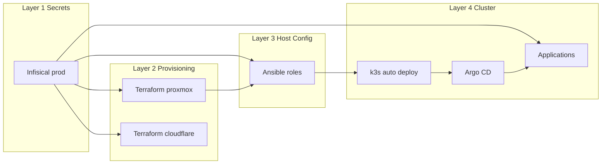
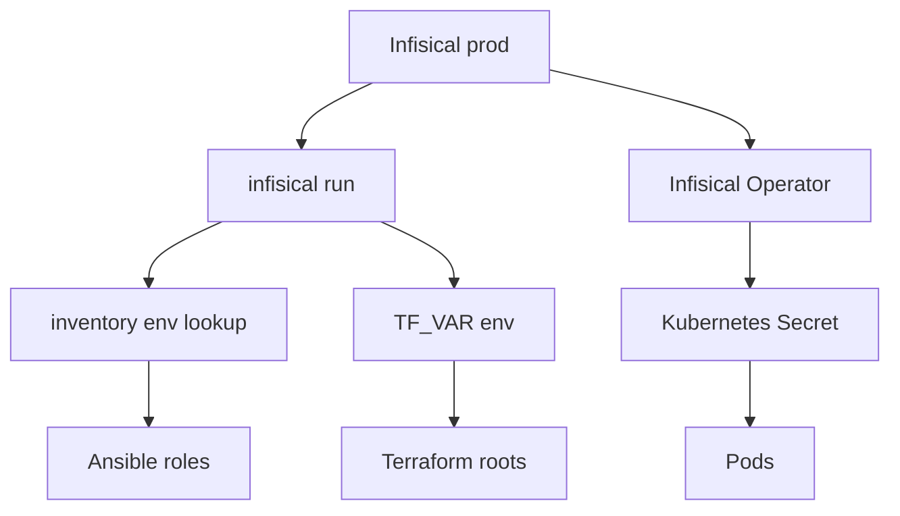
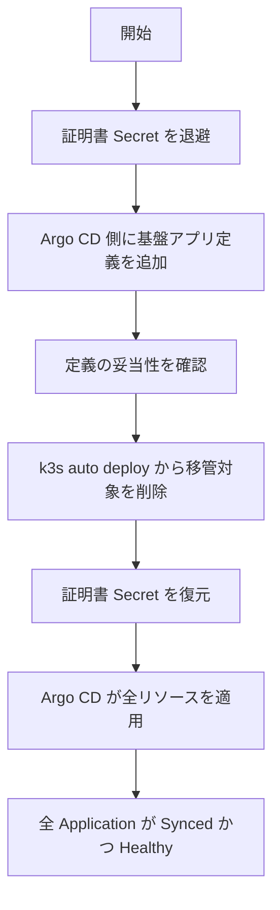
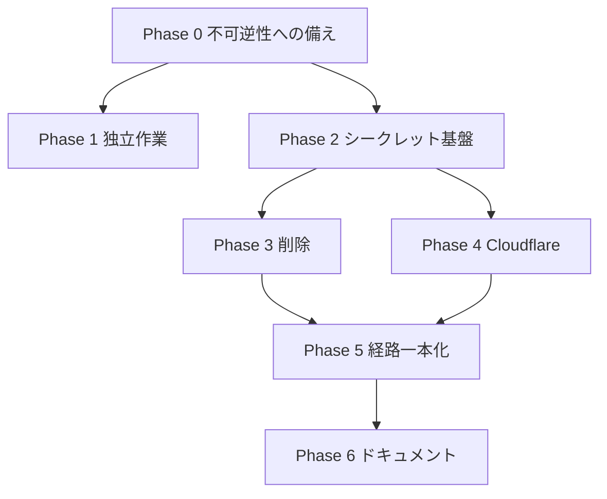

# Technical Design

## Overview

**Purpose**: 本設計は、自宅環境のインフラを構成する2リポジトリ（my-home-network、gitops-apps）と稼働中の k3s クラスタに対し、シークレットの供給経路を Infisical に一元化し、Cloudflare 構成を Terraform 化し、クラスタへのデプロイ経路を Argo CD に一本化する。

**Users**: 単一のホームラボ運用者が、任意の作業マシンから同一の手順で構成を適用できる状態を得る。

**Impact**: シークレットが6系統に分散し、デプロイ経路が4系統併存する現状を、**シークレットの正が1つ、クラスタへの経路が1つ**の状態へ変更する。ドリフトの発生源を構造的に断つことが主眼であり、既存ワークロードへの機能追加は含まない。

現状のドリフトは個別の不具合の集積ではなく、**依存方向の違反**に起因する。Ansible（ホスト構成層）が `kubernetes.core.k8s` でクラスタ内リソースを直接適用し、さらに k3s auto-deploy 経由で2つ目の ApplicationSet を配置することで、上位層が下位層を飛び越えて書き込んでいる。本設計はこの層構造を明示し、依存方向を一方向に固定する。

### Goals

- シークレットの単一の正を Infisical に置き、Ansible / Terraform / Kubernetes が同一の起点から取得する
- Cloudflare の全構成を Terraform コードとして版管理下に置き、コードを唯一の正とする
- クラスタ内リソースの管理主体を Argo CD に一本化し、`Application` の Sync / Health をすべて正常に収束させる
- Terraform の state を作業マシンからも自宅基盤からも独立させる
- Proxmox ホストのセキュリティ更新を自動適用する
- 両リポジトリを clone しただけで構成を再現できる状態にする

### Non-Goals

- Argo CD 自身のブートストラップの GitOps 化（鶏卵問題のため k3s auto-deploy に残す）
- k3s / Traefik など k3s ディストリビューション同梱コンポーネントの管理方式変更
- git 履歴からの秘密情報の消去（履歴書き換え）
- 削除対象アプリの実データ削除、Garage / Infisical 自体の運用設計
- 存続ワークロードの機能追加・仕様変更
- 無停止での移行（停止は許容される）

---

## Boundary Commitments

### This Spec Owns

- **シークレットの供給経路**: Infisical から Ansible / Terraform / Kubernetes へ値が届くまでの機構と命名規則
- **Cloudflare の構成定義**: DNS、ゾーン設定、WAF、Zero Trust トンネルと経路、Access
- **Terraform の構成範囲と state の配置**
- **クラスタ内リソースの管理主体の決定**: どのリソースをどの経路が適用するか
- **gitops-apps のアプリケーション集合とパッケージング形式**
- **Proxmox ホストの更新設定**
- **両リポジトリのドキュメントとネットワーク図**

### Out of Boundary

- Infisical / Garage / Cloudflare それ自体の可用性・運用設計
- 各アプリケーションの内部仕様、コンテナイメージの選定
- k3s クラスタの構築手順（`rlex.k3s` ロールの領分）
- Proxmox の `dist-upgrade` によるバージョン更新（手動作業）
- git 履歴の書き換え、k3s node token の実ローテーション
- 削除対象アプリのデータ退避作業そのもの（要否判断は本仕様、実施は手動）

### Allowed Dependencies

- Infisical（プロジェクト `prod` 環境）— シークレットの正
- HCP Terraform（Free プラン）— Terraform state の保管とロック。**自宅環境に一切依存しない外部サービスであること**が採用理由
- Cloudflare API — Terraform Provider v5 経由
- Proxmox VE API — 既存の `bpg/proxmox` プロバイダ経由
- k3s クラスタ API — Argo CD 経由のみ。**Ansible からの直接アクセスは禁止**

### Revalidation Triggers

- Infisical のシークレット命名規則の変更
- Terraform の state 保管先・ワークスペースの変更
- ApplicationSet の生成規則（`path.basename` → namespace の対応）の変更
- 依存方向（層構造）の変更
- Cloudflare Provider のメジャーバージョン更新

---

## Architecture

### Existing Architecture Analysis

**維持する既存パターン**

- Ansible の変数間接化層（`group_vars` / `host_vars` でシークレットを一般名に束ね、ロールは一般名のみ参照）
- ロール構造の規約（`defaults` / `tasks` / `templates` / `meta` 分離、FQCN 徹底）
- 必須変数の `assert` による事前検証（`letsencrypt` / `cert_manager` / `proxmox_backup` に実装済み）
- Terraform のモジュール分離（`modules/vm`、`modules/container`）と `locals.tf` による差分吸収

**解消する技術的負債**

- Ansible からのクラスタ直接書き込み（`cert_manager` ロールの `kubernetes.core.k8s` 6箇所）
- ApplicationSet の二重定義による `Application` 所有権の分裂
- cert-manager / reflector の二経路適用

### Architecture Pattern & Boundary Map

**選定パターン**: 単層 GitOps + 最小ブートストラップ。責務を4層に分け、依存方向を一方向に固定する。



**Architecture Integration**:

- **依存方向の規則**: `Secrets → Provisioning → Host Config → Cluster Bootstrap → GitOps → Applications`。各層は左側の層にのみ依存してよい。**右向きの矢印以外は設計違反として扱う**
- **Infisical のみが層を横断する**。シークレットは全層が参照するため、最上流に単独で置く
- **Ansible → Applications の直接線を持たない**ことが本設計の中核。現状はこの線が存在し、ドリフトの構造的原因となっている
- **ブートストラップの例外**: Argo CD 自身は Argo CD で管理できないため、`k3s auto deploy` に最小限のマニフェストのみ残す
- **Terraform は単一ルートモジュールで Proxmox と Cloudflare の双方を管理する**。両者は相互に参照せず、同一 state に同居するのみ。分割しない理由は、リソース規模が数十件に留まること、および OPNsense の Tailscale Router により Proxmox API へリモートからも到達できるため分割による到達性上の利点が存在しないことによる

### Technology Stack

| Layer | Choice / Version | Role in Feature | Notes |
|-------|------------------|-----------------|-------|
| Secrets | Infisical CLI 0.43.96 | Ansible / Terraform への環境変数注入 | 導入済・認証済 |
| Secrets | Infisical Kubernetes Operator | クラスタへのシークレット同期 | 新規。`InfisicalConnection` / `InfisicalAuth` / 同期リソースの3 CRD |
| Provisioning | Terraform 1.15.9（`required_version >= 1.10.0`） | Proxmox / Cloudflare の宣言的管理 | 導入済 |
| Provisioning | `bpg/proxmox`（既存） | Proxmox VM / LXC | 変更なし |
| Provisioning | `cloudflare/cloudflare` v5 系（`~> 5.19`） | Cloudflare 全構成 | 新規。v4 から資源名が変更されている |
| Provisioning | cf-terraforming | 既存構成の HCL / import ブロック生成 | **未導入。導入が必要** |
| Data / Storage | HCP Terraform Free | Terraform state の保管・ロック・履歴保持 | 実行モードは **Local**。管理リソース上限500に対し本環境は数十規模 |
| Host Config | Ansible 10.7+ / ansible-lint | ホスト構成適用 | 既存 |
| Host Config | `unattended-upgrades`（Debian 12） | Proxmox のセキュリティ更新 | 新規ロール |
| GitOps | Argo CD（HelmChart 7.4.4） | クラスタ内リソースの唯一の適用主体 | 既存。ApplicationSet を統合 |

---

## File Structure Plan

### my-home-network

```
ansible/
├── ansible.cfg                          # 追跡対象へ復帰
├── inventory/
│   ├── group_vars/
│   │   ├── all/main.yml                 # 右辺を env lookup へ置換、vault.yml を削除
│   │   └── k3s/main.yml                 # argocd 系の重複変数の集約先
│   └── host_vars/{gitea,pbs,vps,k3s-server}/main.yml
├── playbooks/
│   ├── host_updates.yml                 # 新規: proxmox_nodes 向け
│   └── site.yml                         # host_updates.yml を追加、cert_manager.yml を削除
└── roles/
    ├── unattended_upgrades/             # 新規
    ├── argocd/                          # ブートストラップ最小限へ縮小
    └── cert_manager/                    # 削除（Argo CD へ移管）
scripts/
├── migrate-vault-to-infisical.py        # 新規
└── dump-cloudflare.sh                   # 新規
terraform/                               # 単一ルートモジュール（既存配置を維持）
├── backend.tf                           # 新規: cloud ブロック
├── main.tf / locals.tf / providers.tf / variables.tf / versions.tf
├── modules/{vm,container}/              # 変更なし
├── cloudflare_dns.tf                    # 新規
├── cloudflare_zone_settings.tf          # 新規
├── cloudflare_waf.tf                    # 新規
├── cloudflare_zero_trust.tf             # 新規
└── cloudflare_imports.tf                # 新規: 収束後に削除
```

### gitops-apps

```
apps/
├── infisical-operator/    # 新規: Operator + InfisicalConnection + InfisicalAuth
├── cert-manager/          # 新規: Ansible から移管
├── cluster-issuer/        # 新規: ClusterIssuer + wildcard Certificate
├── reflector/             # 新規: k3s auto-deploy から移管
├── reloader/              # 新規: 同上
├── cloudflared-fickledev/ # Kustomize へ統一、tunnel ID とトークンの直書きを除去
├── xrayvpn/               # Kustomize へ統一
└── (削除) authentik-aramakisai / cloudflared-aramakisai / outline / planka / tailscale / tailscale-auth
argocd/
└── applicationset.yaml    # 統合後の唯一の ApplicationSet
scripts/                   # 削除（aramakisai 専用）
```

### Modified Files

- `ansible/roles/argocd/tasks/main.yml` — cert-manager / reflector / reloader / ClusterIssuer / wildcard-cert の配置を削除。Argo CD 本体・repo secret・ApplicationSet のみ残す
- `ansible/roles/argocd/templates/*.j2` — 移管対象のテンプレート5点を削除
- `ansible/roles/proxmox_backup/defaults/main.yml` — 7変数を env lookup へ置換
- `gitops/apps/gitops-apps-set.yaml` — 統合後の唯一の ApplicationSet 定義へ更新
- `gitops/apps/base/cert-manager/application.yaml` — 削除（死んだ定義）
- `.gitignore` — `ansible.cfg` / `.terraform.lock.hcl` の除外を解除、`terraform/.discovery/` を追加
- `.gitleaks.toml` — k3s node token 形式のカスタムルールを追加、vault example の allowlist を削除
- `README.md` / `.github/instructions/afternetwork.instructions.md` — ネットワーク図と記述を実態へ同期

---

## System Flows

### シークレット供給フロー



Ansible / Terraform は CLI によるプロセス環境変数、Kubernetes は Operator による同期と、**注入方式は2種類だが正は1つ**である。トンネルトークンは Operator 経路のみを通り、tfstate には記録されない。

### 経路一本化の移行フロー



証明書の退避を先頭に置くのは、`/var/lib/rancher/k3s/server/manifests/` からのファイル削除が対象リソースの削除を伴い、Let's Encrypt の重複証明書上限（週5枚）に抵触しうるためである。他のリソースは再作成で復旧できるため退避を要しない。

---

## Requirements Traceability

| Requirement | Summary | Components | Interfaces | Flows |
|-------------|---------|------------|------------|-------|
| 1.1, 1.4 | Ansible / TF が同一機構でシークレット取得 | AnsibleSecretBinding, TerraformSecretBinding | `infisical run` ラッパ | シークレット供給フロー |
| 1.2, 1.6 | vault パスワード不要・値ファイル非追跡 | VaultMigrationScript | CLI 契約 | — |
| 1.3 | 命名規則 `vault_x` → `X` | VaultMigrationScript, AnsibleSecretBinding | 命名規則 | — |
| 1.5 | 欠落時に停止 | AnsibleSecretBinding | `assert` 契約 | — |
| 1.7 | 用途別に認証情報を分離 | InfisicalProjectLayout | シークレット一覧 | — |
| 2.1, 2.2, 2.3 | 平文除去と検知 | GitleaksPolicy | カスタムルール | — |
| 2.4, 2.5 | 移送手段と切り戻し可能性 | VaultMigrationScript | CLI 契約 | — |
| 2.6 | ローテーション対象の明示 | Documentation | — | — |
| 3.1〜3.8 | Cloudflare の Terraform 化 | TerraformRoot, CloudflareDiscoveryScript | Terraform 資源契約 | — |
| 4.1, 4.2, 4.6 | state の外部保管と履歴 | StateBackend | `cloud` ブロック | 移行戦略 Phase 4 |
| 4.3 | ロックによる排他 | StateBackend | ワークスペース契約 | — |
| 4.4, 4.5 | ローカル実行・秘密の非保持 | StateBackend, TerraformSecretBinding | 実行モード契約 | シークレット供給フロー |
| 5.1〜5.6 | リポジトリ再現性 | RepositoryHygiene | `.gitignore` | — |
| 6.1〜6.9 | ドキュメント整合 | Documentation, NetworkDiagram | — | — |
| 7.1〜7.7 | k8s シークレットの集約 | InfisicalSecretOperator | CRD 契約 | シークレット供給フロー |
| 8.1〜8.6 | aramakisai 系削除 | AppRemoval | ApplicationSet 生成規則 | — |
| 9.1〜9.6 | cloudflared 責務分離 | TerraformRoot, CloudflaredWorkload | トンネル資源契約 | シークレット供給フロー |
| 10.1〜10.6 | gitops-apps 構造整理 | PackagingNormalization, UnifiedApplicationSet | ApplicationSet 契約 | — |
| 11.1〜11.7 | Proxmox 更新自動化 | UnattendedUpgradesRole | ロール変数契約 | — |
| 12.1〜12.8 | 経路一本化 | ArgocdBootstrapRole, PlatformApps, UnifiedApplicationSet | 層の依存規則 | 経路一本化の移行フロー |
| 13.1〜13.10 | 孤児・破損の除去 | DriftReconciliation | 検証手順 | — |

---

## Components and Interfaces

| Component | Layer | Intent | Req Coverage | Key Dependencies (P0/P1) | Contracts |
|-----------|-------|--------|--------------|--------------------------|-----------|
| InfisicalProjectLayout | Secrets | シークレットの命名と分割の規約 | 1.3, 1.7 | Infisical (P0) | State |
| VaultMigrationScript | Secrets | 既存シークレットの一括移送 | 1.2, 2.4, 2.5 | ansible-vault (P0), Infisical CLI (P0) | Service, Batch |
| AnsibleSecretBinding | Host Config | 環境変数から Ansible 変数への束縛 | 1.1, 1.2, 1.5 | Infisical CLI (P0) | Service |
| TerraformSecretBinding | Provisioning | `TF_VAR_` 環境変数の供給 | 1.1, 1.4 | Infisical CLI (P0) | Service |
| InfisicalSecretOperator | Cluster | Infisical → Kubernetes Secret の同期 | 7.1〜7.7, 9.5 | Infisical (P0), Argo CD (P0) | Service, State |
| TerraformRoot | Provisioning | Proxmox 資源と Cloudflare 全構成の管理 | 3.1〜3.8, 9.1〜9.4 | StateBackend (P0), Cloudflare API (P0) | State |
| StateBackend | Provisioning | state の外部保管とロック | 4.1〜4.6 | HCP Terraform (P0) | State |
| CloudflareDiscoveryScript | Provisioning | 現状構成のダンプ | 3.5 | Cloudflare API (P1) | Batch |
| ArgocdBootstrapRole | Host Config | Argo CD 起動に必要な最小マニフェスト配置 | 12.2, 12.3 | k3s auto deploy (P0) | Batch |
| UnifiedApplicationSet | GitOps | クラスタ内全アプリの生成規則 | 10.3, 10.4, 12.4, 12.5 | Argo CD (P0) | State |
| PlatformApps | GitOps | 基盤コンポーネントの Argo CD 管理 | 12.1, 12.6 | UnifiedApplicationSet (P0) | State |
| PackagingNormalization | GitOps | パッケージング形式の統一 | 10.1, 10.2 | Argo CD (P1) | — |
| CloudflaredWorkload | Cluster | トンネルの実行のみを担う | 9.2, 9.3 | InfisicalSecretOperator (P0) | State |
| AppRemoval | GitOps | 削除対象の除去と参照整合 | 8.1〜8.6, 13.3 | UnifiedApplicationSet (P0) | — |
| DriftReconciliation | GitOps | 収束の検証手順 | 13.1〜13.10 | Argo CD (P1) | Batch |
| UnattendedUpgradesRole | Host Config | Proxmox のセキュリティ更新 | 11.1〜11.7 | apt (P0) | State |
| GitleaksPolicy | Repository | 秘密混入の検知 | 2.1〜2.3 | pre-commit (P1) | — |
| RepositoryHygiene | Repository | 追跡対象とバージョン固定 | 5.1〜5.6 | — | — |
| Documentation / NetworkDiagram | Repository | 実態との整合 | 6.1〜6.9 | — | — |

### Secrets Layer

#### InfisicalProjectLayout

| Field | Detail |
|-------|--------|
| Intent | Infisical 上のシークレットの命名規則と用途分離を定める |
| Requirements | 1.3, 1.7 |

**Responsibilities & Constraints**

- シークレット名は `vault_` 接頭辞を除去して大文字化した形とする（`vault_gitea_db_password` → `GITEA_DB_PASSWORD`）
- Terraform 用は `TF_VAR_` 接頭辞を保持したまま格納し、変数名を変換しない
- 用途の異なる認証情報を共用しない。特に Cloudflare は **DNS-01 用（既存・DNS 編集のみ）** と **Terraform 用（新規・広域）** を別シークレットとして保持する

**Contracts**: State [x]

##### State Management

- 環境スラグは `prod` 単一。パス階層は用いず平坦に保持する
- Terraform 用トークンの必要スコープ: Zone:Read / DNS:Edit / Zone Settings:Edit / Firewall Services:Edit / Cloudflare Tunnel:Edit / Access Apps and Policies:Edit / Workers R2 Storage:Edit / Workers Scripts:Edit
- 追加で保持するもの: `CLOUDFLARE_ACCOUNT_ID`、`CLOUDFLARE_ZONE_ID`、`CLOUDFLARED_TUNNEL_TOKEN`、`TF_TOKEN_app_terraform_io`（HCP Terraform の API トークン）、`K3S_NODE_TOKEN`

**Implementation Notes**

- Integration: リポジトリルートに `.infisical.json` を配置する（プロジェクト ID のみでシークレットを含まないため追跡してよい）
- Risks: 命名規則の一意性が崩れると移行スクリプトの対応表が壊れる。規則は1つに固定する

#### VaultMigrationScript

| Field | Detail |
|-------|--------|
| Intent | 既存の暗号化・平文シークレットを人手の転記なしに Infisical へ移送する |
| Requirements | 1.2, 2.4, 2.5 |

**Responsibilities & Constraints**

- 5個の ansible-vault ファイルを復号し、`vault_*` を抽出して命名規則に従い変換する
- 平文コミット済みの `k3s_node_token` を git 追跡内容から回収する
- **既存ファイルを削除しない**。削除は明示的な別操作とする

**Dependencies**

- External: `ansible-vault` — 復号（P0）
- External: Infisical CLI — 投入（P0）

**Contracts**: Service [x] / Batch [x]

##### Batch / Job Contract

- Trigger: 運用者による手動実行
- Input: Vault パスワード（対話取得）、環境スラグ
- Output: Infisical `prod` 環境へのシークレット投入
- Idempotency: 同一キーへの再投入は上書きとなり、繰り返し実行して安全
- Modes: `--dry-run`（キー名のみ表示）、`--cleanup`（移行済みファイルの追跡解除）

**Implementation Notes**

- Validation: Vault パスワードはプロセス引数に載せず、一時ファイル経由で `ansible-vault` に渡す
- Risks: **復号鍵の喪失が唯一の不可逆な失敗**。本スクリプトの実行を他のすべての作業に先行させる

#### AnsibleSecretBinding

| Field | Detail |
|-------|--------|
| Intent | 環境変数を既存の変数間接化層に束縛する |
| Requirements | 1.1, 1.2, 1.5 |

**Responsibilities & Constraints**

- 既存の間接化層の構造を変えず、右辺のみを差し替える
- ロール本体は一般名の変数を参照し続ける。ロールのタスクには変更を加えない
- フォールバック値を持つ変数のみ、空文字を未定義として扱う形で既定値を維持する

**Contracts**: Service [x]

##### Service Interface

変数束縛の契約を疑似シグネチャで示す。

```typescript
// 束縛規則: Infisical のシークレット名 → Ansible 変数
type SecretName = Uppercase<string>;          // 例: "GITEA_DB_PASSWORD"
type AnsibleVarName = Lowercase<string>;      // 例: "gitea_db_password"

interface SecretBinding {
  readonly source: SecretName;                // lookup('env', source)
  readonly target: AnsibleVarName;
  readonly fallback?: string;                 // 省略時は既定値なし
  readonly required: boolean;                 // true なら assert 対象
}
```

- Preconditions: プロセス環境に `source` が存在する
- Postconditions: `target` が非空の値に解決される。`required` かつ空の場合は実行が停止する
- Invariants: `source` と `target` は一対一。同一の `source` を複数の `target` に束縛しない

**Implementation Notes**

- Integration: 既存の `assert` パターン（`letsencrypt` / `cert_manager` / `proxmox_backup`）を全ロールへ水平展開する
- Validation: `rule.instructions.md` がフォールバック禁止を定めるため、`| default('')` による黙認は許容しない
- Risks: `infisical run` でのラップ漏れ時に全変数が空となる。`assert` により早期に検出される

#### InfisicalSecretOperator

| Field | Detail |
|-------|--------|
| Intent | Infisical のシークレットを Kubernetes Secret として同期する |
| Requirements | 7.1〜7.7, 9.5 |

**Responsibilities & Constraints**

- クラスタ内シークレット供給の**唯一の**機構となる。SealedSecrets / SOPS-age / AVP を置き換える
- Argo CD 管理下に置く（`apps/infisical-operator/`）。オペレータ自身も GitOps の対象とする
- 同期に失敗した場合、空の Secret を生成しない

**Dependencies**

- Inbound: CloudflaredWorkload ほか各ワークロード — Secret の消費（P0）
- Outbound: Infisical API — 値の取得（P0）
- External: Argo CD — 自身のデプロイ（P0）

**Contracts**: Service [x] / State [x]

##### State Management

- CRD 構成: `InfisicalConnection`（接続先）、`InfisicalAuth`（認証）、同期定義リソース（対象と配置先）
- オペレータ自身の認証情報（Machine Identity）は**ブートストラップ時のみ手動投入**し、以降は自己完結する
- 同期方向は Infisical → クラスタの一方向に限定する。クラスタからの押し出しは使用しない

**Implementation Notes**

- Integration: 移行期間中は既存の SealedSecret を残置し、同期成功を確認してから削除する
- Validation: 同期リソースの状態を Argo CD の Health で観測する。失敗時は Application が Degraded となり検知できる
- Risks: オペレータ障害時に新規 Pod がシークレットを取得できない。既存 Secret はクラスタに残るため稼働中 Pod は影響を受けない

### Provisioning Layer

#### StateBackend

| Field | Detail |
|-------|--------|
| Intent | Terraform state を自宅環境から独立した外部サービスに保管し、ロックと履歴を得る |
| Requirements | 4.1, 4.2, 4.3, 4.4, 4.5, 4.6 |

**Responsibilities & Constraints**

- state を **HCP Terraform** に保管する。自宅環境内のどのコンポーネント（Proxmox、k3s、Garage）にも依存しない
- ワークスペースは**1件**とする。ルートモジュールが単一であるため state も単一となる
- **実行モードは Local を選択する**。plan / apply は作業者のローカル環境で実行し、HCP は state の保管とロックのみを担う
- **ワークスペース変数に秘密を保持しない**。シークレットの供給元は Infisical に限定する

**Dependencies**

- External: HCP Terraform（Free プラン）— state 保管・ロック・履歴（P0）
- Outbound: Infisical — プロバイダ認証情報の供給（P0）

**Contracts**: State [x]

##### State Management

- ワークスペース構成: `my-home-network` 1件
- 接続方式: ルートモジュールの `cloud` ブロックで組織名とワークスペース名を宣言する。`cloud` ブロックは変数補間を受け付けないため、いずれも定数として記述する
- **ロックは HCP が提供する**。並行実行は 1 concurrent run の制約とあわせて構造的に排他される（4.3）
- 履歴保持: 直近100件の state が保持され、誤った適用からロールバックできる（4.6）
- 規模の妥当性: 現状の管理リソースは6件（VM 4 / LXC 2）。Cloudflare 追加後も数十規模であり、Free プランの上限500に対して十分な余裕がある

**Implementation Notes**

- Integration: `required_version` を `>= 1.10.0` へ引き上げる。既存のローカル state は `terraform init` の state 移行機能で転送する
- Validation: 移行後に `terraform plan` が差分なしを出力することで、state が正しく転送されたことを確認する（4.2）
- **Local 実行モードは HCP のワークスペース変数および変数セットを評価しない**。この性質により、シークレットが Infisical のみに存在する状態が構造的に保証される（4.5）
- 認証は `terraform login` を用いず、Infisical が供給する `TF_TOKEN_app_terraform_io` に一本化する。環境変数が資格情報ファイルより優先されるため、作業マシン側にログイン状態を持たない
- Risks: state に Proxmox の認証情報が記録されるため、外部サービスへ秘密が渡る。パスワード認証ではなく API トークン認証（`proxmox_auth_method = token`）を用い、当該トークンの権限を Terraform の操作範囲に限定することで影響を抑える

#### TerraformRoot

| Field | Detail |
|-------|--------|
| Intent | Proxmox 資源と Cloudflare の全構成を単一のルートモジュールで保持し、コードを唯一の正とする |
| Requirements | 3.1〜3.8, 9.1〜9.4 |

**Responsibilities & Constraints**

- 既存の Proxmox VM / LXC の管理を継続し、配置とモジュール参照を変更しない
- Cloudflare の DNS レコード、ゾーン設定、WAF ルールセット、Zero Trust トンネルと経路、Access を追加で管理する
- R2 / Workers は現状ダンプで実在が確認できたもののみ定義する（存在しない資源の空ファイルを作らない）
- **トンネルトークンを出力しない**。トークンは Infisical が保持し、Terraform は関与しない
- Cloudflare 側の資源は Proxmox 側の出力を参照しない。同一 state に同居するのみで、両者の間に依存を作らない

**Dependencies**

- Outbound: StateBackend — state 保管（P0）
- External: Cloudflare API — Provider v5 経由（P0）
- External: Proxmox VE API — 既存の `bpg/proxmox` 経由（P0）

**Contracts**: State [x]

##### State Management

- 主要資源: `cloudflare_dns_record`、`cloudflare_zone_setting`、`cloudflare_ruleset`、`cloudflare_zero_trust_tunnel_cloudflared`、`cloudflare_zero_trust_tunnel_cloudflared_config`、`cloudflare_zero_trust_access_application` / `_policy`
- DNS レコードは `locals` のマップと `for_each` で表現し、`vps_proxy` の upstream 定義（`ansible/inventory/host_vars/vps/main.yml`）との対応が読み取れる構造とする
- ファイル名は `cloudflare_` 接頭辞で揃え、既存の Proxmox 向けファイルと視覚的に分離する
- 収束の判定基準: `terraform plan` が差分なしを出力すること。**収束前に適用しない**

**Implementation Notes**

- Integration: cf-terraforming で骨子を生成し、反復性の高い DNS を `for_each` へ整形する。取り込み用の定義は収束後に削除する
- Validation: `.discovery/` のダンプと `terraform state list` を突き合わせ、コード化漏れを検出する
- Risks: Cloudflare Provider v5 の不具合で `refresh` が失敗すると、同一 state にある Proxmox 側の操作も同時に停止する。単一ルート化で受容したトレードオフであり、収束前に適用しない運用と HCP の state 履歴で影響を限定する
- Risks: Provider v5 はトークンデータソースに既知の不具合があるため依存しない設計とする。トンネルが import できず再作成となる場合、トークン再発行と Infisical 更新をセットで実施する

### GitOps Layer

#### UnifiedApplicationSet

| Field | Detail |
|-------|--------|
| Intent | クラスタ内アプリケーションの生成規則を単一に定める |
| Requirements | 10.3, 10.4, 12.4, 12.5 |

**Responsibilities & Constraints**

- `apps/*` を対象とする ApplicationSet を**1つだけ**保持する
- すべての `Application` の所有権をこの ApplicationSet に収束させる
- 除外対象は実在するディレクトリのみを列挙する

**Contracts**: State [x]

##### State Management

- 生成規則: `Application` 名 = `path.basename`、配置先 namespace = `path.basename`
- 同期方針: `prune: true` / `selfHeal: true` を維持する
- 現行の2定義（gitops-apps 内の `apps` と Ansible 配置の `gitops-apps`）を統合する。統合先は gitops-apps リポジトリ内とし、Ansible はブートストラップ時に当該定義を指す最小の ApplicationSet のみ配置する

**Implementation Notes**

- Integration: 停止許容のため、既存 `Application` を削除して再生成してよい。所有権の付け替え手順は不要
- Risks: `path.basename` が namespace 名となるため、新規ディレクトリ名は namespace として妥当な文字列に限る

#### PlatformApps

| Field | Detail |
|-------|--------|
| Intent | 基盤コンポーネントを Argo CD 管理下へ移す |
| Requirements | 12.1, 12.6 |

**Responsibilities & Constraints**

- cert-manager、ClusterIssuer、ワイルドカード証明書、reflector、reloader、Infisical Operator を Argo CD 管理とする
- これらは**単一の経路でのみ**適用される。k3s auto-deploy と Ansible からの適用を同時に持たない

**Implementation Notes**

- Integration: reflector / reloader は現在 `kube-system` に配置されている。ApplicationSet の生成規則により namespace が変わる。停止許容の前提で受容する
- Risks: cert-manager の CRD は Application 削除時に巻き添えになりうる。証明書 Secret の退避で影響を限定する

#### DriftReconciliation

| Field | Detail |
|-------|--------|
| Intent | クラスタとリポジトリの一致を検証する手順を定める |
| Requirements | 13.1〜13.10 |

**Contracts**: Batch [x]

##### Batch / Job Contract

- Trigger: 各フェーズ完了時の手動実行
- Input: クラスタ接続情報（kubeconfig）
- Output: 差分の一覧。収束時は空
- 判定基準:
  - すべての `Application` が Sync = Synced かつ Health = Healthy
  - `ownerReferences` を持たない `Application` が存在しない
  - リポジトリに対応定義を持たない namespace が存在しない

**Implementation Notes**

- Integration: 除去対象は実査済み。`common-secrets`（孤児 Application）、`minio` / `stalwart` / `vikunja`（孤児 namespace）、`postgres` の OutOfSync、`garage` / `tailscale-auth` の manifest 生成失敗
- Validation: `tailscale` の Degraded は `tailscale` / `tailscale-auth` の削除により解消する
- Risks: `prune: true` により削除は不可逆。実施前にデータ退避の要否を判断する

### Host Config Layer

#### UnattendedUpgradesRole

| Field | Detail |
|-------|--------|
| Intent | Proxmox ホストへセキュリティ更新を自動適用する |
| Requirements | 11.1〜11.7 |

**Responsibilities & Constraints**

- 対象は `proxmox_nodes` グループ（n100 / hp-z440）
- 再起動を自動実行しない。要再起動の状態は観測可能な形で残す
- 稼働中のゲスト（VM / LXC）を停止させない

**Contracts**: State [x]

##### State Management

- 許可 origin: Debian のセキュリティ更新に加え、`origin=Proxmox,label=Proxmox Debian Repository`
- 適用範囲は `upgrade` 相当に限られる。**新規パッケージの導入を伴う `dist-upgrade`（PVE のバージョン更新）は対象外**であり、手動作業として残る
- 失敗時の記録はログとして保持する

**Implementation Notes**

- Integration: `playbooks/host_updates.yml` を新設し `site.yml` に組み込む。`proxmox_nodes` を対象とする playbook は現状存在しないため導線ごと新設する
- Validation: 各リポジトリの origin / label は `apt-cache policy` の出力で確認する
- Risks: 自動更新が PVE の想定と異なる挙動を生む可能性。再起動を自動化せず対象を限定することで影響範囲を抑える

---

## Error Handling

### Error Strategy

本設計は**フェイルファストを原則**とする。プロジェクト規約がフォールバックの実装を禁じているため、値が得られない状態で処理を継続しない。

### Error Categories and Responses

**設定・入力の誤り**
- シークレット未供給 → `assert` により、欠落変数を特定できるメッセージとともに停止する（1.5）
- Infisical 未初期化 → 移行スクリプトが `.infisical.json` の不在を検出し、実行前に停止する

**外部依存の失敗**
- Infisical 到達不可 → Ansible / Terraform は起動時点で失敗する。クラスタ内は既存 Secret が残るため稼働中 Pod は影響を受けない
- Cloudflare API 失敗 → Terraform が適用を中断する。部分適用は state に記録され、再実行で回復する
- HCP Terraform 到達不可 → Terraform が state を取得できず停止する。適用は行われないため構成は不整合にならない

**収束しない状態**
- Cloudflare の `plan` が差分ゼロにならない → **適用しない**（3.8）。コード側を修正して再確認する
- Argo CD の manifest 生成失敗 → Application が Unknown となる。原因は `status.conditions` に記録され特定できる（13.9）

### Monitoring

- Argo CD の Sync / Health ステータスをクラスタ内リソースの健全性指標とする
- Proxmox の自動更新結果は unattended-upgrades のログに残す
- 本設計では新規の監視基盤を導入しない

---

## Testing Strategy

インフラ構成が対象のため、テストは**適用前の検証**と**適用後の収束確認**の2種で構成する。

### 適用前の検証

- `ansible-lint playbooks/site.yml` — 規約準拠（FQCN、べき等性）の確認
- `ansible-playbook --check --diff` — 実機に触れない差分確認
- `terraform validate` / `terraform plan` — ルートモジュールの構文と差分
- `pre-commit run --all-files` — gitleaks による秘密混入の検知
- `helm template` / `kustomize build` — gitops-apps の各ディレクトリが manifest を生成できること

### 適用後の収束確認

- `terraform plan` が差分なし（3.4, 4.2）
- 全 `Application` が Synced かつ Healthy（13.4, 13.5）
- `ownerReferences` を持たない `Application` が存在しない（13.2）
- リポジトリに対応を持たない namespace が存在しない（13.1）
- `.discovery/` のダンプと `terraform state list` の突き合わせで Cloudflare のコード化漏れがない（3.5）
- 外形確認: `dig` による DNS 応答、公開ホスト名への HTTPS 到達

### シークレット移行の検証

- `--dry-run` によるキー名の事前確認
- `infisical run -- ansible-inventory --host <host>` で変数がプレースホルダを含まず解決されること
- vault パスワードの入力を求められないこと（1.2）

---

## Security Considerations

- **認証情報の用途分離**: Cloudflare は DNS-01 用（既存・最小権限）と Terraform 用（新規・広域）を分離し、単一トークンの共用を避ける（1.7）
- **tfstate への秘密の混入の最小化**: cloudflared のトンネルトークンを Terraform で扱わないことで、state に当該秘密が入らない。ただし Proxmox の認証情報は `sensitive` 指定でも state に記録され、**HCP Terraform という外部サービスへ渡る**。パスワード認証ではなく API トークン認証を用い、トークンの権限を Terraform の操作範囲に限定する
- **シークレットの二重保持の回避**: HCP Terraform のワークスペース変数は使用しない。Local 実行モードがこれらを評価しないため、Infisical 以外にシークレットの複製が生まれない。認証も `terraform login` を使わず環境変数に一本化し、作業マシンの資格情報ファイルにトークンを残さない
- **平文シークレットの残存**: `k3s_node_token` は git 履歴に残る。コード修正では解消せず、**クラスタ側でのローテーションが必須**。本仕様のスコープ外だがドキュメントに明記する（2.6）
- **検知の強化**: gitleaks に k3s node token 形式のカスタムルールを追加し、同種の混入を再発防止する（2.3）
- **暗号鍵の廃止**: SOPS-age 秘密鍵の Argo CD への配布を停止する（7.4）。移行完了まで鍵を破棄しない

---

## Migration Strategy

不可逆な操作を含むため、**回復不能な失敗の回避を最優先**とする順序を定める。



| Phase | 内容 | ロールバック契機 |
|-------|------|------------------|
| 0 | 全シークレットの Infisical への移送、証明書 Secret の退避、削除対象のデータ退避要否判断 | 移送の失敗（既存ファイルは削除しないため常に切り戻せる） |
| 1 | リポジトリ衛生（5）、Proxmox 更新（11）、`garage` の YAML 構文エラー是正 | — |
| 2 | Ansible / Terraform のシークレット切替（1, 2）、Infisical Operator 導入（7） | 同期失敗時は既存 SealedSecret を残置したまま切り戻す |
| 3 | aramakisai 系および稼働終了アプリの削除（8, 13） | データ退避済みであれば切り戻し不要 |
| 4 | state の外部移行（4）、Cloudflare 化（3, 9） | `plan` が差分ゼロにならない場合は適用しない |
| 5 | デプロイ経路の一本化（10, 12） | 証明書 Secret の復元により復旧 |
| 6 | ドキュメントとネットワーク図の同期（6） | — |

**検証チェックポイント**: 各 Phase の完了時に「適用後の収束確認」を実行する。Phase 5 完了時点で全 Application が Synced かつ Healthy となることが最終判定となる。

---

## Open Questions / Risks

### 判断を要する事項

**state を外部 SaaS に預けることの受容**

HCP Terraform に state を置く構成では、Proxmox の認証情報が state に記録されて外部サービスへ渡る。自宅環境への依存を断つという目的とのトレードオフとなる。

- 影響を抑える手段: パスワード認証ではなく API トークン認証を用い、当該トークンの権限を Terraform が操作する範囲に限定する
- これを受容できない場合の代替: 自宅外の別ストレージを用意するか、state をローカルに置いてオフラインのバックアップ運用とする

**前提となる手動作業**

HCP Terraform の組織の用意、ワークスペース1件の作成、実行モードを Local に設定する作業、および API トークンの発行は本仕様のスコープ外の手動作業となる。複数のアカウントを保有する場合は、どのアカウントにワークスペースを置くかを先に確定する。Free プランで足りることは確認済み（管理リソース上限500に対し、現状6件・Cloudflare 追加後も数十規模）。

### リスク

- **cloudflared トンネルの import 可否が未検証**。再作成となる場合、トークン再発行と Infisical の更新が連動する（Requirement 9.6 に影響）
- **Cloudflare Provider v5 の成熟度**。移行初期で不具合報告が多い。収束前に適用しない運用で影響を限定する
- **Infisical Operator の Machine Identity 供給**。ブートストラップ時の手動投入を前提とするが、クラスタ再構築時の手順として文書化が要る
- **reflector / reloader の namespace 変更**。`kube-system` から専用 namespace へ移ることで、参照側のアノテーション解釈に影響がないか適用時に確認する
