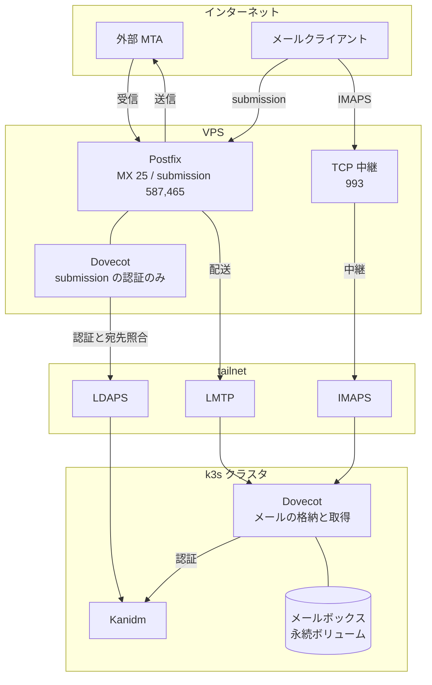
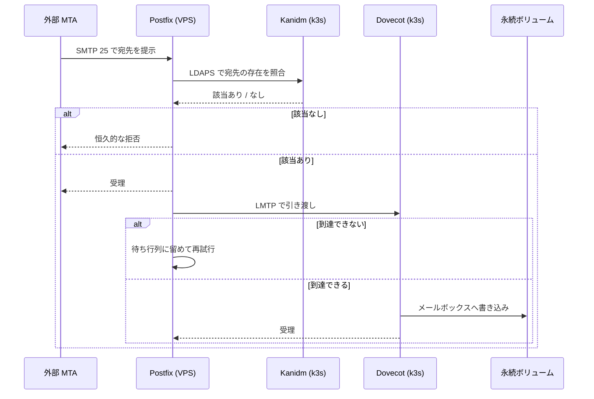
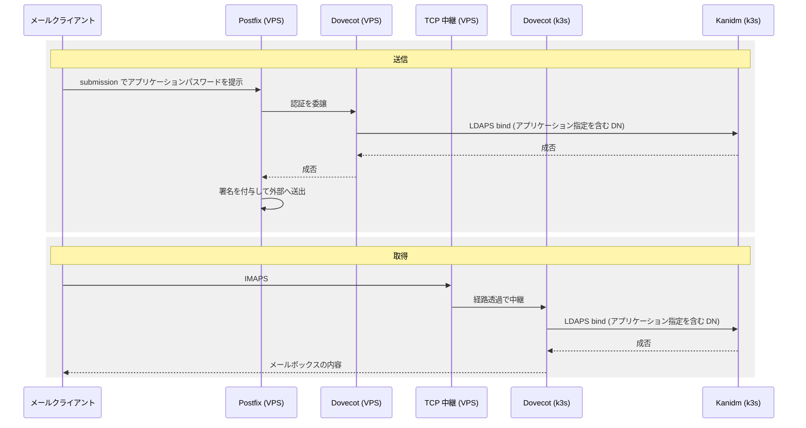
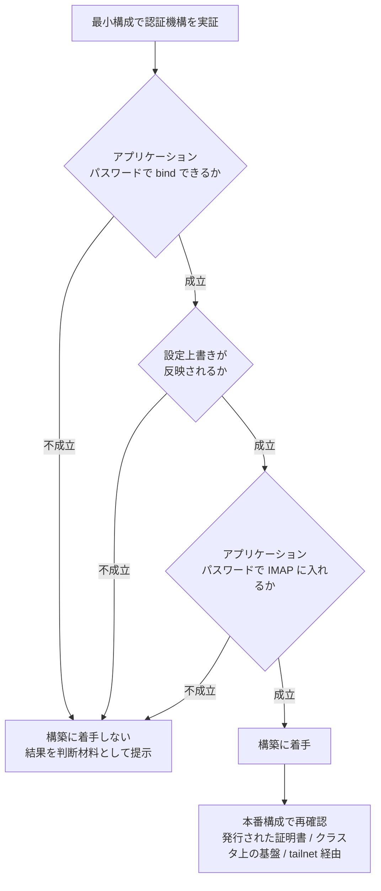
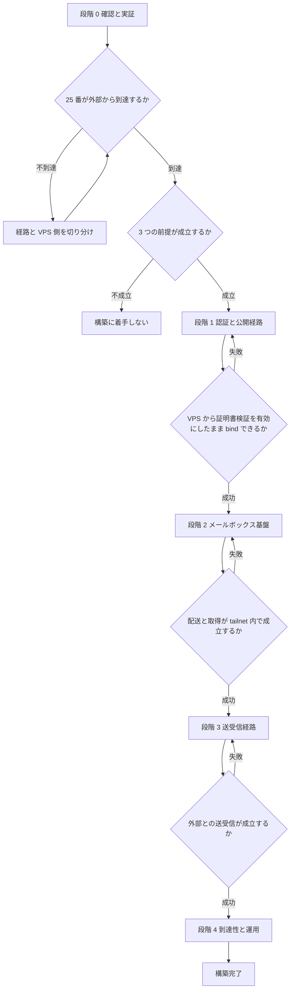

# Technical Design: mail-platform

## Overview

**Purpose**: ホームラボのメール基盤を新規に構築する。外部との送受信を VPS 上の docker-mailserver が担い、メールの実体と取得の終端を k3s 側に置く。利用者の認証は k3s 上の Kanidm に集約し、メールクライアントには主クレデンシャルと分離されたアプリケーションパスワードを用いさせる。

**Users**: ホームラボ管理者が単独で運用し、同一の人物が利用者でもある。メールクライアントは複数の端末から接続する。

**Impact**: `my-home-network` に VPS のメールサーバを構成するロールと、メール関連の DNS 定義が加わる。`gitops-apps` にメールボックスの格納と取得を担う定義が加わる。認証基盤に対しては、メール用のアプリケーション定義と利用者グループが宣言として加わる。

構成の中核は 2 つある。第一に、Kanidm のアプリケーションパスワード機構により、メールクライアントが保持する資格情報をログインおよび sudo に用いる資格情報から分離する。第二に、メールボックスと取得の終端を k3s 側に置き、VPS と k3s の間をネットワークファイルシステムではなく配送規約で結ぶ。後者により、広域網の断絶がファイルシステムのストールとしてプロセスを停止させる経路を作らない。

前者の機構は Kanidm の安定版に同梱されているが公式ドキュメントに解説の章を持たず、docker-mailserver との組み合わせの公開事例も存在しない。したがって最小構成による実証を本構築の前提条件とし、実証が成立しない場合の撤退を段階の分岐として設計に含める。

### Goals

- 外部との送受信を VPS で完結させ、家庭回線の可用性と送信制約に依存しない状態にする。
- メールの実体を自宅側に置き、VPS の容量に制約されない状態にする。
- メールクライアントが保持する資格情報を、ログインおよび sudo に用いる資格情報から分離する。
- 送信したメールが送信元の識別に関する検証をすべて通過する状態にする。
- 構成を再現可能な定義から適用し、手作業で組み上げた状態を唯一の情報源にしない。
- 蓄積されるメールを復旧できる状態にする。

### Non-Goals

- Web メールクライアントの提供。
- メーリングリスト、共有メールボックス、および組織的なメール運用機能。グループ宛の配送を含む。
- 旧メール基盤からのメールデータの移行。引き継ぐべき受信済みのメールが存在しない。
- 迷惑メール対策の高度化。docker-mailserver が既定で備える範囲に留める。
- 認証基盤そのものの構築。`iac-hygiene-remediation` の要件 26 が担う。
- 複数の利用者に対する運用設計。単一の利用者を前提とする。
- メールボックスへの複数サーバからの同時アクセス。書き込み側を単一に保つ。

## Boundary Commitments

### This Spec Owns

- VPS 上のメールサーバの構成と、それを管理する Ansible ロール。
- k3s 側のメールボックスの永続化、取得の終端、および配送の受け口の定義。
- 認証基盤上のメール用アプリケーション定義、利用者グループ、および検索用サービスアカウントの宣言。
- 認証基盤の LDAPS の待受の有効化、tailnet から到達可能にする公開経路、およびそのホスト名の解決。`iac-hygiene-remediation` の要件 26 は LDAP を前提とする統合方式を採らないため、LDAPS に関する構成は本 spec が所有する。
- メール到達性を成立させる DNS レコード (MX / SPF / DKIM / DMARC) の定義。
- エッジホストのネットワークフィルタに対する、メールの待受ポートの許可の追加。
- メール基盤が用いる認証情報のキー空間。
- DMS の衛星サービス (迷惑メール判定、ウイルス検査、認証の反復失敗に対する遮断) の有効化と、それに伴う旧来の機構の無効化。
- 蓄積されるメールの保全と、その復旧手順。
- 利用者がメールクライアントを設定するための記述。

### Out of Boundary

- 認証基盤の構築、および認証基盤と Gitea / ArgoCD / NAS / Home Assistant / Garage / Guacamole との統合。
- エッジホストの証明書供給の仕組みそのもの。本 spec はメール用ホスト名の証明書を利用する側であり、供給機構は `iac-hygiene-remediation` が確立する。
- 逆引きレコードの実際の設定操作。提供元の管理画面での操作であり、コードによる管理の対象外とする。
- 実証が不成立だった場合の認証基盤の再選定。判断は `iac-hygiene-remediation` 側に属する。
- 家庭回線への受信用ポートの開放。公開するアドレスを VPS のものに限る。

### Allowed Dependencies

- k3s 上の Kanidm。LDAPS による認証と検索。
- Infisical。認証情報の単一の情報源。
- tailnet。VPS と k3s の間の通信路。
- cert-manager および `iac-hygiene-remediation` が確立するエッジホストの証明書供給。
- Terraform と HCP Terraform。DNS レコードの定義。
- ArgoCD。k3s 側の定義の同期。
- 仮想化基盤の保護機構。計算機単位の保護を第 2 の層として用いる。

**依存の制約**: k3s 側のコンポーネントは外部 MTA へ直接送信しない。送信は必ず VPS を経由する。家庭回線の外向き 25 番ポートが遮断されているため、この制約に違反する構成は成立しない。VPS の 25 番ポートは外向き・内向きとも実測により開通しており、送受信双方の前提は満たされている。内向きの到達は構成全体の前提であるため、着手時点での確認を関門として残す。

### Revalidation Triggers

- 認証基盤の bind DN の形式、またはアプリケーションパスワードの発行手順が変わった場合。
- 認証基盤の LDAPS の公開方式、またはメール基盤が用いるホスト名が変わった場合。
- メールボックスの格納先、または配送の受け口の位置が変わった場合。
- VPS のアドレスが変わった場合。送信元の識別に関する記録がすべて追随を要する。
- `iac-hygiene-remediation` がエッジホストの証明書供給の割り当てを変更した場合。

## Architecture

### Architecture Pattern & Boundary Map



**Architecture Integration**:

- **選択したパターン**: 送受信の境界と格納の境界を分離する。VPS は外部との境界を担い、k3s はメールの保持を担う。両者はネットワークファイルシステムではなく配送規約と取得規約で結ぶ。
- **境界の分離**: VPS 側は「外部と話す」責務のみを持ち、メールの実体を保持しない。k3s 側は「メールを保持し取得させる」責務のみを持ち、外部と直接話さない。
- **維持する既存のパターン**: VPS 上の TCP 中継は `vps_proxy` ロールが既に持つ経路透過の仕組みに載せる。k3s 側の定義は ApplicationSet の走査対象に置く。認証情報は Infisical から供給する。
- **新規コンポーネントの根拠**: k3s 側のメール格納コンポーネントは、メールボックスを永続ボリュームとして直接扱うために必要である。これを置くことで、広域網を越えるファイルシステムを構成から排除できる。
- **steering への適合**: 公開するアドレスを VPS のものに限り、家庭回線に受信用のポートを開けない。

### Technology Stack

| Layer | Choice / Version | Role in Feature | Notes |
|-------|------------------|-----------------|-------|
| 外部境界 | docker-mailserver (Dovecot 2.4 系を同梱する版) | MX による受信、submission による送信、送信元識別の署名 | 実証を行った系列。対象版を固定する。主要版の更新は本 spec の範囲外 |
| 認証 (VPS 側) | Dovecot passdb (LDAP) | submission の認証 | bind DN をテンプレートで組み立てる。設定は環境変数ではなく設定ファイルで与える |
| 宛先照合 | Postfix LDAP テーブル | 受信可能な宛先の判定 | 検索用サービスアカウントのトークンで接続する。フィルタはインデックス済み属性との論理積とする |
| 配送 | Postfix `virtual_transport` (LMTP) | VPS から k3s への引き渡し | 到達できない場合は待ち行列に留まる |
| 格納と取得 | Dovecot (2.4 系) | メールの格納、IMAP の終端、LMTP の受け口 | k3s 上で稼働し、永続ボリュームを直接扱う。主要版を VPS 側と揃える |
| 取得の公開 | 経路透過の TCP 中継 | VPS で受けて k3s へ中継する | TLS は k3s 側で終端する |
| 認証基盤 | Kanidm | アプリケーションパスワードによる bind、メール属性の検索 | 構築は別 spec が担う |
| 通信路 | tailnet | VPS と k3s の間 | LMTP / IMAPS / LDAPS が通過する |
| シークレット | Infisical | 認証情報の単一の情報源 | k3s へは Operator 経由、VPS へは実行時取得 |
| DNS | Terraform / Cloudflare | MX / SPF / DKIM / DMARC | 逆引きのみ対象外 |
| 保全 | 定期実行による書庫の取り出し | メールボックスの複製 | 保存先はクラスタ外のホスト |

## File Structure Plan

### Directory Structure

```
my-home-network/
├── ansible/
│   ├── roles/
│   │   └── mailserver/              # VPS 上のメールサーバ
│   │       ├── defaults/main.yml    # 対象版、ホスト名、待受ポート、配送先
│   │       ├── tasks/main.yml       # 前提変数の検査 → 配置 → 起動
│   │       ├── templates/
│   │       │   ├── compose.yaml.j2          # コンテナ定義と環境変数
│   │       │   ├── postfix-main.cf.j2       # 配送先と宛先照合の上書き
│   │       │   ├── postfix-master.cf.j2     # 待受の上書き
│   │       │   ├── dovecot.cf.j2            # bind DN テンプレート
│   │       │   └── ldap-*.cf.j2             # 宛先照合の検索定義
│   │       └── handlers/main.yml
│   └── playbooks/mailserver.yml
├── terraform/
│   └── cloudflare_dns_mail.tf       # MX / SPF / DKIM / DMARC
└── docs/mail-client-setup.md        # 利用者向けの設定手順

gitops-apps/
└── apps/mailbox/                    # k3s 側のメールボックス
    ├── kustomization.yaml
    ├── namespace.yaml
    ├── statefulset.yaml             # Dovecot と永続ボリューム
    ├── configmap.yaml               # passdb / userdb / LMTP / IMAPS の設定
    ├── service.yaml                 # LMTP と IMAPS の待受
    ├── certificate.yaml             # 取得の終端に用いる証明書
    ├── infisical-secret.yaml        # 認証情報の供給
    └── backup-cronjob.yaml          # 書庫の取り出しと複製
```

### Modified Files

- `ansible/inventory/host_vars/vps/main.yml` — メールサーバの配送先、公開ホスト名、および認証基盤の接続先を追加する。
- `ansible/roles/vps_proxy/` — 取得の公開に用いる経路透過の中継先を追加する。メールの待受に関する既存の定義は `iac-hygiene-remediation` が**削除済み**であり、土台は残らない。中継の定義とネットワークフィルタの許可ポートは本 spec が新たに追加する。
- `ansible/playbooks/site.yml` — メールサーバのロールを適用対象に加える。
- `gitops-apps/apps/argocd/applicationset.yaml` — 走査対象は `apps/*` であるため変更を要しない。新規ディレクトリの追加のみで同期対象になる。

## System Flows

### 受信と配送



宛先の照合を受理の前に行うのは、存在しない宛先を受理したのちに送信元へ返送する経路を作らないためである。配送先へ到達できない場合に待ち行列へ留める挙動は送信側の標準の機構であり、追加の実装を要しない。

### 送信と取得の認証



双方の bind は同一の形式を用いる。VPS 側の bind は tailnet を経由し、k3s 側の bind はクラスタ内で完結する。取得の経路で TLS を終端するのは k3s 側であり、中継は経路を透過させるのみで内容を解さない。

### 実証と撤退の判断



実証は VPS と k3s の実環境を用いずに完結させる。3 項目のいずれが不成立でも撤退の判断に直結する。

最小構成では再現されない条件がある。認証局が発行した証明書による接続、クラスタ上で稼働する認証基盤への接続、および tailnet を経由する経路の 3 つは、実証ではなく構築の過程で確認する。それぞれ段階 1 と段階 3 の完了条件に含める。

## Requirements Traceability

| Requirement | Summary | Components | Interfaces | Flows |
|-------------|---------|------------|------------|-------|
| 1.1-1.7 | 実証と撤退判断 | FeasibilityProof | 最小構成の起動定義 | 実証と撤退 |
| 1.8 | 本番構成での再確認 | FeasibilityProof, LdapExposure, EdgeMailServer | LDAPS の接続契約 | 実証と撤退 |
| 1.9-1.10 | 待受ポートの実測と撤退 | FeasibilityProof | ポート疎通の実測 | 実証と撤退 |
| 1.11 | 実証に用いる版の一致 | FeasibilityProof | 最小構成の起動定義 | 実証と撤退 |
| 1.12 | 利用可能メモリの実測 | FeasibilityProof, EdgeMailServer | 資源の実測 | 実証と撤退 |
| 2.1-2.3, 2.9-2.10 | アプリケーション定義と利用者グループ | MailAuthProvisioning | 宣言的な適用手段 | — |
| 2.4-2.5 | bind の方式の限定 | MailAuthProvisioning, EdgeMailServer, MailboxBackend | bind DN の形式 | 送信と取得の認証 |
| 2.6-2.7 | 検索用サービスアカウント | MailAuthProvisioning, EdgeMailServer | LDAP 検索の接続 | 受信と配送 |
| 2.8 | アカウント名の命名規約 | MailAuthProvisioning | bind DN の形式 | — |
| 2.11 | 検索フィルタの組み立て | MailAuthProvisioning, EdgeMailServer | LDAP 検索の接続 | 受信と配送 |
| 2.12 | アカウントポリシーの緩和 | MailAuthProvisioning | 宣言的な適用手段 | — |
| 2.13 | 代理発行の不成立を前提とする運用 | MailAuthProvisioning, MailClientGuide | — | — |
| 3.1-3.2 | LDAPS の待受と公開 | LdapExposure | 経路透過の公開 | — |
| 3.3-3.5 | 接続方式と証明書の検証 | LdapExposure, EdgeMailServer | LDAPS の接続契約 | 送信と取得の認証 |
| 3.6-3.7 | 名前解決と通信路の限定 | LdapExposure | tailnet 上の解決 | — |
| 3.8 | 接続不能時の挙動 | EdgeMailServer | 認証の失敗記録 | 送信と取得の認証 |
| 4.1-4.3 | 送受信の提供と認証の経路 | EdgeMailServer | submission の認証契約 | 送信と取得の認証 |
| 4.4, 4.6 | メールボックスの識別子と割当量 | MailboxBackend | userdb の静的定義 | — |
| 4.5, 4.8-4.9 | 対象版と設定上書き経路 | EdgeMailServer | 設定上書きの契約 | 実証と撤退 |
| 4.7 | メール用ホスト名の証明書 | EdgeMailServer, MailboxBackend | 証明書の供給 | — |
| 4.10 | 認証局証明書の信頼 | EdgeMailServer | LDAPS の接続契約 | 送信と取得の認証 |
| 4.11 | 待受ポートの通過許可 | EdgeMailServer | ネットワークフィルタの定義 | — |
| 4.12 | 証明書更新の反映 | EdgeMailServer | 証明書の供給 | — |
| 5.1-5.3 | メールボックスの位置とアクセス | MailboxBackend | LMTP と IMAPS の待受 | 受信と配送 |
| 5.4 | 到達不能時のメール保全 | EdgeMailServer | 配送の再試行契約 | 受信と配送 |
| 5.5 | 直接アクセスと単一書き込み | MailboxBackend | 永続ボリュームの定義 | — |
| 5.6 | 容量の監視 | MailboxBackend | — | — |
| 5.7 | 削除保護の注釈 | MailboxBackend | 永続ボリュームの定義 | — |
| 6.1-6.4 | 送信元識別の記録 | MailDeliverability | DNS 定義 | — |
| 6.5-6.6 | 逆引きと管理対象外の記録 | MailDeliverability | — | — |
| 6.7 | 到達性の確認 | MailDeliverability | — | — |
| 6.8 | 中継の禁止 | EdgeMailServer | Postfix の制限 | 受信と配送 |
| 6.9 | MX 公開の承認ゲート | MailDeliverability, MailboxBackup | — | — |
| 7.1-7.6 | 認証情報の集約 | MailSecretSupply | Infisical キー空間 | — |
| 8.1-8.7 | 構成のコード化と冪等性 | MailConfigCodification | ロール、GitOps、Terraform | — |
| 9.1-9.6 | 保全と復旧 | MailboxBackup | 書庫の取り出し | — |
| 9.7-9.10 | 保護の層、保存先の分離、残る障害範囲 | MailboxBackup | 書庫の取り出し | — |
| 10.1-10.7 | 利用者の設定手順 | MailClientGuide | — | — |
| 11.1-11.5, 11.7 | 衛星サービスの有効化と宣言 | EdgeMailServer | 環境変数の宣言 | — |
| 11.6 | 資源不足時の取捨 | FeasibilityProof, EdgeMailServer | 資源の実測 | 実証と撤退 |
| 11.8-11.10 | 衛星サービスの動作確認 | EdgeMailServer | 既知検体による確認 | — |

## Components and Interfaces

| Component | Domain/Layer | Intent | Req Coverage | Key Dependencies (P0/P1) | Contracts |
|-----------|--------------|--------|--------------|--------------------------|-----------|
| FeasibilityProof | 検証 | 依存する機構の成立と環境側の前提を着手前に確認する | 1.1-1.12, 11.6 | Kanidm イメージ (P0), DMS イメージ (P0), VPS (P0) | Batch |
| MailAuthProvisioning | 認証基盤 | メール認証に必要な定義を認証基盤上に宣言から作る | 2.1-2.3, 2.6, 2.8-2.10 | Kanidm (P0), 宣言的適用手段 (P0) | State |
| LdapExposure | ネットワーク | 認証基盤の LDAPS を tailnet から到達可能にする | 3.1-3.2, 3.6-3.7 | k3s (P0), cert-manager (P0), tailnet (P0) | State |
| EdgeMailServer | VPS | 外部との送受信、submission の認証、および衛星サービスを担う | 2.4, 2.5, 2.7, 3.3-3.5, 3.8, 4.1-4.3, 4.5, 4.7-4.12, 5.4, 6.8, 11.1-11.10 | DMS (P0), Kanidm (P0), MailboxBackend (P0) | Service, State |
| MailboxBackend | k3s | メールを保持し、配送を受け、取得を終端する | 2.4, 4.4, 4.6-4.7, 5.1-5.7 | k3s (P0), Kanidm (P0), cert-manager (P1) | Service, State |
| MailDeliverability | DNS | 送信元の識別に関する記録を定義する | 6.1-6.7, 6.9 | Terraform (P0), Cloudflare (P0), VPS 提供元 (P1) | State |
| MailSecretSupply | シークレット | メール基盤の認証情報を単一の情報源から供給する | 7.1-7.6 | Infisical (P0), Infisical Operator (P0) | State |
| MailConfigCodification | 横断 | 構成を再現可能な定義として保持する | 8.1-8.7 | Ansible (P0), ArgoCD (P0), Terraform (P0) | Service |
| MailboxBackup | 運用 | 蓄積されるメールを復旧できる状態にする | 9.1-9.10, 6.9 | MailboxBackend (P0), 別ディスク上の保存先 (P0) | Batch |
| MailClientGuide | ドキュメント | 利用者が資格情報を発行し接続できる状態にする | 10.1-10.7 | MailAuthProvisioning (P1) | — |

### 検証

#### FeasibilityProof

| Field | Detail |
|-------|--------|
| Intent | 公開事例を持たない機構の成立と、環境側の前提を、構築に着手する前に確認する |
| Requirements | 1.1-1.12 |

**Responsibilities & Constraints**

- 外部から VPS への 25 番ポートは到達が確認済みである。提供元側に解除を要する操作は存在しない。着手時点で到達が維持されていることを確認し、到達しない場合は原因を切り分けて解消するまで後続の段階に着手しない。
- 確認は OP25B の影響を受けない経路からの接続によって行う。家庭回線を経由する測定は無効とする。OP25B が塞ぐのは発信側の外向き 25 番であり、家庭回線から VPS の 25 番へ接続を試みると家庭側で落ちる。測っているのは家庭回線の外向き 25 番であって VPS の内向き 25 番ではない。測定経路の条件そのものが確認手順の一部である。
- 465 / 587 / 993 番ポートも到達が確認済みであり、submission と IMAPS の公開経路について提供元側の操作を要しない。VPS からの外向き 25 番ポートも開通が確認済みで、送信側の前提は満たされている。
- あわせて VPS の利用可能メモリと swap を実測する。定義の確認ではなく実測による。
- 利用可能メモリと swap の合計がウイルス検査機構の要求量を下回る場合、当該機構を有効化しない判断とその残存リスクを記録する。この判断は撤退ではなく機能の取捨であり、他の衛星サービスには影響しない。
- 実証に用いる認証基盤の版を `iac-hygiene-remediation` が固定した版と一致させる。一致しない版で得た結果を成立の根拠としない。
- 認証基盤とメールサーバを最小構成で起動し、依存する 3 つの前提を個別に確認する。確認は VPS および k3s の実環境を用いずに完結させる。
- 確認の対象は、アプリケーション指定を含む bind DN による認証、設定上書き経路の反映、およびアプリケーションパスワードによる取得の成立の 3 つとする。
- 対照として、アプリケーション指定を含まない bind DN で同一の資格情報が拒否されること、および利用者グループから除外した場合に認証が成立しないことを確認する。これらが区別されない場合、資格情報の分離が成立していない。
- 結果を成立した項目と成立しなかった項目に分けて記録する。成立しなかった項目については、確認に用いた操作と得られた応答をそのまま残す。
- 実証が完了するまで、VPS および k3s に対するメール基盤の構成変更を行わない。
- 最小構成では再現されない条件を、本番構成で改めて確認する項目として定める。対象は認証局が発行した証明書による接続、クラスタ上で稼働する認証基盤への接続、および tailnet を経由する経路とする。これらは実証の対象ではなく、構築の過程で該当する段階の完了条件として確認する。

**Dependencies**

- External: 認証基盤のコンテナイメージ — 最小構成での起動 (P0)
- External: メールサーバのコンテナイメージ — 設定上書き経路の確認 (P0)

**Contracts**: Batch [x]

##### Batch / Job Contract

- **Trigger**: 本 spec の最初の作業として、他のいずれの構成変更よりも前に実行する。環境側の実測を機構の実証より前に置く。
- **Input / validation**: 対象とする認証基盤の版が、アプリケーションパスワードの管理手段を備え、かつ `iac-hygiene-remediation` が固定した版と一致することを確認する。備えない版では実証自体が成立せず、一致しない版では結果が本番に適用できない。
- **Output / destination**: 項目ごとの成否と、成立しなかった項目における操作と応答の記録。環境側の実測値 (25 番ポートの到達確認、測定に用いた経路、メモリと swap の実測値) を含む。測定経路を記録するのは、無効な経路で得た結果を後から判別できるようにするためである。
- **Idempotency & recovery**: 実証環境は破棄可能とし、再実行できる形で構成を残す。

**Implementation Notes**

- Integration: 実証の構成は本番の構成と一致させない。確認すべきは機構の成立であり、構成の再現ではない。版のみを一致させる。
- Validation: 後続を止めるのは、25 番ポートの不到達、bind の不成立、および取得の不成立の 3 つ。ただし不到達は測定経路の誤りである場合があるため、経路の条件を満たしたうえで原因を切り分ける分岐を持つ。設定上書き経路は代替経路への分岐を持ち、メモリの不足は機能の取捨に留まる。
- Risks: 実証が成立しても本番規模での動作を保証しない。実証は撤退の判断を早めるためのものであり、構築の検証を代替しない。
- Risks: 到達の確認は経路を誤ると偽の失敗を返す。家庭回線からの測定は 25 番について常に失敗し、その失敗は VPS 側の状態を示さない。到達しているのに不到達と判断し、存在しない遮断の解消に手を費やすことになる。

### 認証基盤

#### MailAuthProvisioning

| Field | Detail |
|-------|--------|
| Intent | メール認証に必要な定義を認証基盤上に宣言から作る |
| Requirements | 2.1-2.3, 2.6, 2.8-2.10 |

**Responsibilities & Constraints**

- メール用のアプリケーション定義を保持し、利用者グループに関連付ける。当該グループに所属しない利用者はアプリケーションパスワードを発行できない。
- 利用者をグループから除外した時点で、その利用者のメール認証が成立しなくなる状態を保つ。
- メール属性を検索条件として用いるために、当該属性の読み取りを許可されたサービスアカウントを保持する。属性の読み取り許可は検索結果の取得だけでなく、検索条件として用いる場合にも必要である。**許可が欠けている場合、認証基盤はエラーではなく 0 件を返す。** 呼び出し側からは宛先が存在しないのと区別できないため、許可の有無を直接確認する検証を構築時に行う。
- メール属性はインデックスされていない。当該属性のみを条件とする検索は資源制限により拒否されるため、検索はインデックス済み属性との論理積として組み立てる。
- メール利用者グループに対して、メールクライアントが用いる資格情報の種別を許容するアカウントポリシーを与える。既定のポリシーは多要素を要求し、パスワードのみの資格情報を確定できない。
- アプリケーションパスワードの発行には利用者自身の認証済みセッションを要する。管理者による代理発行は成立しない。運用手順はこの制約を前提とする。
- 利用者のアカウント名をメールアドレスのローカル部と一致させる。認証基盤の bind DN 解決はアカウント名、主体名、および識別子のみを受け付け、メール属性からは解決できない。
- アプリケーションパスワードを利用者自身が発行および失効できる状態に保つ。発行手段は命令行のみであり、画面上の操作手段を持たない。
- 定義は宣言として保持し、繰り返し適用しても結果が変わらない手段で反映する。画面操作でのみ存在する定義を作らない。

**Dependencies**

- Inbound: `iac-hygiene-remediation` の認証基盤 — 稼働と LDAPS の有効化 (P0)
- Outbound: 宣言の適用手段 — 定義の反映 (P0)

**Contracts**: State [x]

##### State Management

- **State model**: メール用アプリケーション定義、利用者グループ、グループの構成員、および検索用サービスアカウントとその属性読み取り許可。
- **Persistence & consistency**: 宣言が正であり、適用は宣言から認証基盤への一方向とする。認証基盤側にのみ存在する定義を認めない。アプリケーションパスワードそのものは利用者が発行するものであり、宣言の対象に含めない。
- **Concurrency strategy**: 適用は直列に行う。

**Implementation Notes**

- Integration: 宣言の適用手段は `iac-hygiene-remediation` の要件 26 が確定させたものを用いる。本 spec で別の手段を導入しない。
- Integration: アカウント名とメールアドレスのローカル部の一致は、bind DN をテンプレートで組み立てる方式の前提である。この制約が破られると認証経路が成立しない。
- Validation: 宣言を 2 回適用して 2 回目に変更が報告されないこと、グループから除外した利用者の認証が成立しなくなること、および検索用サービスアカウントがメール属性の読み取り許可を持つことを確認する。最後の項目は、許可の欠落が 0 件として現れ他の失敗と区別できないため、独立した確認とする。
- Risks: アプリケーションパスワードに有効期限を設定できない。失効はパスワードの削除、グループからの除外、アプリケーション定義の削除、およびアカウントの有効期限のいずれかによる。**このうちグループからの除外が最も速く反映される**ため、失効の第一手段とする。

### ネットワーク

#### LdapExposure

| Field | Detail |
|-------|--------|
| Intent | 認証基盤の LDAPS を tailnet から到達可能にする |
| Requirements | 3.1-3.2, 3.6-3.7 |

**Responsibilities & Constraints**

- 認証基盤の LDAPS の待受を有効にし、TLS を終端しない経路でクラスタ外へ公開する。LDAPS は素の TLS であり、HTTP を前提とする公開経路では扱えない。
- 認証基盤は HTTPS と LDAPS に同一の証明書を用いる。LDAPS 専用の証明書を別に持てないため、接続に用いるホスト名は認証基盤が提示する証明書の対象に含まれる名前とする。
- 証明書の連鎖は認証局と末端の証明書を分ける。認証局の証明書をそのまま末端として提示する構成は認証基盤に拒否される。認証局が発行する通常の構成ではこの条件を満たす。
- VPS が当該ホスト名を tailnet 上のアドレスへ解決する。名前そのものは公開ドメインのものを用い、解決先のみを tailnet に向ける。これにより証明書の対象名の一致、公開された認証局による検証、および通信路の tailnet 内への限定を同時に満たす。
- 認証基盤の識別子は単一であり、複数のホスト名を並立させられない。tailnet が発行する名前で接続する構成は採らない。

**Dependencies**

- Inbound: `iac-hygiene-remediation` の認証基盤 — LDAPS の待受 (P0)
- Outbound: k3s — 経路透過の公開 (P0)
- Outbound: tailnet — 名前解決と通信路 (P0)

**Contracts**: State [x]

##### State Management

- **State model**: LDAPS の待受アドレスとポート、クラスタ外への公開定義、および VPS 側の名前解決の設定。
- **Persistence & consistency**: 公開定義は k3s 側の定義として保持する。名前解決の設定は VPS の構成として保持する。
- **Concurrency strategy**: 該当しない。

**Implementation Notes**

- Integration: 公開の手段は経路透過の TCP 中継、負荷分散の割り当て、または tailnet への直接の接続のいずれかを選ぶ。いずれの場合も TLS を終端しない。
- Validation: VPS から当該ホスト名に対する LDAPS の接続が、証明書の検証を有効にしたまま成立することを確認する。
- Risks: 名前解決を tailnet に向ける手段が失われると、当該ホスト名が公開経路の側へ解決されうる。解決先を固定する手段を構成として保持する。

### VPS

#### EdgeMailServer

| Field | Detail |
|-------|--------|
| Intent | 外部との送受信と submission の認証を担う |
| Requirements | 2.4, 2.5, 2.7, 3.3-3.5, 3.8, 4.1-4.3, 4.5, 4.7-4.12, 5.4, 6.8, 11.1-11.10 |

**Responsibilities & Constraints**

- MX による受信、submission による送信、および取得の公開点を提供する。取得は自身で終端せず、格納側へ経路を透過させて中継する。
- 認証を Dovecot の passdb によって行い、submission の認証も同一の passdb を経由させる。bind DN はテンプレートによって組み立てる。検索によって得た識別名で bind する方式を用いない。認証基盤が返す識別名にはアプリケーション指定が含まれないため、検索方式では資格情報の分離が成立しない。
- 認証基盤への接続は LDAPS を用い、サーバ証明書を検証する。StartTLS を用いる設定と検証を無効化する設定を保持しない。認証基盤は StartTLS に対応しない。
- 認証基盤への接続が確立できない場合、認証を成立させず失敗を記録に残す。
- 宛先の照合を受理の前に行い、存在しない宛先を恒久的に拒否する。受理後に返送する経路を作らない。照合の検索はメール属性とインデックス済み属性の論理積として組み立てる。メール属性のみを条件とする検索は資源制限により拒否される。
- 認証基盤の証明書を検証するために必要な認証局の証明書を、自身の信頼済み証明書の集合に保持する。保持しない場合、認証基盤への接続そのものが確立しない。
- 受理したメールを配送規約によって格納側へ引き渡す。格納側へ到達できない場合、待ち行列に留めて再試行する。送信元には一時的な失敗として応答し、メールを損失させない。
- 第三者による中継を許可しない。
- 対象版を固定し、当該版が前提とする設定名に一致する構成を保持する。認証に関する設定は環境変数では反映されないため、設定ファイルの追加によって与える。あわせて既定の項目定義を差し替える。既定の定義は認証基盤に存在しない属性を参照しており、差し替えなければ認証が成立しない。
- メール用ホスト名の証明書を保持し、受信および送信の待受で用いる。証明書の更新後、更新後の値を各待受に反映する。反映のために手動の操作を要しない状態にする。
- メールの待受に用いるポートを、ホスト自身のネットワークフィルタと提供元のネットワークフィルタの双方で通過させる。`iac-hygiene-remediation` はメールの待受に関する既存の定義を削除し、エッジホストの許可ポートの集合を意図した値に一致させる検証を持つため、本 spec が明示的に追加しなければ閉じられる。
- 衛星サービスとして、迷惑メールの判定、ウイルスの検査、および認証の反復失敗に対する遮断を有効化する。いずれも既定では無効である。
- 衛星サービスの有効化にあたり、迷惑メール判定機構が置き換える旧来の機構を無効化する。対象は DKIM 署名、認証結果の記録、送信者方針の検査、およびメッセージ検査の中継であり、**いずれも既定で有効**である。有効化する変数を足すだけでは無効にならない。
- DKIM 署名の担当を迷惑メール判定機構に一本化する。旧来の署名機構を有効なまま残すと署名が二重に付与され、受信側の検証に失敗する。
- 認証の反復失敗に対する遮断機構が要求するカーネル権限を、コンテナの定義に明示して与える。当該機構はホストのパケットフィルタを操作するため、既定の権限では有効化しても遮断が機能しない。
- 認証済みの送信に対して検査を適用するか否かを、明示的な宣言として保持する。既定に委ねない。

**Dependencies**

- Outbound: Kanidm — 認証と宛先の照合 (P0)
- Outbound: MailboxBackend — 配送先と取得の中継先 (P0)
- Outbound: Infisical — 検索用トークンと署名鍵の供給 (P0)
- Inbound: `iac-hygiene-remediation` のエッジ証明書供給 — メール用ホスト名の証明書 (P0)
- External: docker-mailserver — 送受信の実装 (P0)

**Contracts**: Service [x] / State [x]

##### Service Interface

認証と配送の契約を、満たすべき性質として定義する。

- アプリケーション指定を含む bind DN による認証のみが、アプリケーションパスワードで成立する。指定を含まない形式では成立しない。
- 認証に成功した利用者のみが送信できる。認証を伴わない送信要求は、自ドメイン宛の受信を除き受理しない。
- 宛先の照合に用いる検索は、メール属性の読み取りを許可されたサービスアカウントの資格情報で行う。
- 格納側へ到達できない場合、受理済みのメールは待ち行列に留まる。破棄しない。
- 認証情報および署名鍵は、応答にもコンテナイメージにも現れない。

##### State Management

- **State model**: コンテナの定義と環境変数、Postfix と Dovecot の上書き設定、衛星サービスの有効化状態、待ち行列、署名鍵、および遮断機構が保持する発信元の一覧。
- **Persistence & consistency**: 設定はロールの定義から生成する。衛星サービスの有効化と旧来の機構の無効化は環境変数の宣言としてロールの定義に置き、当該定義を有効化状態の単一の情報源とする。コンテナ上での直接の変更を前提としない。待ち行列と署名鍵は VPS 上に永続化する。メールの実体は保持しない。
- **Concurrency strategy**: 単一のコンテナとして稼働する。

**Implementation Notes**

- Integration: 配送先の指定と宛先照合の定義は、上書き用の設定ファイルとして与える。当該経路は任意のパラメータを受け付け、起動時に既定の設定へ追記されたうえで重複が除去される。
- Integration: 認証の設定は 2 つの経路を併用する。追加設定のファイルで待受の方式と bind DN のテンプレートを与え、既定の項目定義のファイルを差し替えて参照する属性を是正する。いずれか一方では成立しない。**この構成は対象版に固有であり、主要版の更新時に追随を要する。**
- Integration: 取得の中継は経路を透過させるのみで内容を解さない。TLS の終端は格納側が行う。中継の定義は既存の TCP 中継の仕組みに載せる。
- Integration: 送信元の識別に関する記録はすべて VPS のアドレスに対して設定する。家庭回線の外向き 25 番ポートが遮断されているため、送信を VPS 以外から行う構成は成立しない。
- Integration: 衛星サービスは有効化する 3 つの変数と、無効化する 4 つの変数の組で 1 つの決定として扱う。片方だけの適用を許さない。ウイルス検査機構のみ、段階 0 の実測結果によって有効化しない分岐を持つ。
- Validation: アプリケーションパスワードで送信でき、主クレデンシャルおよび POSIX パスワードでは送信できないこと。格納側を停止させた状態で受信したメールが待ち行列に留まり、復旧後に配送されること。認証を伴わない第三者宛の中継が拒否されること。
- Validation: 衛星サービスは有効化の宣言ではなく動作によって確認する。迷惑メールの判定とウイルスの検知には判定を発火させる既知の検体を用い、遮断は意図的な反復失敗によって確認する。あわせて送信メールに付与された署名が 1 つだけであることを確認する。
- Risks: 認証の設定が対象版に固有の 2 経路の併用に依存する。版の更新でいずれかの経路が変わると認証が成立しなくなる。版を固定し、更新を別の作業として扱う。
- Risks: 旧来の DKIM 署名機構は既定で有効であり、迷惑メール判定機構を足しただけでは二重署名になる。二重署名は送信時には成功して見え、受信側でのみ失敗するため、送信側の記録からは検知しにくい。到達性の確認 (要件 6.7) が事実上の検知点となるが、それ以前に署名の数を直接確認する。
- Risks: ウイルス検査機構は定義データベース全体を常駐メモリに読み込むため、要求量が VPS の実リソースを上回りうる。上回る状態で有効化すると、当該機構だけでなくメールサーバ全体がメモリ不足で停止する。段階 0 の実測を有効化の前提とする。

### k3s

#### MailboxBackend

| Field | Detail |
|-------|--------|
| Intent | メールを保持し、配送を受け、取得を終端する |
| Requirements | 2.4, 4.4, 4.6-4.7, 5.1-5.7 |

**Responsibilities & Constraints**

- メールボックスの実体を k3s 側の永続ボリュームに保持する。ネットワークファイルシステムを介さず、直接扱う。索引の写像とロックの方式にネットワークファイルシステム向けの調整を要しないことが、この選択の帰結である。
- 永続ボリュームの定義に、同期による削除の対象から除外する注釈を与える。当該注釈を永続ボリュームの定義と同一の適用で与える。同期は削除を伴う設定で運用されるため、注釈を欠いた状態で定義が一時的に外れると、蓄積したメールが失われる。
- 配送の受け口と取得の終端を提供し、いずれも tailnet からのみ到達可能とする。クラスタ外へ公開する経路を tailnet の内側に限る。
- 認証は認証基盤に対して行う。接続はクラスタ内で完結し、広域網を経由しない。bind DN の形式は VPS 側と共通とする。
- メールボックスの位置および所有者の識別子を、認証基盤から取得せず静的な値として設定する。認証基盤は所有者の識別子と既定シェルに相当する属性を返さない。ホームディレクトリに相当する属性は返るが、値が利用者名に基づかないため用いない。
- 利用者ごとの割当量について方針を定めた設定を保持する。
- メールボックスの容量を確認できる状態にする。
- 書き込み側を単一に保つ。同一のメールボックスへ複数のプロセスから同時にアクセスする構成を作らない。
- 外部 MTA へ直接送信しない。送信は VPS を経由する。

**Dependencies**

- Inbound: EdgeMailServer — 配送と取得の中継 (P0)
- Outbound: Kanidm — 認証 (P0)
- Outbound: k3s の永続ボリューム — メールの保持 (P0)
- Outbound: cert-manager — 取得の終端に用いる証明書 (P1)

**Contracts**: Service [x] / State [x]

##### Service Interface

- 配送の受け口は、宛先が存在する場合のみ受理する。存在しない場合は恒久的な失敗を返す。
- 取得はアプリケーション指定を含む bind DN による認証を経た利用者にのみ許す。
- 取得の経路で TLS を終端する。中継元は内容を解さない。
- 認証情報は応答にも定義にも平文で現れない。

##### State Management

- **State model**: メールボックスの実体、索引、および Dovecot の設定。
- **Persistence & consistency**: メールボックスは永続ボリュームに保持する。書き込み側を単一に保つことで、同時アクセスによる破損の条件を成立させない。
- **Concurrency strategy**: 単一の複製として稼働する。複数の複製による同時アクセスを行わない。

**Implementation Notes**

- Integration: 同梱される Dovecot の主要版を VPS 側と揃える。設定名が版によって異なるため、揃えないと 2 つの設定体系を同時に保守することになる。
- Integration: メールボックスの形式は、各メッセージが個別のファイルとなり操作が不可分であるものを用いる。
- Validation: 配送の受け口へ引き渡したメールが永続ボリュームに現れること、取得がアプリケーションパスワードで成立すること、複製を再作成してもメールが失われないこと。
- Risks: 永続ボリュームの喪失は蓄積したメールの喪失にあたる。復旧対象とする方針に基づき、保全の成果物の存在を段階の完了条件に含める。

### 到達性

#### MailDeliverability

| Field | Detail |
|-------|--------|
| Intent | 送信元の識別に関する記録を定義する |
| Requirements | 6.1-6.7, 6.9 |

**Responsibilities & Constraints**

- 受信するドメインに対する MX の記録を定義する。当該記録の公開は外部からの受信を開始させ、以降に到着したメールは再構築できない。公開の前に、メールボックスの保全が成立し書庫からの復元が確認済みであることを提示して承認を得る。
- 送信元を VPS に限定する送信者方針の記録を定義する。家庭回線からの送出が存在しないため、限定の範囲に家庭側のアドレスを含めない。
- 送信メールへの署名を有効にし、対応する公開鍵の記録を保持する。秘密鍵は記録に現れない。
- 認証に失敗したメールの扱いを指定する記録を定義する。
- 逆引きの記録をメール用ホスト名に一致させる。当該操作が提供元の管理画面を要し、コードによる管理の対象外であることを記録する。
- 構築の完了時に、外部の受信ドメインに対する送信が送信者方針、署名、および両者に基づく方針のすべてに合格することを確認する。

**Dependencies**

- Outbound: Terraform / Cloudflare — 記録の定義 (P0)
- Outbound: EdgeMailServer — 署名鍵と送信元アドレス (P0)
- External: VPS 提供元 — 逆引きの設定 (P1)

**Contracts**: State [x]

##### State Management

- **State model**: MX、送信者方針、署名の公開鍵、および方針の記録。逆引きは対象外。
- **Persistence & consistency**: 記録は Terraform の定義として保持する。手動での作成を前提としない。
- **Concurrency strategy**: 該当しない。

**Implementation Notes**

- Integration: 記録が指す先はすべて VPS のアドレスとなる。VPS のアドレスが変わった場合、記録と逆引きの双方が追随を要する。
- Validation: 外部の受信ドメインへ実際に送信し、受信側が報告する検証結果を確認する。定義の存在だけでは合格を確認できない。
- Risks: 逆引きはコードによる管理の対象外であり、他の記録と同期しない。設定の実施を利用者の作業として明示する。
- Risks: MX の記録の公開は、この spec において唯一「戻せない状態」を作る操作である。記録そのものは削除できるが、公開中に到着したメールは保全が動いていなければ復旧できない。承認ゲートの対象とする理由がここにある。

### 横断

#### MailSecretSupply

| Field | Detail |
|-------|--------|
| Intent | メール基盤の認証情報を単一の情報源から供給する |
| Requirements | 7.1-7.6 |

**Responsibilities & Constraints**

- 検索用のトークン、署名の秘密鍵、およびその他の認証情報を Infisical に登録し、そこを単一の情報源として供給する。
- リポジトリに認証情報を平文で含めない。VPS 上の設定は実行時に取得した値として保持する。
- 新しい認証情報を発行する場合、ローカルで生成したうえで Infisical へ登録して供給する。
- 署名の鍵は生成された値を Infisical に登録し、公開鍵側のみが DNS の定義に現れる状態にする。
- 認証情報が Infisical に存在しない場合、適用を中止し不足している値を示す。適用の途中で停止させない。

**Dependencies**

- Outbound: Infisical — 単一の情報源 (P0)
- Outbound: Infisical Operator — k3s 側への供給 (P0)

**Contracts**: State [x]

##### State Management

- **State model**: Infisical 上のキー空間と、両リポジトリからの参照の対応。
- **Persistence & consistency**: Infisical が正であり、リポジトリは参照のみを持つ。
- **Concurrency strategy**: 該当しない。

**Implementation Notes**

- Integration: 供給の経路は `iac-hygiene-remediation` が確立したものに従う。k3s へは Operator 経由、VPS へは実行時の取得とする。本 spec で別の経路を導入しない。
- Validation: リポジトリ全体の走査で認証情報が検出されないこと、値を欠いた状態でロールを適用すると開始前に停止することを確認する。
- Risks: 署名の秘密鍵は再作成すると公開鍵の記録も更新を要する。再作成の手順を復旧の記述に含める。

#### MailConfigCodification

| Field | Detail |
|-------|--------|
| Intent | 構成を再現可能な定義として保持する |
| Requirements | 8.1-8.7 |

**Responsibilities & Constraints**

- VPS 側の構成を Ansible ロールとして保持する。2 回連続で適用した場合、2 回目に変更を報告しない。
- k3s 側の定義を `gitops-apps` に保持し、ArgoCD の同期対象に含める。
- DNS の記録を Terraform の定義として保持する。
- 認証基盤上のメール用定義を宣言から冪等に適用できる状態にする。
- 適用前に必要な変数の充足を検査し、不足している場合は適用を中止する。
- 構成の適用に必要な手順のうち、コードによる管理の対象外となるものを列挙した記述を持つ。

**Dependencies**

- Outbound: Ansible — VPS の構成 (P0)
- Outbound: ArgoCD — k3s の定義の同期 (P0)
- Outbound: Terraform — DNS の定義 (P0)

**Contracts**: Service [x]

##### Service Interface

- ロールの適用は、前提となる変数がすべて与えられている場合にのみ開始する。
- ロールの 2 回目の適用は変更を報告しない。
- k3s 側の定義は同期の対象に含まれ、手動の適用を前提としない。

**Implementation Notes**

- Integration: k3s 側の定義は ApplicationSet の走査対象に置く。走査は所定の階層を対象とするため、定義の追加のみで同期対象になる。
- Validation: ロールを 2 回適用して 2 回目に変更が報告されないこと、変数を欠いた状態で適用が開始前に停止すること。
- Risks: コードによる管理の対象外となる手順は逆引きの設定と利用者によるアプリケーションパスワードの発行である。後者は対話的な端末を要するため原理的に自動化できず、宣言的な定義の対象にもならない。これらを列挙した記述を持たないと、構成が再現できない状態になる。

### 運用

#### MailboxBackup

| Field | Detail |
|-------|--------|
| Intent | 蓄積されるメールを復旧できる状態にする |
| Requirements | 9.1-9.10, 6.9 |

**Responsibilities & Constraints**

- 蓄積されるメールを復旧対象とする。`iac-hygiene-remediation` はクラスタ上の永続データを復旧対象外としているが、その根拠は再構築できることにある。受信したメールは再構築できないため、同一の扱いを適用しない。
- メールボックスを定期的に書庫として取り出し、**メールボックスの実体を保持する物理ディスクとは異なる物理ディスク**上の保存先へ複製する。異なるホストであっても同一の物理ディスク上にあれば保全にならない。保護対象のゲストは `sda` 上に、保全先は `sdc` 上にあり、この分離は既に成立している。保存する世代数の上限を持つ。
- 仮想化基盤の保護機構による計算機単位の保護を第 2 の層とする。粒度が粗いため第 1 の層としない。メールボックスを保持する計算機を、`iac-hygiene-remediation` が構築する保護機構の対象一覧に含める。
- 保全の成立と復元の確認を、外部からの受信を開始させるより前に済ませる。受信の開始は MX レコードの公開によって起き、それ以降に到着したメールは保全が動くまでの間、単一の複製しか存在しない。
- 復元の手順を記述し、復元が成立することを確認する。定義の存在だけでは確認としない。
- 署名の鍵および認証基盤上のメール用定義について、失われた場合の再作成手順を記述する。これらは復元ではなく再作成の対象である。
- 取得に失敗した場合、失敗を記録に残し成功したものとして扱わない。

**Dependencies**

- Inbound: MailboxBackend — 取得の対象 (P0)
- Outbound: クラスタ外の保存先 — 複製の保存 (P0)

**Contracts**: Batch [x]

##### Batch / Job Contract

- **Trigger**: 定期実行。実行間隔は定義として保持する。
- **Input / validation**: メールボックスの実体が存在することを確認する。存在しない場合は成功として扱わない。
- **Output / destination**: メールボックスの実体とは異なる物理ディスク上の保存先に置かれた書庫。世代数の上限を超えたものは削除する。
- **Idempotency & recovery**: 同一の時点に対する再実行は同一の結果を生む。復元は書庫を展開してメールボックスの実体を置き換える形で行う。

**Implementation Notes**

- Integration: 取り出しは書庫としての一括処理であり、常時のファイルアクセスを伴わない。メールボックスへの常時のネットワークアクセスを構成に持ち込まない。
- Validation: 書庫が生成されること、世代数の上限が機能すること、書庫から復元したメールボックスが取得できること。
- Risks: 保存先がメールボックスと同一の障害域にあると保全にならない。この環境のディスクはいずれも単発構成であり冗長性を持たないため、障害域の境界は物理ディスクである。ホストを分けるだけでは足りない。
- Risks: ディスク単位の分離が成立していても、両者を収容するホストの全損では実体と成果物を同時に失う。これが現構成の限界であり、解消にはホストをまたぐ複製を要する。範囲を記録するに留める。

#### MailClientGuide

| Field | Detail |
|-------|--------|
| Intent | 利用者が資格情報を発行し接続できる状態にする |
| Requirements | 10.1-10.7 |

**Responsibilities & Constraints**

- アプリケーションパスワードの発行手順を記述する。発行が命令行の操作のみで行えること、画面上の操作手段が存在しないことを含める。
- 発行時に必要となる識別子の取得方法を記述する。発行の操作はアプリケーション定義の識別子を引数に取り、名称では指定できない。
- 発行が利用者自身の認証済みセッションを要し、管理者が代理で発行できないことを記述する。発行の操作は対話的な端末を要するため自動化できない。
- 発行されたパスワードが一度だけ表示され再表示できないことを記述する。
- メールクライアントに設定する接続先、ポート、および認証方式を記述する。
- アプリケーションパスワードに有効期限を設定できないこと、および失効の手段を記述する。
- 利用者のアカウント名がメールアドレスのローカル部と一致する必要があることを記述する。

**Dependencies**

- Inbound: MailAuthProvisioning — 発行の前提となる定義 (P1)

**Implementation Notes**

- Integration: 記述は `my-home-network` に置く。認証基盤の操作手順であるが、メール基盤の利用に固有の内容であるため本 spec が保持する。
- Validation: 記述に従って未経験の状態から発行と接続が完了すること。
- Risks: 発行手段が命令行のみであるため、利用者が命令行を扱えない場合に構築が使われないまま残る。この制約を記述の冒頭に置く。

## Error Handling

### Error Strategy

メールの損失を伴う失敗と、伴わない失敗を区別する。損失を伴わない失敗は再試行または利用者への通知で処理し、損失を伴いうる失敗は受理そのものを行わない。

### Error Categories and Responses

**受理前の失敗**: 宛先が存在しない場合は恒久的な拒否とし、受理しない。認証に失敗した場合は送信を許さない。認証基盤へ到達できない場合は認証を成立させず、失敗を記録に残す。いずれもメールを受け取っていないため損失は生じない。

**受理後の失敗**: 格納側へ到達できない場合、受理済みのメールを待ち行列に留めて再試行する。送信元には一時的な失敗として応答する。破棄しない。

**保全の失敗**: 書庫の取得に失敗した場合、失敗を記録に残し成功したものとして扱わない。

### Monitoring

メールボックスの容量を確認できる状態にする。配送の待ち行列の滞留と保全の失敗を記録として残す。本 spec は監視基盤を導入しない。継続的な検知の手段は記録の確認とする。

## Testing Strategy

### 統合検証

- 外部の受信ドメインへ送信し、送信者方針、署名、および両者に基づく方針のすべてに合格する。
- 外部から受信したメールがメールボックスに現れる。
- 存在しない宛先への受信要求が受理されずに拒否される。
- 格納側を停止させた状態で受信したメールが待ち行列に留まり、復旧後に配送される。
- 認証を伴わない第三者宛の中継が拒否される。

### 認証検証

- アプリケーションパスワードで送信および取得が成立する。
- 主クレデンシャルおよび POSIX パスワードでは送信も取得も成立しない。
- 利用者をメール利用者グループから除外すると、送信も取得も成立しなくなる。除外は失効の手段として最も速く反映される。
- 検索用サービスアカウントがメール属性の読み取り許可を持つ。許可を外すと検索が 0 件を返し、宛先が存在しない場合と区別できなくなる。この確認は他の検証から独立して行う。
- メール属性とインデックス済み属性の論理積による検索が成立し、メール属性のみを条件とする検索が資源制限により拒否される。
- 認証基盤を停止させた状態で認証が成立せず、失敗が記録に残る。

### 冪等性検証

- ロールを 2 回連続で適用し、2 回目に変更が報告されない。
- 認証基盤上の宣言を 2 回適用し、2 回目に変更が報告されない。
- 必要な変数を欠いた状態でロールの適用が開始前に停止する。

### 保全検証

- 書庫が生成され、世代数の上限が機能する。
- 書庫から復元したメールボックスが取得できる。
- 取得の失敗が記録に残り、成功として扱われない。

## Security Considerations

- **資格情報の分離**: メールクライアントに保存される資格情報を、ログインおよび sudo に用いる資格情報から分離することが本構成の目的である。分離は bind DN にアプリケーション指定を含めることで成立し、指定を含まない形式では POSIX パスワードによる認証経路に落ちる。この区別が失われると分離の前提が崩れるため、認証基盤側で POSIX パスワードによる bind を無効化する。
- **検索と認証の権限の分離**: 宛先の照合に用いるサービスアカウントは検索のみを行い、利用者の認証には用いない。認証は利用者自身の資格情報による bind で行う。
- **中継の禁止**: 認証を伴わない第三者宛の送信を受理しない。受理する構成は送信元の識別に関する記録の有無にかかわらず外部から悪用される。
- **公開するアドレスの限定**: 家庭回線に受信用のポートを開けない。公開されるアドレスを VPS のものに限ることで、家庭側の構成を外部から到達不能に保つ。
- **証明書の検証**: 認証基盤への接続で証明書の検証を無効化しない。tailnet 内の通信であっても、検証の無効化は経路の信頼性を検証不能な設定に置き換える。

## Migration Strategy



| 段階 | 対象要件 | 完了条件 | 切り戻し |
|------|----------|----------|----------|
| 0 確認と実証 | 1 (8 を除く), 11.6 | 25 番ポートの到達が、OP25B の影響を受けない経路からの接続で確認できている。VPS の利用可能メモリと swap が実測され、ウイルス検査機構の有効化可否が決まっている。3 つの前提の成否が項目ごとに記録されている。成立しなかった項目について操作と応答が残っている | 実証環境の破棄。実環境は未変更 |
| 1 認証と公開経路 | 2, 3, 1.8 | 認証基盤上のメール用定義が宣言から適用され、2 回目の適用で変更が報告されない。**認証局が発行した証明書を用いて、クラスタ上の認証基盤へ tailnet 経由で LDAPS 接続が成立する。証明書の検証を有効にしたまま成立することを確認する** (要件 1.8 の 3 条件をここで満たす)。検索用サービスアカウントがメール属性の読み取り許可を持つことを、許可を外した場合との対比で確認済み。POSIX パスワードによる bind が無効化されている | 宣言の削除と公開定義の削除。認証基盤本体には影響しない |
| 2 メールボックス基盤 | 5, 4.4, 4.6 | 配送の受け口と取得の終端が tailnet からのみ到達可能である。配送規約で引き渡したメールが永続ボリュームに現れる。アプリケーションパスワードで取得が成立する。永続ボリュームに削除保護の注釈が付与されている | 定義の削除。永続ボリュームは注釈により保持され、削除は承認を要する |
| 3 送受信経路と保全 | 4 (7 を除く), 6.8, 9, 11 | アプリケーションパスワードで送信できる。存在しない宛先が拒否される。格納側の停止中に受信したメールが待ち行列に留まり復旧後に配送される。中継が拒否される。認証の設定が追加設定と項目定義の差し替えの双方で与えられ、実行中の設定値として反映されている。衛星サービスが有効で、既知の検体による判定と検知、および反復失敗による遮断が確認されている。署名が 1 つだけ付与されている。**書庫が生成され、書庫からの復元でメールボックスが取得できる** | ロールの適用前の状態へ戻す。MX の記録が未公開のため外部からの受信は始まっていない |
| 4 到達性と利用者 | 6, 10 | **MX の公開について承認を得ている**。外部からの受信がメールボックスに現れる。外部の受信ドメインへの送信が送信者方針、署名、方針のすべてに合格する。利用者向けの記述に従って発行と接続が完了する | 記録の削除。ただし公開中に到着したメールは書庫からのみ復元できる。逆引きは提供元の管理画面での操作となる |

要件 7 と要件 8 は全段階に横断する。認証情報は発生した段階で Infisical に登録し、構成は生成した段階で定義として保持する。段階の終わりにまとめて行わない。

段階 1 を段階 2 より前に置くのは、メールボックス基盤の認証が認証基盤の定義を前提とするためである。段階 2 を段階 3 より前に置くのは、配送先が存在しない状態で受信を開始すると、受理したメールが待ち行列に滞留し続けるためである。

**保全を段階 3 に置き、MX の公開を段階 4 に置くのは、受信の開始より前に保全を成立させるためである。** MX の公開は外部からの受信を開始させ、以降に到着したメールは再構築できない。書庫が生成され、そこからの復元が確認できるまで公開しない。段階 3 の完了条件に復元の確認を含め、段階 4 の開始条件に公開の承認を置くことでこの順序を担保する。

25 番ポートの到達と MX レコードの公開は、独立した 2 つの関門である。前者は段階 0 に属し、受信が成立しうるかを決める。後者は段階 4 に属し、受信を開始させる。25 番が開いていても MX レコードが存在しなければ受信は始まらないため、到達の確認は公開の承認を代替しない。

段階 4 の到達性の確認は外部の受信ドメインを用いる。逆引きの設定が完了していない状態では合格しないため、利用者の作業を段階 4 の開始条件とする。

### 段階境界の停止条件

| 段階 | 完了時点で止めた場合の状態 | 未構築のまま残るもの |
|---|---|---|
| 0 | 依存する機構の成否が判明し、25 番ポートの到達が確認できている。実環境は未変更 | 構成のすべて |
| 1 | 認証基盤にメール用の定義があり、VPS から到達できる。メールは扱えない | メールボックス、送受信、到達性、保全 |
| 2 | メールボックスが存在し、配送と取得を受け付ける。外部とは接続していない | 送受信、到達性、保全 |
| 3 | 内部的には送受信が成立し、保全も動いている。MX が未公開のため外部からは受信しない | 到達性の記録、利用者向けの記述 |
| 4 | すべて完了している | — |

段階の途中で中断した場合に不整合が残る箇所は次に限られる。

- 段階 1: POSIX パスワードによる bind の無効化を、アプリケーション定義の適用より前に行うと、認証経路が一時的に存在しない状態になる。順序を逆にする。
- 段階 3: ロールの初回適用は VPS 上で凍結されている既存の中継設定を消す。当該設定は旧メール基盤のものであり復活させないが、消える時点で取得の経路が一時的に途切れる。本 spec の中継定義を同一の適用に含める。
- 段階 3: 旧来の DKIM 署名機構を無効化せずに迷惑メール判定機構を有効化して止まると、署名が二重に付与される。送信側では成功して見えるため、署名の数を直接確認するまで気づかない。無効化を同一の適用に含める。
- 段階 4: MX の記録を追加したのち配送先の指定を行う前に止まると、受理したメールが待ち行列に滞留する。配送先の指定は段階 3 で完了しているため、段階の順序を守る限り発生しない。
- 段階 4: 署名を有効にしたのち公開鍵の記録を追加する前に止まると、署名の検証が失敗する。記録の追加を先に行う。

### 撤退経路

段階 0 の実証において、アプリケーション指定を含む bind または取得のいずれかが成立しない場合、本 spec の構築には着手しない。結果は判断材料として提示する。不成立の原因が認証基盤の版に起因する場合は版の更新を、機構そのものに起因する場合は選定の見直しを提示する。選定の見直しそのものは `iac-hygiene-remediation` の要件 26 に属する。

25 番ポートが到達しない場合は、まず測定経路の誤りと VPS 側の状態を切り分ける。切り分けても到達が得られない場合は、外部からの受信を成立させる要件が達成できず、本 spec の目的が満たせない。その時点で撤退の判断に移る。

設定上書きは追加設定と項目定義の差し替えの併用によって成立する。この構成は対象版に固有であり、主要版の更新でいずれかが変わると認証が成立しなくなる。撤退の対象とはせず、版を固定して更新を別の作業として扱うことで対処する。格納側は上書き経路に依存せず直接構成するため、この制約の影響は VPS 側の submission の認証に限られる。
