# my-home-network

このリポジトリは、自宅環境のプロビジョニングと構成管理をコード化したものです。  
Proxmox 上での VM/LXC 作成は Terraform、各ホストの設定は Ansible によって管理します。

## 目的と設計方針

- 単一リポジトリでリソース作成（Terraform）と構成適用（Ansible）を分離して管理する
- 環境差分（ノード、VMID、ストレージなど）を変数で吸収し、再利用性を重視する
- シークレットは Ansible Vault に集約し、平文でのコミットを避ける
- ネットワーク境界（VPS / Firewall / DMZ / LAN）を意識した設計を保つ

## 技術スタック

- IaC: Terraform (`bpg/proxmox`)
- Configuration Management: Ansible（Role ベース）
- Virtualization: Proxmox VE（VM / LXC）
- OS / Runtime: Debian 系ゲスト, systemd
- Edge/Proxy: Nginx, HAProxy, Cloudflare, Tailscale
- Data/Backup: MariaDB, Proxmox Backup Server
- Security / Secrets: Ansible Vault
- Quality Gate: ansible-lint, pre-commit (gitleaks)

## 主要ワークロード

- Gitea（LXC）
- NAS（OMV + NFS/SMB）
- Proxmox Backup Server（PBS）
- VPS Reverse Proxy（Nginx / HAProxy）
- Let's Encrypt 証明書配布
- k3s クラスタ連携（構成管理対象）

## アーキテクチャの要点

- **Terraform (`terraform/`)**
	- VM/LXC をモジュール化して再利用（`modules/vm`, `modules/container`）
	- ノード差分やリソース差分を `locals.tf` / variables で吸収
	- ネットワーク、ストレージ、bind mount をコード化

- **Ansible (`ansible/`)**
	- Playbook で適用順序を定義し、Role で責務分離
	- `inventory` でホスト特性を管理し、`group_vars` / `host_vars` で設定を分離
	- Vault によるシークレット注入を前提化

- **Network Design**
	- Public/Edge/DMZ/LAN/Console の層構造で運用境界を明確化

```mermaid
---
config:
  theme: neo-dark
  look: neo
---
flowchart TB
 subgraph SUBNET_INTERNET["インターネット / CDN"]
        NET_INTERNET["インターネット"]
        NET_CFCDN["Cloudflare CDN"]
        NET_CFZT["Cloudflare Zero Trust"]
  end
 subgraph NET_VPS["Conoha VPS"]
        VPS_NGINX["Nginx Reverse Proxy"]
        VPS_HAPROXY["HAProxy (TCP Stream)"]
        VPS_TAILSCALE("Tailscale Endpoint")
  end
 subgraph LAYER_PUBLIC["1. Public & Cloud Services"]
    direction LR
        SUBNET_INTERNET
        NET_VPS
  end
 subgraph SUBNET_EXTERNAL["物理境界"]
        HW_ROUTER_ONU["RS-500KI<br>（ブリッジモード）"]
  end
 subgraph SUBNET_FIREWALL["ファイアウォール"]
        HW_ROUTER_OPNSENSE["OPNsense Gateway<br>Tailscale Router / Zenarmor"]
  end
 subgraph LAYER_EDGE["2. Network Edge"]
        SUBNET_EXTERNAL
        SUBNET_FIREWALL
  end
 subgraph HW_SERVER_MINIPC["Node: N100 MiniPC<br>[4C/4T, Max 32GB RAM]"]
        K3S_CP["VM: k3s Server<br>Control Plane"]
        K3S_AGENT_MINI["VM: k3s Agent<br>Worker Node 1"]
        LXC_MARIADB["LXC: MariaDB"]
        LXC_GITEA["LXC: Gitea"]
  end
 subgraph K3S_PINNED["k3s Pinned Pods"]
        POD_NEXTCLOUD["Pod: Nextcloud"]
        POD_OLLAMA["Pod: Ollama"]
        POD_MINIO["Pod: MinIO<br>(S3 Object Storage)"]
  end
 subgraph HW_SERVER_Z440["Node: Z440 Workstation<br>[Xeon 8C/16T+, ECC RAM]"]
        K3S_PINNED
        K3S_AGENT_Z440["VM: k3s Agent<br>Worker Node 2"]
        LXC_PBS["LXC: Proxmox Backup Server"]
        VM_NAS["VM: NAS<br>NFS / SMB Manager"]
        VM_REC["VM: EPGStation + Mirakurun"]
        VM_WINDOWS["VM: Windows"]
        STORAGE_HDD[("IronWolf 4TB<br>ZFS Pool")]
        STORAGE_NVME[("NVMe SSD")]
        GPU_GTX1650["NVIDIA GTX1650 GPU"]
  end
 subgraph K3S_FLOATING["k3s Floating Workloads"]
        POD_INGRESS["Ingress Controller<br>Traefik/Nginx"]
        POD_STALWART["Pod: Stalwart Mail"]
        POD_GHOST["Pod: Ghost"]
        POD_PORTFOLIO["Pod: Portfolio"]
        POD_ARGO["Argo CD (GitOps)"]
  end
 subgraph HW_VCLUSTER["Proxmox Cluster"]
        HW_SERVER_MINIPC
        HW_SERVER_Z440
        K3S_FLOATING
  end
 subgraph SUBNET_DMZ["3. DMZ (Virtualization Cluster)"]
        HW_SWITCH_TPLink["TP-Link SG116E (L2スイッチ)<br>[1Gbps Backplane]"]
        HW_VCLUSTER
  end
 subgraph SUBNET_INTERNAL["4. Internal Network (LAN)"]
        HW_SWITCH_TPLINK_LAN["TP-Link SG108"]
        HW_CLIENT_AP["Aterm AP"]
        HW_CLIENT_DEVICES["PC / Smartphone / Amazon Echo"]
  end
 subgraph SUBNET_CONSOLE["5. Management & Console"]
        HW_ADMIN_PC["管理用PC<br>Prometheus / Guacamole<br>cloudflared"]
  end
 subgraph POWER_SYSTEM["電源管理"]
        UPS_MAIN["APC Smart-UPS 750<br>[500W/750VA]"]
  end
    NET_INTERNET --- NET_CFCDN & NET_CFZT & HW_ROUTER_ONU
    NET_CFCDN -- Web(443) --> VPS_NGINX
    NET_INTERNET -- Mail(25/587/993) --> VPS_HAPROXY
    VPS_NGINX --> VPS_TAILSCALE
    VPS_HAPROXY --> VPS_TAILSCALE
    VPS_TAILSCALE -- Tunnel --> HW_ROUTER_OPNSENSE
    HW_ROUTER_ONU <-- PPPoE --> HW_ROUTER_OPNSENSE
    HW_ROUTER_OPNSENSE -- LAG (2Gbps) --> HW_SWITCH_TPLink
    HW_SWITCH_TPLink -- "DMZ-VLAN" --> HW_SERVER_Z440 & HW_SERVER_MINIPC
    HW_SWITCH_TPLink -- "LAN-VLAN" --> HW_SWITCH_TPLINK_LAN
    HW_SWITCH_TPLink -- "CONSOLE-VLAN" --> HW_ADMIN_PC
    HW_ROUTER_OPNSENSE -- Port Fwd/Routing --> POD_INGRESS
    POD_INGRESS --> POD_NEXTCLOUD & POD_GHOST & POD_PORTFOLIO
    POD_INGRESS -- TCP --> POD_STALWART & POD_ARGO & POD_MINIO
    STORAGE_HDD == ZFS === VM_NAS
    STORAGE_HDD === LXC_PBS
    VM_NAS -- NFS --> LXC_GITEA & VM_REC & K3S_FLOATING
    VM_NAS -- SMB --> HW_CLIENT_DEVICES
    POD_NEXTCLOUD -. S3 API .-> POD_MINIO
    LXC_GITEA -. S3 LFS/Artifacts .-> POD_MINIO
    LXC_GITEA --> LXC_MARIADB
    POD_NEXTCLOUD --> LXC_MARIADB
    POD_STALWART --> LXC_MARIADB
    POD_PORTFOLIO --> LXC_MARIADB
    STORAGE_NVME == PCIe Passthrough === VM_WINDOWS
    GPU_GTX1650 == PCIe Passthrough === POD_OLLAMA
    HW_SERVER_MINIPC <== Cluster Network ==> HW_SERVER_Z440
    LXC_GITEA -. Terraform Apply .-> K3S_CP
    LXC_GITEA -- Watch / Sync --> POD_ARGO
    POD_ARGO -- Apply Manifests --> K3S_CP
    K3S_CP -. Schedule .-> K3S_AGENT_MINI & K3S_AGENT_Z440 & K3S_FLOATING
    NET_CFZT -- CF Tunnel --> HW_ADMIN_PC
    HW_ADMIN_PC -- USB Console --- HW_ROUTER_OPNSENSE
    HW_SWITCH_TPLINK_LAN --> HW_CLIENT_AP & HW_CLIENT_DEVICES
    HW_CLIENT_AP --> HW_CLIENT_DEVICES
    UPS_MAIN -- USB Signal --- HW_ROUTER_OPNSENSE
    UPS_MAIN ==> HW_ROUTER_ONU & HW_ROUTER_OPNSENSE & HW_SWITCH_TPLink & HW_SERVER_Z440 & HW_SERVER_MINIPC & HW_ADMIN_PC
    STORAGE_HDD == ZFS ==> POD_MINIO & POD_NEXTCLOUD
```



## 実装ハイライト

- インフラ作成（Terraform）と構成適用（Ansible）を分離し、変更影響を局所化
- 役割ごとに Role を分割し、再利用性と保守性を確保
- 変数設計により、環境差分（ノード、VMID、ストレージ）へ追従しやすい構造を採用
- セキュリティを「運用手順」ではなく「設計」に組み込み（Vault + gitleaks）

## ディレクトリガイド

- `terraform/`: Proxmox リソース定義
- `terraform/modules/`: VM / Container モジュール
- `ansible/playbooks/`: 適用エントリポイント
- `ansible/roles/`: 各コンポーネントの構成管理
- `ansible/inventory/`: ホスト定義・変数・Vault

## 再現性の確認（参考）

このREADMEは概要説明を主目的とし、以下は再現性確認の最小コマンドです（**相対パスのみ**）。

```bash
cd terraform
terraform init
terraform validate

cd ../ansible
ansible-galaxy collection install -r collections/requirements.yml
ansible-lint playbooks/site.yml
```

## 補足

- 秘密情報は `inventory/**/vault.yml` に集約し、平文で管理しない設計です
- `terraform.tfstate` は機微情報を含み得るため、保管と共有ポリシーを分離して運用します
