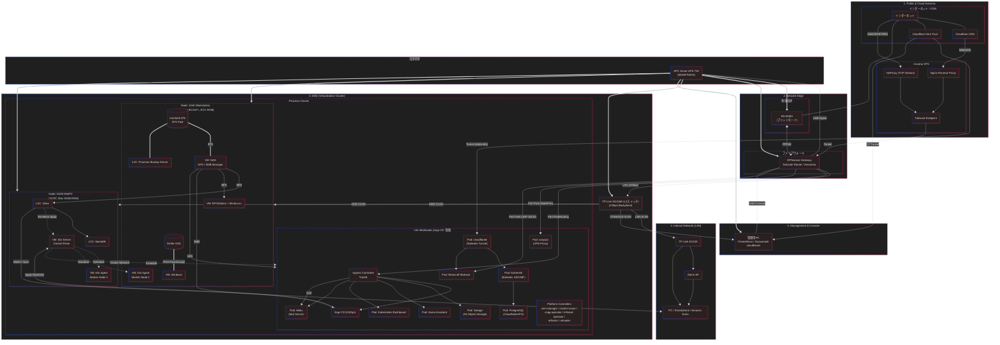

# my-home-network

このリポジトリは、自宅環境のプロビジョニングと構成管理をコード化したものです。  
Proxmox 上での VM/LXC 作成は Terraform、各ホストの設定は Ansible によって管理します。

## 目的と設計方針

- 単一リポジトリでリソース作成（Terraform）と構成適用（Ansible）を分離して管理する
- 環境差分（ノード、VMID、ストレージなど）を変数で吸収し、再利用性を重視する
- シークレットは Infisical に集約し、平文でのコミットを避ける
- ネットワーク境界（VPS / Firewall / DMZ / LAN）を意識した設計を保つ

## 技術スタック

- IaC: Terraform (`bpg/proxmox`)
- Configuration Management: Ansible（Role ベース）
- Virtualization: Proxmox VE（VM / LXC）
- OS / Runtime: Debian 系ゲスト, systemd
- Edge/Proxy: Nginx, HAProxy, Cloudflare, Tailscale
- Data/Backup: MariaDB, Proxmox Backup Server
- Security / Secrets: Infisical
- Quality Gate: ansible-lint, pre-commit (gitleaks)

## 主要ワークロード

- Gitea（LXC）
- NAS（OMV + NFS/SMB）
- Proxmox Backup Server（PBS）
- VPS Reverse Proxy（Nginx / HAProxy）
- Let's Encrypt 証明書配布
- k3s クラスタ連携（構成管理対象）

## アーキテクチャの要点

- **Terraform (`terraform/`)**
	- VM/LXC をモジュール化して再利用（`modules/vm`, `modules/container`）
	- ノード差分やリソース差分を `locals.tf` / variables で吸収
	- ネットワーク、ストレージ、bind mount をコード化

- **Ansible (`ansible/`)**
	- Playbook で適用順序を定義し、Role で責務分離
	- `inventory` でホスト特性を管理し、`group_vars` / `host_vars` で設定を分離
	- Infisical 起点の環境変数（`lookup('env', ...)`）によるシークレット注入を前提化

- **Network Design**
	- Public/Edge/DMZ/LAN/Console の層構造で運用境界を明確化


```mermaid
---
config:
  theme: neo-dark
  look: neo
---
flowchart TB
 subgraph SUBNET_INTERNET["インターネット / CDN"]
        NET_INTERNET["インターネット"]
        NET_CFCDN["Cloudflare CDN"]
        NET_CFZT["Cloudflare Zero Trust"]
  end
 subgraph NET_VPS["Conoha VPS"]
        VPS_NGINX["Nginx Reverse Proxy"]
        VPS_HAPROXY["HAProxy (TCP Stream)"]
        VPS_TAILSCALE("Tailscale Endpoint")
  end
 subgraph LAYER_PUBLIC["1. Public & Cloud Services"]
    direction LR
        SUBNET_INTERNET
        NET_VPS
  end
 subgraph SUBNET_EXTERNAL["物理境界"]
        HW_ROUTER_ONU["RS-500KI<br>（ブリッジモード）"]
  end
 subgraph SUBNET_FIREWALL["ファイアウォール"]
        HW_ROUTER_OPNSENSE["OPNsense Gateway<br>Tailscale Router / Zenarmor"]
  end
 subgraph LAYER_EDGE["2. Network Edge"]
        SUBNET_EXTERNAL
        SUBNET_FIREWALL
  end
 subgraph HW_SERVER_MINIPC["Node: N100 MiniPC<br>[4C/4T, Max 32GB RAM]"]
        K3S_CP["VM: k3s Server<br>Control Plane"]
        K3S_AGENT_MINI["VM: k3s Agent<br>Worker Node 1"]
        LXC_MARIADB["LXC: MariaDB"]
        LXC_GITEA["LXC: Gitea"]
  end
 subgraph HW_SERVER_Z440["Node: Z440 Workstation<br>[Xeon 8C/16T+, ECC RAM]"]
        K3S_AGENT_Z440["VM: k3s Agent<br>Worker Node 2"]
        LXC_PBS["LXC: Proxmox Backup Server"]
        VM_NAS["VM: NAS<br>NFS / SMB Manager"]
        VM_REC["VM: EPGStation + Mirakurun"]
        VM_WINDOWS["VM: Windows"]
        STORAGE_HDD[("IronWolf 4TB<br>ZFS Pool")]
        STORAGE_NVME[("NVMe SSD")]
  end
 subgraph K3S_FLOATING["k3s Workloads (Argo CD 管理)"]
        POD_INGRESS["Ingress Controller<br>Traefik"]
        POD_ARGO["Argo CD (GitOps)"]
        POD_AUTHENTIK["Pod: Authentik<br>(fickledev SSO/IdP)"]
        POD_CLOUDFLARED["Pod: cloudflared<br>(fickledev Tunnel)"]
        POD_XRAYVPN["Pod: xrayvpn<br>(VPN Proxy)"]
        POD_MAILU["Pod: Mailu<br>(Mail Server)"]
        POD_HOMEASSISTANT["Pod: Home Assistant"]
        POD_MINECRAFT["Pod: Minecraft Bedrock"]
        POD_GARAGE["Pod: Garage<br>(S3 Object Storage)"]
        POD_POSTGRES["Pod: PostgreSQL<br>(CloudNativePG)"]
        POD_K8SDASH["Pod: Kubernetes Dashboard"]
        POD_PLATFORM["Platform Controllers<br>cert-manager / cluster-issuer /<br>cnpg-operator / infisical-operator /<br>reflector / reloader"]
  end
 subgraph HW_VCLUSTER["Proxmox Cluster"]
        HW_SERVER_MINIPC
        HW_SERVER_Z440
        K3S_FLOATING
  end
 subgraph SUBNET_DMZ["3. DMZ (Virtualization Cluster)"]
        HW_SWITCH_TPLink["TP-Link SG116E (L2スイッチ)<br>[1Gbps Backplane]"]
        HW_VCLUSTER
  end
 subgraph SUBNET_INTERNAL["4. Internal Network (LAN)"]
        HW_SWITCH_TPLINK_LAN["TP-Link SG108"]
        HW_CLIENT_AP["Aterm AP"]
        HW_CLIENT_DEVICES["PC / Smartphone / Amazon Echo"]
  end
 subgraph SUBNET_CONSOLE["5. Management & Console"]
        HW_ADMIN_PC["管理用PC<br>Prometheus / Guacamole<br>cloudflared"]
  end
 subgraph POWER_SYSTEM["電源管理"]
        UPS_MAIN["APC Smart-UPS 750<br>[500W/750VA]"]
  end
    NET_INTERNET --- NET_CFCDN & NET_CFZT & HW_ROUTER_ONU
    NET_CFCDN -- Web(443) --> VPS_NGINX
    NET_INTERNET -- Mail(25/587/993) --> VPS_HAPROXY
    VPS_NGINX --> VPS_TAILSCALE
    VPS_HAPROXY --> VPS_TAILSCALE
    VPS_TAILSCALE -- Tunnel --> HW_ROUTER_OPNSENSE
    HW_ROUTER_ONU <-- PPPoE --> HW_ROUTER_OPNSENSE
    HW_ROUTER_OPNSENSE -- LAG (2Gbps) --> HW_SWITCH_TPLink
    HW_SWITCH_TPLink -- "DMZ-VLAN" --> HW_SERVER_Z440 & HW_SERVER_MINIPC
    HW_SWITCH_TPLink -- "LAN-VLAN" --> HW_SWITCH_TPLINK_LAN
    HW_SWITCH_TPLink -- "CONSOLE-VLAN" --> HW_ADMIN_PC
    HW_ROUTER_OPNSENSE -- Port Fwd/Routing --> POD_INGRESS
    POD_INGRESS --> POD_ARGO & POD_GARAGE & POD_HOMEASSISTANT & POD_K8SDASH & POD_MAILU
    POD_INGRESS -- TCP --> POD_MAILU
    HW_ROUTER_OPNSENSE -- "Port Fwd (NodePort)" --> POD_XRAYVPN
    HW_ROUTER_OPNSENSE -- "Port Fwd (UDP 19132)" --> POD_MINECRAFT
    NET_CFZT -- "Tunnel (idp/crafty)" --> POD_CLOUDFLARED
    POD_CLOUDFLARED --> POD_AUTHENTIK & POD_MINECRAFT
    POD_AUTHENTIK --> POD_POSTGRES
    STORAGE_HDD == ZFS === VM_NAS
    STORAGE_HDD === LXC_PBS
    VM_NAS -- NFS --> LXC_GITEA & VM_REC & K3S_FLOATING
    VM_NAS -- SMB --> HW_CLIENT_DEVICES
    LXC_GITEA --> LXC_MARIADB
    STORAGE_NVME == PCIe Passthrough === VM_WINDOWS
    HW_SERVER_MINIPC <== Cluster Network ==> HW_SERVER_Z440
    LXC_GITEA -. Terraform Apply .-> K3S_CP
    LXC_GITEA -- Watch / Sync --> POD_ARGO
    POD_ARGO -- Apply Manifests --> K3S_CP
    K3S_CP -. Schedule .-> K3S_AGENT_MINI & K3S_AGENT_Z440 & K3S_FLOATING
    NET_CFZT -- CF Tunnel --> HW_ADMIN_PC
    HW_ADMIN_PC -- USB Console --- HW_ROUTER_OPNSENSE
    HW_SWITCH_TPLINK_LAN --> HW_CLIENT_AP & HW_CLIENT_DEVICES
    HW_CLIENT_AP --> HW_CLIENT_DEVICES
    UPS_MAIN -- USB Signal --- HW_ROUTER_OPNSENSE
    UPS_MAIN ==> HW_ROUTER_ONU & HW_ROUTER_OPNSENSE & HW_SWITCH_TPLink & HW_SERVER_Z440 & HW_SERVER_MINIPC & HW_ADMIN_PC
```

## 実装ハイライト

- インフラ作成（Terraform）と構成適用（Ansible）を分離し、変更影響を局所化
- 役割ごとに Role を分割し、再利用性と保守性を確保
- 変数設計により、環境差分（ノード、VMID、ストレージ）へ追従しやすい構造を採用
- セキュリティを「運用手順」ではなく「設計」に組み込み（Infisical + gitleaks）

## ディレクトリガイド

- `terraform/`: Proxmox リソース定義（単一ルートモジュール）
- `terraform/modules/`: VM / Container モジュール
- `ansible/playbooks/`: 適用エントリポイント
- `ansible/roles/`: 各コンポーネントの構成管理
- `ansible/inventory/`: ホスト定義・変数（シークレット値は Infisical から環境変数経由で注入）
- `scripts/dump_cloudflare_config.sh`: 既存 Cloudflare 構成のダンプ（Terraform 化の下調べ用）
- `scripts/migrate-vault-to-infisical.py`: Ansible Vault から Infisical へのシークレット移送

## 再現性の確認（参考）

このREADMEは概要説明を主目的とし、以下は再現性確認の最小コマンドです（**相対パスのみ**）。

```bash
# Terraform 用シークレットは Infisical から供給する（ローカルの .env / terraform.tfvars は使わない）
set -a; source ~/.config/infisical/universal-auth.env; set +a
INFTOK=$(infisical login --method=universal-auth \
  --client-id="$INFISICAL_UNIVERSAL_AUTH_CLIENT_ID" \
  --client-secret="$INFISICAL_UNIVERSAL_AUTH_CLIENT_SECRET" \
  --plain --silent)

cd terraform
infisical run --token="$INFTOK" --projectId=<project-id> --env=prod -- terraform init
infisical run --token="$INFTOK" --projectId=<project-id> --env=prod -- terraform validate

cd ../ansible
ansible-galaxy collection install -r collections/requirements.yml
ansible-lint playbooks/site.yml

# 実機に触れない構文/差分確認も Infisical 経由で行う（vault パスワードの入力は発生しない）
infisical run --token="$INFTOK" --projectId=<project-id> --env=prod -- \
  ansible-playbook playbooks/site.yml --syntax-check
```

## 補足

- 秘密情報は Infisical（`prod` 環境）に集約し、平文で管理しない設計です
- Terraform 用シークレットは `TF_VAR_` 接頭辞を保持したまま Infisical に格納し、`infisical run` で子プロセスの環境変数として供給します
- Ansible 用シークレットは一般名の変数から `lookup('env', ...)` で参照し、`infisical run` が子プロセスへ注入する環境変数を解決先とします
- Proxmox への認証はパスワードではなく API トークンで行います（`proxmox_auth_method = "token"`）
- `terraform.tfstate` は機微情報を含み得るため、保管と共有ポリシーを分離して運用します

## 手動作業として残っている項目

自動化の対象外、または本リファクタでは要否判断のみ行い実施を運用者に委ねた作業です。

- **k3s node token のローテーション**: 移行前に平文でコミットされていた期間が git 履歴に残るため、
  値そのもののローテーションが必要です（履歴の書き換えは対象外）。

以下は 2026-08-31 時点で解消済みです（参考のため経緯を残します）:

- ~~削除対象アプリの残存データ~~: 確認時点で `outline` / `planka` データベースと Garage バケット
  `outline` は既に存在しないことを確認しました（記録時点以降に Garage・`postgres-cluster` 双方が
  再構築されたため）。`minio-pv`（PersistentVolume）は不要と判断済みのため削除しました。
- ~~`postgres-credentials`・`garage-backup-secrets` への値投入~~: `postgres-credentials` は
  openssl で生成したダミー値を投入（参照元がなく実害なし）。`garage-backup-secrets` は
  `GARAGE_BACKUP_ENCRYPTION_PASSWORD`（openssl 生成）と `GARAGE_BACKUP_RCLONE_CONFIG`（Google Drive
  OAuth token）を投入し、rclone による定期バックアップの動作を確認済みです。
- ~~`garage` / `home-assistant` の Ingress TLS 誤名参照~~: `secretName` を実在の `tls-fickledev-com`
  へ修正しました。
- ~~CNPG バックアップの不備~~: Garage に `cnpg-backups` バケットとアクセスキーを作成し、
  `s3Credentials.region`（Garage の `s3_region = "garage"`）を Cluster 定義に追加、Infisical へ
  `CNPG_GARAGE_BACKUP_ACCESS_KEY_ID` / `_ACCESS_SECRET_KEY` / `_REGION` を投入しました。
  region 未指定のままだと Garage 側が `Authorization header malformed, unexpected scope` で
  拒否するため、Pod 再起動を伴う反映が必要でした（`postgres-cluster` / `authentik-fickledev-cluster`
  とも `ContinuousArchiving=True` に到達済み）。
